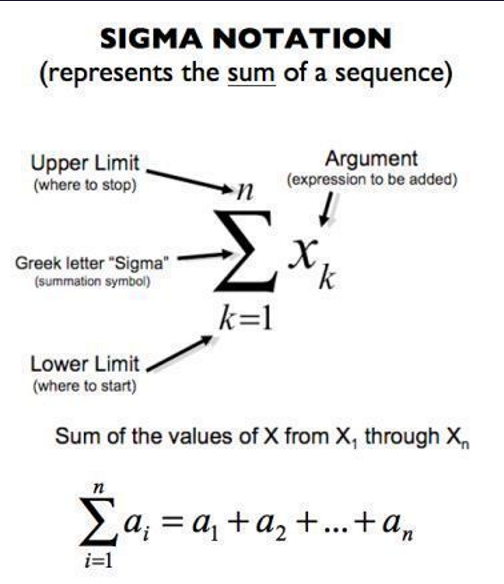
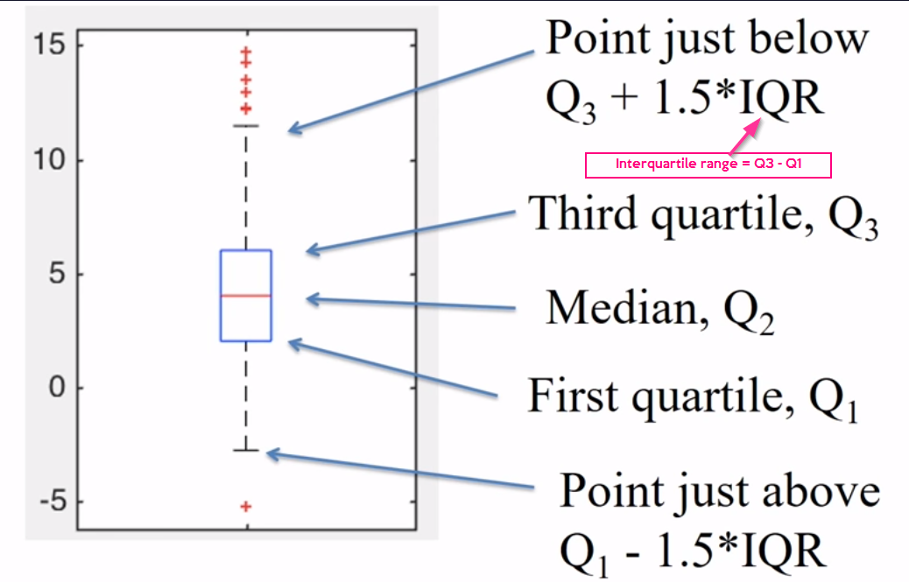
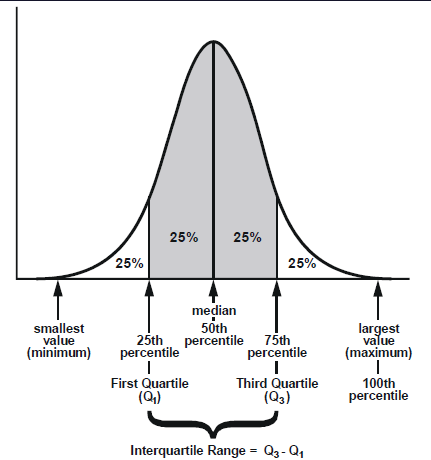
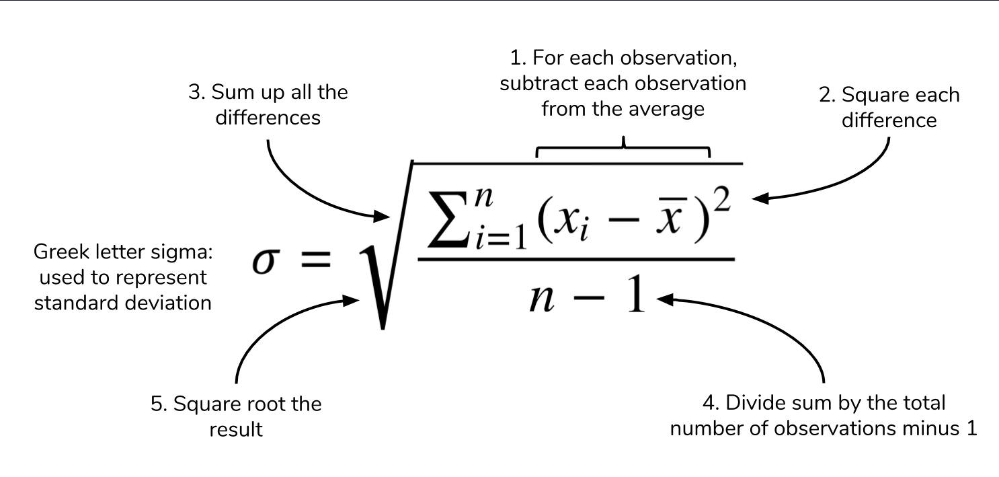
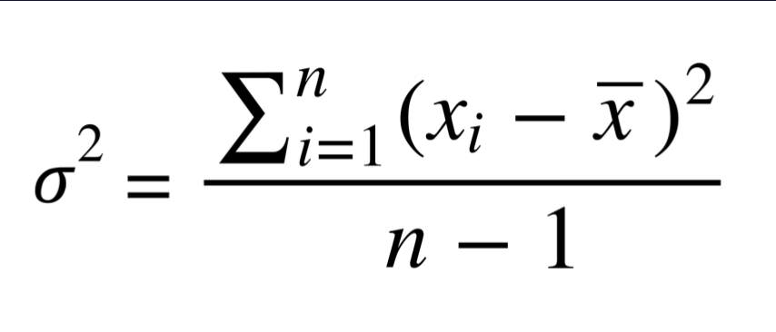
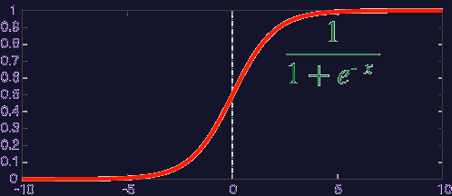
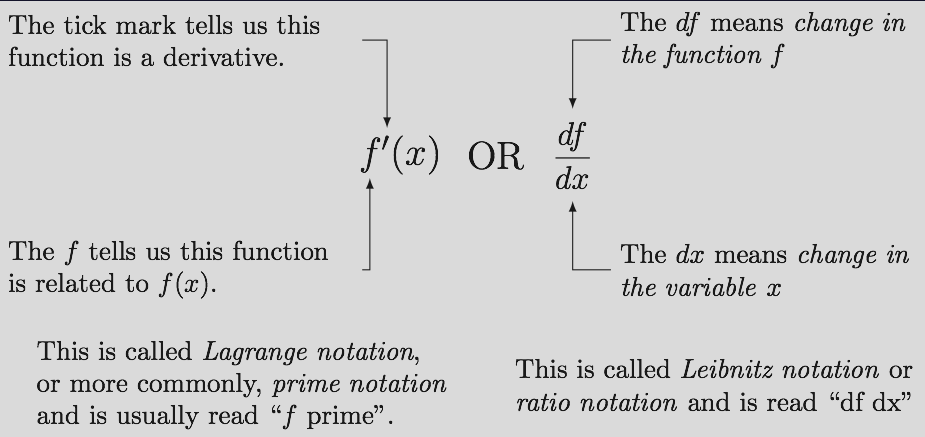
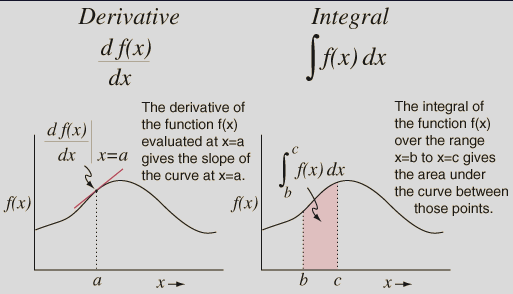
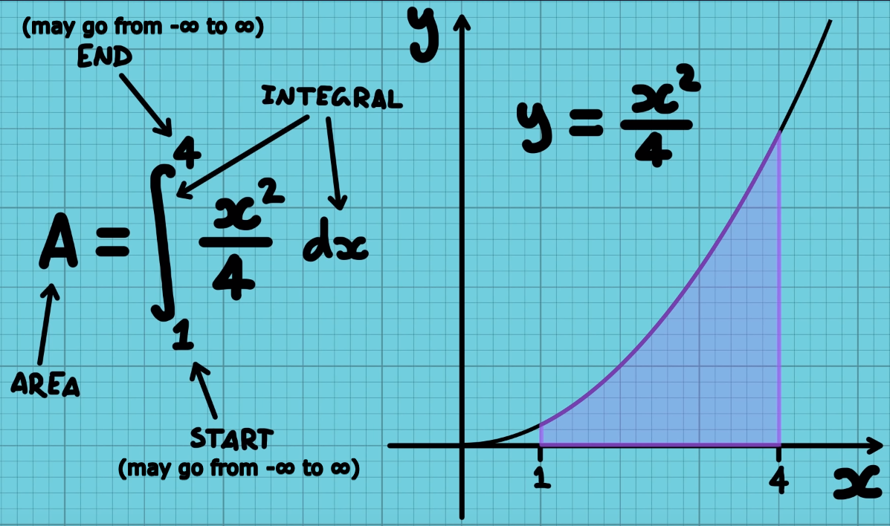
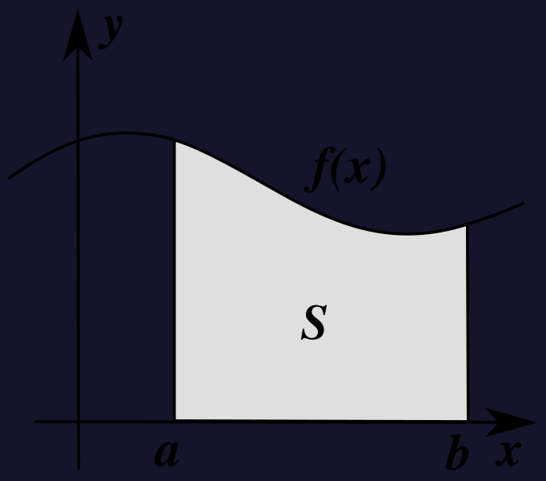

## Summation

## Descriptive statistics with code in Python

[Descriptive statistics](https://www.kdnuggets.com/2018/08/basic-statistics-python-descriptive-statistics.html)

- Divide into
  - Measures of central tendency
    - Answers "What does the middle of our data look like?"
      - Mean
      - Median
      - Mode
  - Measures of spread
    - Answers "How much does my data vary?"
      - Range and interquartile range
      - Standard deviation
      - Variance

## Mean

- Average value of a data set
- Sum of all values divided by the number of observations

## Median

- Define a typical value in the data set
- Does not require calculation
- Value that coincides with the middle of the data set

## Mode

- Value that appears the most frequently in our data
- Intuition of the mode as the "middle" is not as immediate as mean or median, but there is a clear rationale
- Highest weighted contributing factor to our mean

## Range and interquartile range

- Range
  - Maximum - minimum value
- Interquartile range (IQR)
  - Also called the midspread or middle 50%, or technically H-spread, is a measure of statistical dispersion, being equal to the difference between 75th and 25th percentiles, or between upper and lower quartiles, IQR = Q3 − Q1

## Standard deviation

- Measure of the spread of your observations
- Statement of "how much your data deviates from a typical data point"
- Summarizes how much your data differs from the mean

## Variance

- Square of the standard deviation, for the reason of:
  - Avoiding negative values in the sum
  - Pointing out the significance of outliers
  - Having an exponential term that allows us to find where the point of minimum deviation is
- Usually it is enough to give mean and standard deviation, but it is good to note variance as well

## Sigmoid function

- Classify as 1/0 (yes/no)
- Give probability, for example, "there is 65% probability of 'yes'"
- [Video](https://youtu.be/XWo3nY06RgQ)

## Derivative

- **Derivative at a point** ← slope of the straight line tangent to f(x) at a chosen value x
  - [More definition](https://www.youtube.com/watch?v=YW5X4quq5HU)
- **Derivative of f(x) is**
  - Slope of f(x)
  - Instantaneous rate of change of f(x)
- **Calculating derivative**
  - $f(x) = x^{10}$
  - $f'(x) = 10x^9$ ← typical derivative
  - [More examples](https://www.youtube.com/watch?v=54KiyZy145Y)
- Uses of derivatives
  - Find minima
  - Find maxima
  - Find inflection points

## Integral

- [Matemaks (całka nieoznaczona)](https://www.youtube.com/watch?v=LOF1YddNe2U)

- S (darker colored section) ← integral of f(x) in the interval from "a" to "b"
- $\int_{a}^{b}f(x)dx$
  
- To calculate: we need to find equation, from which derivative would equal f(x)
- Important formulas
  - $\int x^n dx=\frac{1}{n+1}x^{n+1}+C$ ← for $n \neq -1$
    - because $\int x^{-1} \, dx=\frac{1}{0}x^0$ ← that is not possible
  - $\int \frac{1}{x} \, dx=\ln|x| + C$ ← can be used for $n=1$
- Examples:
  - $\int x^2 \, dx=\frac{1}{3}x^3 + C$
    - because $\left( \frac{1}{3}x^3 \right)'=\frac{1}{3}\times 3x^2=x^2$
    - C = any constant
  - $\int 5x^7 \, dx=5\int x^7 \, dx=5\times \frac{1}{8}x^8+C$
  - $\int \frac{x^2+x^7}{x^3} \, dx=\int \left( \frac{1}{x}+x^4 \right) \, dx=\int \frac{1}{x} \, dx+\int x^4 \, dx=\ln|x|+\frac{1}{5}x^5+C$ ← it's enough to type one C
  - $\int \left( 5+7x^{\frac{-1}{4}} \right) \, dx=\int 5 \, dx+7\int x^{\frac{-1}{4}} \, dx=5x+7 \times \frac{4}{3}x^{\frac{3}{4}}+C$
    - imagine that $5=5\times x^0$ ← but it's not normal to think like that
  - $\int \cos(x) \, dx=\sin (x)+C$
  - $\int \sin(x) \, dx=-\cos(x)+C$
