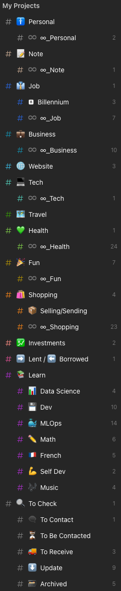
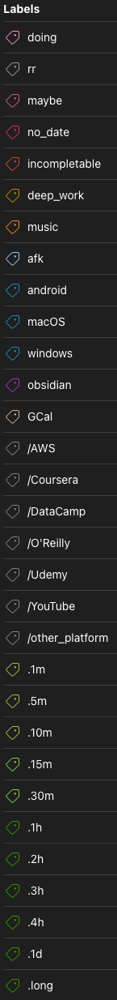
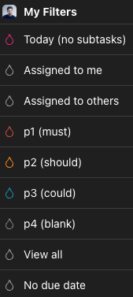

:::note
See also my [blog post about Todoist](/posts/aim-for-your-goals-the-right-way/).
:::

[Todoist](https://todoist.com/) is the ultimate app to manage your tasks. I've been using it since 2017, applying the Getting Things Done (GTD) methodology.

I praise Todoist mainly for:

- autocompletion with integrated keywords
- cross-platform availability (I can even use it on my smartwatch)
- simplicity (offer of just the right features)

:::tip
If you want to add something that cannot be ever done, use `*` in the beginning. It might be useful for things that you just need to check regularly, but cannot complete.
:::

## Projects

To start with, you should organise your tasks into different projects. Trust me; you don't want to keep all of them in the "Inbox", same as all the e-mails that you would later like to find in the categorised folders. Whenever you write down a task, use `#` sign, and you will be able to remember about buying milk by assigning it into "Shopping" project.

- 🚹 _Personal_ – store of all the personal duties, such as feeding my cat at 8 am
  - ♾️ _∞\_Personal_ – recurring tasks from the Personal category, such as doing my laundry each Saturday morning :|
- 📝 _Note_ – quick notes to jot down in [Obsidian](/knowledge/software/obsidian/) and process later
  - ♾️ _∞\_Note_ – recurring notes in Obsidian
- 👔 _Job_ – everything related to my professional work, interviews etc.
  - 🅱️ _Billennium_ – tasks dealing with my employer (Billennium)
  - ♾️ _∞\_Job_ – recurring tasks from the Job category
- 💼 _Business_ – tasks related to my own company
  - ♾️ _∞\_Business_ – recurring tasks from the business category
- 🌐 _Website_ – things to do on my blog, such as publishing this blog post
- 💻 _Tech_ – work to be done on my technical devices, such as contributing to an open-source project
  - ♾️ _∞\_Tech_ – recurring tasks from the Tech category
- 🗺️ _Travel_ – let's go for an adventure!
- 💚 _Health_ – don't forget to drink more water!
  - ♾️ _∞\_Health_ – recurring tasks from the Health category, such as weekly running sessions
- 🎉 _Fun_ – what would be life without dancing like crazy once in a while?!
  - ♾️ _∞\_Fun_ – recurring tasks from the Fun category, such as watching new episodes of Mr. Robot
- 🛍️ _Shopping_ – it's the 3rd day since I forgot to buy some milk
  - 📦 _Selling/Sending_ – would you like to buy my old printers?
  - ♾️ _∞\_Shopping_ – this time I'll not forget to recharge my seasonal train ticket
- 💹 _Investments_ – tracking investment-related tasks
- ➡️ _Lent / ⬅️ Borrowed_ – do you remember about the 50 cents I lent you back in 2010 for the lollipop?
- 📚 _Learn_ – learning materials to go through (mainly online courses)
  - 📊 _Data Science_ – time to watch some Andrew Ng
  - 💾 _Dev_ – why is this JavaScript always so unpredictable?!
  - 🐳 _MLOps_ – let's set up some containers and orchestrate them!
  - ✏️ _Math_ – damn that calculus!
  - 🇫🇷 _French_ – il est temps d'améliorer mon français
  - 💪 _Self Dev_ – come to me my dear soft skills
  - 🎶 _Music_ – my piano can't just stay there and collect dust
- 🔍 _To Check_ – this project replaces the popular Pocket application. All the videos of cats that I have to watch in my free time
  - 💬 _To Contact_ – I can't forget to call my dentist in the morning
  - ⌛ _To Be Contacted_ – yes, I will perfectly remember that it's the 4th day since you didn't reply
  - 🚚 _To Receive_ – my delivery is late, as always...
  - ⬇️ _Update_ – links to websites that post some critical updates, such as leaks of new Skrillex tracks
  - 🗃️ _Archived_ – completed or inactive projects kept for reference

## Labels

You can treat labels as hashtags. It's some additional option to categorise your tasks, and sometimes it's pretty useful. In order to assign some tags to the activity, type `@` sign, and you will be reminded of your labels.

- _doing_ – implement the "Personal Kanban" method to mark tasks in three categories: to do, doing and done
- _rr_ – recurring task
- _maybe_ – should I, or should I not?
- _no\_date_ – there is no particular deadline for this task
- _incompletable_ – a task that can never be fully completed (e.g. ongoing habits)
- _deep\_work_ – objectives requiring a great focus, unlike typical shallow work activities
- _music_ – la la la
- _afk_ – Away From Keyboard. Anything that doesn't involve my fingers on the keyboard / smartphone screen
- _android_ – task related to my Android phone
- _macOS_ – task related to my Mac
- _windows_ – task related to my Windows machine
- _obsidian_ – task related to my Obsidian vault
- _GCal_ – tag automatically assigned by Google Calendar app, during the process of syncing with my calendar
- platforms assigned to the tasks within my 📚 _Learn_ project
  - _/AWS_
  - _/Coursera_
  - _/DataCamp_
  - _/O'Reilly_
  - _/Udemy_
  - _/YouTube_
  - _/other\_platform_
- time estimations for tasks
  - _.1m_ – 1 minute
  - _.5m_ – 5 minutes
  - _.10m_ – 10 minutes
  - _.15m_ – 15 minutes
  - _.30m_ – 30 minutes
  - _.1h_ – 1 hour
  - _.2h_ – 2 hours
  - _.3h_ – 3 hours
  - _.4h_ – 4 hours
  - _.1d_ – 1 day
  - _.long_ – longer than a day

## Priorities

> _There is no such thing as 'I do not have the time'. This is all just a matter of priorities._
>
> — Maciej Aniserowicz

Type `p` followed with a number "1,2,3 or 4" to prioritise your goals.

- _p1 (must)_ – very important, I can't go to bed without marking it as done
- _p2 (should)_ – quite important, but I can survive without doing it
- _p3 (could)_ – it would be great to do it
- _p4 (blank)_ – meehhh... just a regular task.
