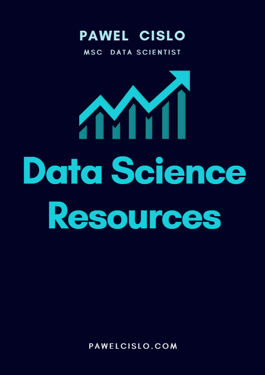

And welcome aboard dear friend!  
From now on, you can be sure that you won't miss any post and will be informed in case of any important news.

Side note: I am not going to send any spam; however, the algorithms are not always working according to their specifications, and my messages can land in your spam folder. To prevent that, [add my newsletter e-mail](https://knowledgebase.constantcontact.com/guides/KnowledgeBase/5873-adding-email-addresses-to-a-safe-sender-list?lang=en_US) (contact@pawelcislo.com) in the list of your trusted contacts. Thank you.

I am including the "Last Updated" date of this e-book as I might add more links on the way.

  
_**Last updated on: 30/05/2019**_

To view/download, click on the following book cover.  
Enjoy!

To complete this book, please have a look at [**the rest of my recommendations**](https://pawelcislo.com/recommendations/).

* * *

## Addendum

If you are feeling lost on this website, you can always check the [Sitemap](https://pawelcislo.com/sitemap/), where I keep all my posts organised chronologically, with the rest of the pages.

Moreover, if you like what I am doing, I will be grateful if you can like my [Facebook Fan page](https://www.facebook.com/pawelcislocom/).

Thank you again for subscribing to my newsletter and I wish you a pleasant reading. :)

All the best!  
Pawel Cislo
