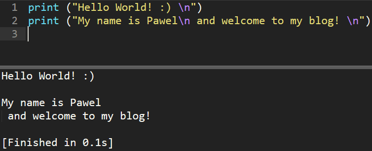
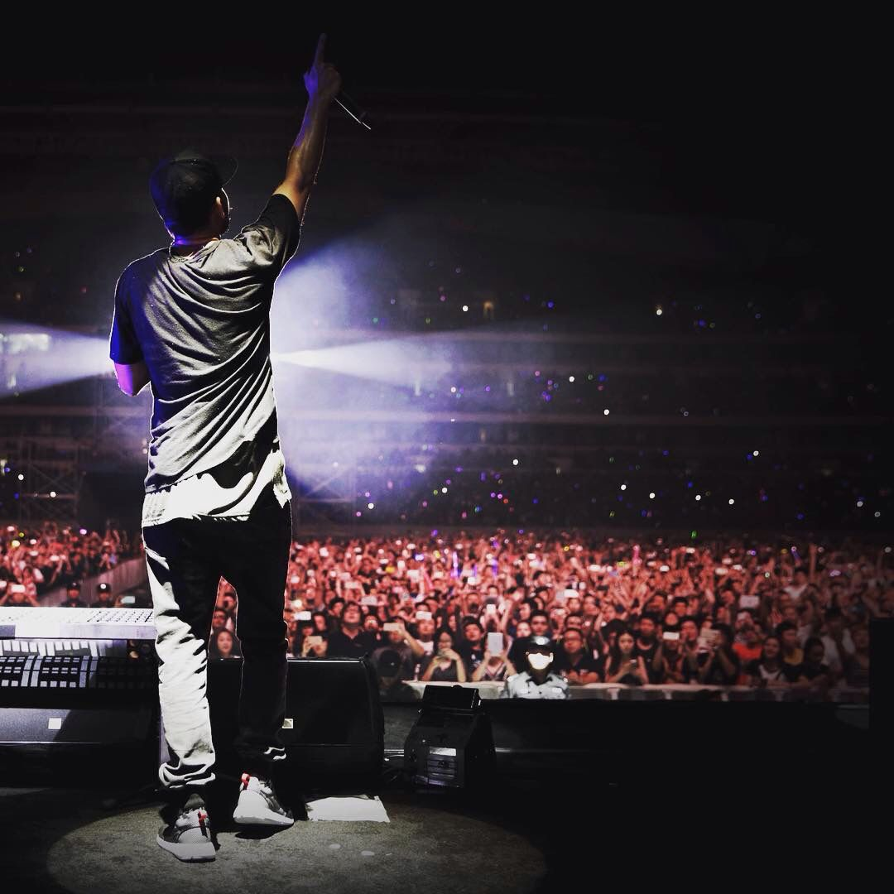
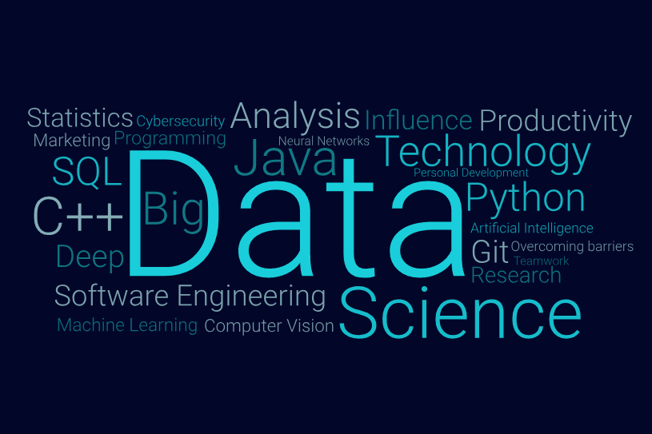
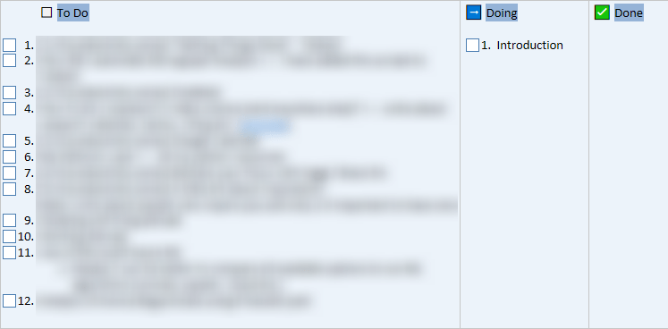

**To start with, bear in mind, that this post is not merely a "hello world" message to all the readers, but something to bring life-changing deliberations.**

## It happened

Another part of my life [has been finalised](https://twitter.com/pawel_cislo/status/1032960942886277120), and space has been opened for a new experience. As everything in life has its limited lifespan, that we can or cannot control, the present time let me start something that I had in plans for a very long time – being a more visible spider of the endless digital web (not in the context of traversing the trail more often, but creating new paths).

Most importantly, it's a big discipline test for me, to check if I can handle something from the second quartile (Q2) of everything that we can do in our life. The idea presented 13 years ago by Gary Halbert[^1] is still highly applicable to every human being. The overall message presents that we are spending the majority of our limited lifetime for Q1 and Q3 category. If we analyse what I am doing at the moment – writing a blog post is falling into the Q4 category as it might wait and I would not hurt myself without doing it. The magic happens if we spend much more time with Q4 each day and wait patiently for the effects.

|  | URGENT | NOT URGENT |
| --- | --- | --- |
| Important | Q1 | Q2 |
| Not Important | Q3 | Q4 |

Being on a constant pressure and deadlines set in advance for ~17 years of my life, I've been prepared well to deal with Q1 and Q3 sphere; however, now the point of my direction is to go along with something diverse. I'm not saying that now I'm free of the urgent variants but will try to give myself a try with activities falling into the third column.

## But... why?

First of all, I like writing (more explicitly presenting my point of views in the most clarified way possible). Yeah, I know that if the current version of myself told me that thing even just two years ago, I would laugh and lost hope in the world; however, something changed. Maybe spending more time with myself due to my studies abroad in the UK,  sparked some source of power in the central organ of the nervous system. Maybe I was just overthinking all the time, what has been told to me by too many people. Maybe, I just wanted a change.

It started with the phrase "_**Let yourself be known**_" stuck in my head for waaaay too many hours than enough. I think I have to thank for it Maciej Aniserowicz – a former programmer who nowadays encourages IT practitioners, to share their knowledge to quench the thirst of online surfers. Obviously, the change wasn't just initiated by Maciej, but many other influencers (especially those included in one answer of [my FAQ page](https://pawelcislo.com/faq/)) that I cannot thank enough. To pinpoint three more personalities, it would be:

- Andrzej Krzywda and his book "[Blogging for Busy programmers](https://www.goodreads.com/book/show/28245875-blogging-for-busy-programmers)"
- Jakub Mrugalski and [his podcast](https://anchor.fm/unknow) about being an online creator
- Mirosław Burnejko and each one of his daily vlogs, but especially the first one "[I was scared of that day](https://www.youtube.com/watch?v=IWqdPrJrKxs)".

Think about it yourself. Isn't everything around you running with increased speed, such as you might tend to listen to your podcasts on the way home? We had just raised a couple of years ago and followed the predetermined scheme of going to school, finding a job, marrying and lastly getting into a long time sleep, regretting that we didn't make enough. To regret is a strong word, and [the five examples](https://www.businessinsider.com/5-things-people-regret-on-their-deathbed-2013-12?IR=T) of regrets of people preparing to close their eyes for once, speak for themselves, with the most common "_**I wish I'd had the courage to live a life true to myself, not the life others expected of me**_". Unfortunately, everything mostly starts not just with the friends around you, but the ones who are with us since the very beginning – our parents (and I'm proud and thankful to have ones, that allowed me to choose my own way). If you find yourself with ones that block you, consider not listening to them, if you don't want to end up your life with never-ending regret ([significantly explained by Gary in 60 seconds](https://www.instagram.com/p/BnG7ykBA7Ho/?taken-by=garyvee)).

If I think about it, that just annoys me to live in this global algorithm, hoping for a little "bug" in the code, that will let us use a different way. I've decided not to wait for it, but simply start doing something in my free time, which one day will be prone to monetising or will be my side-hobby apart from the daily routine. Clearly, a blog is not the only thing that I'm talking about, but it is a part of the plan too.

Someone said very wise words, once:

> _Find three hobbies you love: one to make you $$, one to keep you in shape and one to be creative._
>
> — Unknown author

Perhaps, I'll describe in detail what I'm about to one day, but for now, I'll leave you with Gary who answers the question in the way, that there is not much for me to add. The core message starts at 07:58, but I recommend watching the entire speech if you feel like you hate what you are doing at the moment. If you feel like there are too many unnecessary anecdotes, here is also a [tl;dw version](https://www.instagram.com/p/BnSIV6dAgnU/?taken-by=garyvee).

<iframe
  width="560"
  height="315"
  src="https://www.youtube.com/embed/EhqZ0RU95d4?start=478"
  title="YouTube video player"
  frameborder="0"
  allow="accelerometer; autoplay; clipboard-write; encrypted-media; gyroscope; picture-in-picture"
  allowfullscreen>
</iframe>

Okay, there is actually a single thing I want to include, as Gary did not mention this analogy. Do you know how were people giving a speech in the historical times and how were they automatically respected, without ever seeing the speaker before? Let's look at the following picture of Mike Shinoda, giving one of his concerts. Do you know what makes him being listened to by such a huge crowd?

Stop here for a minute, think about it, and when you are ready, read the answer below this image. If you find my answer different from yours, please let me know in the comments what was your assumption.

_Credit: Somewhere in a pile of Pinterest images[^2]_

So, tell me, what do you think?

No, I am not saying that you need to be a great musician to be listened to. Observe the height difference between the crowd and the performer. As you can see, apparently the person who is in a higher position will be naturally paid respect to. After finding yourself in a better spot, you can perform some vocal warm-up exercises to rule the crowd, such as [Julian Treasure on a TED show in 2013](https://www.ted.com/talks/julian_treasure_how_to_speak_so_that_people_want_to_listen/transcript?language=en#t-459957) (07:47).

But that's all not the point of this post! I'm actually trying to say that you don't need all of that (the height, charisma, perfect body language or vocal that takes the crowd). No, you just need... a blog or more generally speaking a social media presence, even on your Facebook wall. Yes, you probably got one already and are an active monthly user of 2.23 billion other FB surfers[^3]. Every time you post something online, you can feel like standing on the stage, where you will be heard. Don't worry about the audience as even Mike Shinoda might not have a single spectator around him in the beginning, but what let him agglomerate such a crowd, was uninterrupted persistence.

## So, what will be the spectrum of this online diary?

They say that "_A Picture is worth a thousand words"_, so I have prepared one, that more or less defined what will be the subject of my discussions.

_Uhm, but I don't get it, this picture has only 33 words, so how can it be worth more than a thousand words?!_

The range of topics is no less than impressive thanks to the open access to knowledge that we have nowadays. Data science has been enlarged as it's a fascinating area providing endless possibilities. As such, I shouldn't worry about running out of topics to discuss on this blog. I cannot say that I'm already an expert in this field, but I believe that now with more time spent on practical exercises, I will be able to present you with a fascinating analysis.

By reading this post, you might have also got an impression that I like to philosophise and it will be the second major point of this blog connected with business and marketing.

Of course, the whole spectrum will base on the modern technology and the ways of utilising it for the best possible outcomes. Everything written on this blog will go through my personal filter to prepare the content that matters the most, such as sharing my notes from the online courses (I'm about to finish one at the moment).

## What did the creation of this blog teach me?

Most importantly, that the only limits are in our head and with the resources of the current world, we can achieve pretty much anything if we just want that and work on it consistently. See, publishing this blog wasn't as hard; apparently, it did cost me some time that I believe anyone has. Financially analysing, it cost me only £44.34 for the annual warranty of my domain and hosting. Again, this is not the amount that might stop most of us from starting a blog, and if you're running low on budget, you can start for free with [GitHub Pages](https://pages.github.com/) or [Medium](https://medium.com/) (well, Medium is more for opinion based posts if you ask me). Don't you have anything interesting to say? Start reading books, watch some YouTube videos, listen to podcasts and you will definitely have a topic in a month or two. If you got any other doubts if you should start a blog or you struggle with its implementation, please leave a comment under this post or [contact me](https://pawelcislo.com/contact/) directly.

## What's next?

There is a lot of topics that I might discuss, and the only thing that I wander around is to manage my time in a way to present new posts regularly without writing a clickbait. Before writing this post, I've already predefined some scenario, and as I go along, I will find more influence and skills to perform the machine learning way of analysing things (finding information, cleaning it, applying own algorithms and presenting the results).

So far, my OneNote consists of a special section just for the website with multiple notes reminding me of the steps. Here is a sneak peak, of how I manage the work on my posts using the Kanban method.

_Let's be a little mysterious with my work and blur it for now ;)_

## [HEYYEYAAEY!](https://youtu.be/ZZ5LpwO-An4?t=30s) I don't want to miss another post

No problem my friend. Just go on the home page and click the F5 page from time to time. ( ͡° ͜ʖ ͡°)

No? That is too hard to press a single button?

Okay... the alternative is to [sign up for my newsletter](http://eepurl.com/dDqG-z) or solely following me on social media (links in the header of this website and ["About Me" section](https://pawelcislo.com/)).

## Addendum

In the end, I wanted to add that sometimes the pressure of time is the best thing that helps us to achieve remarkable things. Did you know that in the moment of publishing a [teaser of this website](https://www.instagram.com/p/BnMk26SB29l/?utm_source=ig_web_copy_link) (6 days ago), I still didn't write my free e-book, adjust e-mail marketing campaign, prepare [FB Fan Page](https://www.facebook.com/pawelcislocom/) and scribble down this post? Well... sometimes it can get so stressful, leaving me with 5-6 hours of sleep a day, but the productivity jumps to 100%! ;)

The entire last years of pushing myself to the limits with the bachelor and master's degree made me much more resistant to this kind of things; however, it doesn't mean that I should be proud of it. Every human being has his perspective on what's more important. For ones, it may be time spent with family, for others purchasing luxury goods, whereas for someone like me it's something that I am still trying to answer during that such a short lifespan.

**Did you like this article** (my hybrid theories, which want to get out inside of my head to verify their appropriateness)? Please let me know in the comments, and if you can, please share it with your friends as I think that it can benefit each of us. I hope this post wasn't too long as I wanted to keep it short to be read by most of you. In the next post, most probably, I will present my automatic micrograph analyser with the code for your own implementation, so stay calm. If some topics interest you specifically, let me know as well (in the comments or [privately](https://pawelcislo.com/contact/)), I can consider even writing a feuilleton about sewing buttons on handknits, as I would like to know no limits and write for all of us. ;)

Ciao!

## References

[^1]: Gary C. Halbert (2005) 'The Boron Letter (Chapter 1)'. [ 2005] available from <[http://www.thegaryhalbertletter.com/Boron/BoronLetterCh1.htm](http://www.thegaryhalbertletter.com/Boron/BoronLetterCh1.htm)> [7 September 2018]

[^2]: _Mike Shinoda on a Stage_ (n.d.) available from <[https://www.pinterest.co.uk/pin/476748310532312731/](https://www.pinterest.co.uk/pin/476748310532312731/)> [7 September 2018]

[^3]: Facebook (2018) 'Company Info'. [2018] available from [https://newsroom.fb.com/company-info/](https://newsroom.fb.com/company-info/) [7 September 2018]
