:::note[Last updated on: 19/09/2018]

- [19/09/2018] Version 1.1 - include an option to perform machine learning segmentation in addition to automatic thresholding
- [16/09/2018] Initial release

:::

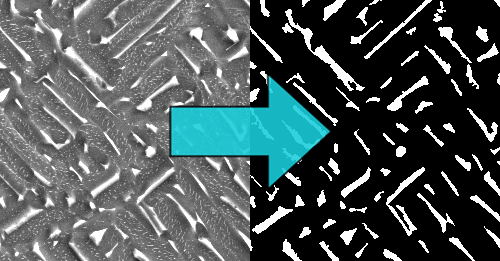

**Clear explanation of how I automatically turned meaningless 2D micrographs into plenty of significant data (numerical, graphical, plot).**

_If you wish, you can also get the idea of this project by checking a [presentation I prepared for it](https://drive.google.com/file/d/1mQZH9pExTbmQhjIbX7bjFtQNP66orTm6/view?usp=sharing). If you just want to get the script and have a quick overview over the features, please check my [GitHub repository](https://github.com/pyxelr/automatic-micrograph-analyser)._

## Introduction

During the period of the last three months, I was heavily working on finding a way to improve the current situation of bioimage analysis at my university. It started with a proposed project on the board of many other that brought my attention as I concentrated my eyes over the words: data, analysis, image. These terms will never bore me as it amazes me how much information we can generate from just a few 2D pixels, especially in the era of AI. The following post will not discuss all the possibilities, but I will do my best to address these areas in depth in the next articles.

“_This is a project to support some of our research staff in automating the analysis of micrographs to extract key parameters that will influence the properties of the material. We’re developing a number of new 3D printed metal materials for the Aerospace industry and understanding which of these parameters influence the properties is very important in justifying their use. The current analysis is done by hand or with a small amount of automation and so is very time-consuming._” — This is a part of the client's response after presenting my willingness to contribute. To complete the reply, I will add that the images are taken at the university using the scanning electron microscope (SEM), as invented in 1937, which applies the focused electron beam to analyse a small-scale raster[^1].

After the response, we have continued with several meetings with the client and PhD students who worked on other parts of the project and wished to save their valuable time on analysis. From this point I am grateful to had them in that time, as they narrowed down my research to some specific techniques that might work, leaving me with multiple options which I was continuously storing in my notebook for my hands-on experience.

## Initial investigation

My OneNote notebook was continuously fed with new information, and I was thinking where will I get the time go through all the resources. In the end, my "tools" section looked somehow like **[this](https://pawelcislo.com/wp-content/uploads/2018/09/Notes_Micrograph.png)**. The arsenal of tools is vast and definitely not fulfilled; however, it contained the most promising options. Feeling under pressure, I sought for tips from the experts of Data Science on the Facebook group by [raising a discussion](https://www.facebook.com/groups/datasciencepl/permalink/1814512748606752/). The answers I received, got their use in my work as I understood that I was looking towards a right direction with the previously scribbled set of tools.

I have also tried to reach out to Kaggle community, but unfortunately, I got no response till now. When I am writing these words, I know that some of the subreddits could have been helpful (such as [r/datascience](https://www.reddit.com/r/datascience/) or [r/computervision](https://www.reddit.com/r/computervision/)).

Python and more specifically scikit-image library were the most recommended for this specific case; however, their functioning was focused on the process of segmenting the image (preprocessing it for the actual analysis part), without the relevant options to generate all the required features. Moreover, taking my short-experience span with Python and the vast amount of client requirements, I have decided to look into something more applicable to this specific case. After some research time and discussions with the client and PhD students, I have decided to try [ImageJ](https://imagej.net/Welcome) as it offered the possibility to automate its functions using several languages, such as Jython (Python), Java or the implemented ImageJ Macro. Furthermore, the distribution connects many passionates on its forum, where I have raised a few discussions in the meantime of product development, seeking for ideas to develop my work.

During the meetings with PhD students, we have agreed on a specific workflow, which just had to present the initial blueprint of the scenario. After all, I did not expect meeting the requirements shown in the "3rd" step with the addition of dozens of extra ones.

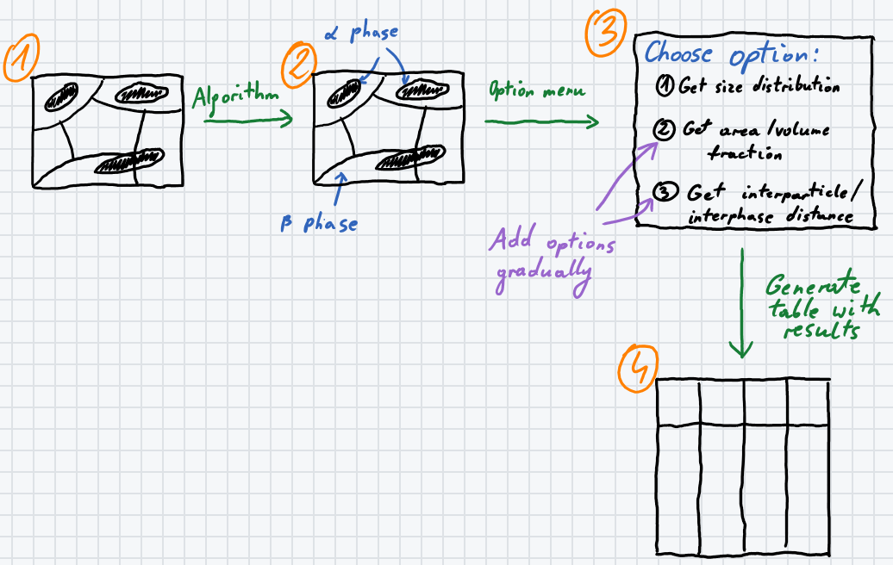
_Initial sketch of the workflow_

## Background research

_The following chapter is written for a purpose to understand the previous approaches, as such, if you are not interested, you might skip to the "Requirements" heading._

The analysis of micrograph samples in this project involves the aerospace industry as the application domain and image processing as the general domain. The image processing focuses firstly on approaches, later on, techniques and lastly on their use in aerospace industry, as the industry is not the biggest concern of this dissertation, but the feature generation required by the client.

### Long history

The history of biomedical image acquisition goes back to the previously mentioned invention of SEM which was described in the "Scanning electron microscopy 1928-1965" article presented by McMullan[^2]. As it was mentioned, Manfred von Ardenne was a German physicist who invented the SEM in 1937, which is utilised in this project to deliver scans for the system development. Thanks to the invention, it is possible to obtain the nanoparticle scans required for the development of the automatic system.

An early application of micrograph analysis automation goes back to 1998 when Carpenter, Rickman and Barmak published a study of automated quantitative microstructural analysis of transmission electron micrographs (TEM) in a journal of applied physics[^3]. As it is described, the applied techniques on Al films obtained using the TEM does not limit only to this specific technique but can apply to other microscopes, such as SEM in this project. The authors compare the manual approach of grain boundary identification with the newly designed algorithms for image processing. The automatic methodology includes filtering noise in the image, finding edges using different filters with automatic thresholding, recombination using logical OR operation, skeletonisation, and lastly binary operation leaving black and white pixels only. Unfortunately, the authors do not mention the applied software or programming techniques; however, looking on the applied operations, it can be assumed that the workflow could have been managed in ImageJ software that was published one year before this research, or by using NIH Image which was superseded by ImageJ[^4]. In the result, the partially automated approach generates a segmented image, leaving black pixels for the particle grain edges and performs as good as manual methods. To compare the work to this master’s research, the authors deal with very low-quality images, which require the acquisition of multiple copies from different angles to generate the final result. Tracing the grain structure took the scientists about 4 hours and the extraction of grain size distribution required about 1.5 hours.

The experiments applied by Carpenter et al. indicate a practical workflow for image pre-processing, that could have been utilised in this project in a fully automated structure, which would be designed to perform in a much less time-consuming approach. Moreover, the developed system establishes all the results automatically, where the authors required to calculate and plot the result diagrams manually.

Later in 2008, Elen Barry conducts a substantial project under the topic of three-dimensional reconstruction of microstructures[^5]. The work done by Barry deals with a very similar type of material – titanium alloy, which scans of slightly reassemble micrographs in this project. The goal of the researcher is not the automation of the process, however, as part of the work he describes a batch processing of the images in the Adobe Photoshop CS and Fovea Pro. The utilised algorithm could not have been fully automated as it included manual specification of thresholding for individual images in the mentioned programs. Afterwards, removal of secondary α laths on the model involved “Gaussian blur, Classic Morphology and Euclidean Distance Mapping (EDM) Based Morphology” processing with the use of Fovea Pro. The presented results look promising; however, the process unnecessary included the work between two different software packages that could have been utilised in a single solution available at the time of the research. Like the previously analysed article, this research gives valuable information about how to deal with image pre-processing, especially with titanium alloys, also examined in the current project. Some of the micrograph examples also include primary and secondary α laths, that will need to be filtered from each other. Overall, the presented workflow of the algorithms by Barry was taken into consideration while developing the system.

### Machine learning possibilities (U-Net)

With the popularisation of machine learning, some of the scientists started including the algorithms which could do much more accurate processes with previous training. Olaf Ronneberger, Philipp Fischer, and Thomas Brox in 2015 designed a working algorithm for the biomedical area called U-Net, which was described in "U-Net: Convolutional Networks for Biomedical Image Segmentation" article[^6]. Over the years, the machine learning algorithm is still highly usable and commonly implemented in multiple projects, in particular, hosted in the form of GitHub repositories. With time, the algorithm started having different modification; however, the original design is utilising convolutional neural networks architecture as a core for the image segmentation. The advantages of the presented solution are fast processing and accuracy that beats previous implementations, but as of the current machine learning state it requires low-dimensional images to work correctly, such as 512 x 512 pixels. Currently, the resolution does not make a significant problem as the available libraries in the Python programming language are capable of cutting the image to equal slices with a little bit of coding process (for example, the NumPy library). The implementation has a powerful impact that can be applied in this project, but it requires to perform manual label colouring to train the algorithm for different types of micrographs, which would not make the process fully automated. Moreover, the training requires a long training time of around 6 hours on a more expensive graphics card, that does not seem to be a good choice for a quick analysis. It is possible to make the process self-working, but if the research department of Coventry University started working on different kind of materials, it would require to perform the time-consuming training of U-Net architecture. Besides, the implementation of U-Net requires good programming skills which can consume a considerable amount of time that might be needed for different parts of the project structure.

### MultiMap tool

One of the recent works by Gherardo Varando et al. develops a new tool that can extract and analyse data from multiple images automatically. The MultiMap tool created in the report utilises "maximum of Laplacians of Gaussian filter and an automated object detection process, performed using a fast tag propagation algorithm" that offers a 3D segmentation using 2D stacks of a substantial number of images in a stack (more than 20 GB of files)[^7]. The images taken into analysis slightly differ from titanium alloy structure, as they present “glutamatergic and GABAergic presynaptic axon terminals” that are used in the process of hole detections. The developed system performs 3D segmentation and quantification of the elements in the automated procedure, which is mostly suitable for low-resolution images, what makes it less applicable in the current dissertation, as the images tend to be of a large dimension. The end system can do the processes in about 1.5 minutes, with a prior acquisition of the same time, but the authors do not mention the utilised hardware which is used for the procedure. The contributors also develop ImageJ extension for the ease of application so that it can be tested in this project. Summarising, the project indicates a possible solution that is directed towards 3D segmentation of large stacks, and as such it does not satisfy the current research, which focuses on single 2D segmentation. Moreover, the project does not implement any analysis features apart from quantification.

### Summary of research

Using the discovered knowledge, this research implements automatic thresholding algorithm as it can automatically apply to every kind of an image in a brief time. Its performance was compared to other available algorithms, such as machine learning ones to measure the time and accuracy difference. The ideal results should outperform the results presented in the quoted papers, both in terms of time and accuracy. The system development was supported with a recent publication by Kota Miura, who described the currently possible analysis methods of digital imaging microscopy in his book "Bioimage Data Analysis"[^8]. Miura outlines most of the analysis tools available on the market and proposes some of the efficient workflows which will be taken into consideration while designing the final system.

## Requirements

Defining user requirements for the system before a development process is a crucial step to satisfy the client with a detailed solution and avoid any misconceptions and plan the project management accordingly in advance to meet the requirements in time. These are the expectations upon which the project will be verified in the end.

As the project consists of many particular interested users, the requirements had to be collected from multiple users addressing own feature requests throughout the meetings. In this scenario, gathering user requirements before the development is a must to organise the client meetings for reporting the project status and verifying the user satisfaction.

The following table summarises the user requirements collected along the meetings with the client and the PhD students.

| **User Requirement** | **Description** |
| --- | --- |
| Analysis preferences | The user must be able to specify the analysis preferences used in the micrograph segmentation, which will affect the analysis of image analysis |
| Input specification | The user must be able to specify the input as a single image and optionally the entire catalogue of files into the system, ideally through GUI |
| Label removal | The user should be prompted to select the option used for removing micrograph’s label, which should be done either manually or automatically |
| Output directory specification | The user must be able to specify the output directory, ideally, an empty folder designed for saving micrograph results |
| Particle specification | The user must be able to enter specifications of different phases, like the size of it in order to differentiate between the different phases of particles, like primary α-phase, secondary α-phase and β-phase |
| Result selection | The user must be able to specify the desired results from a menu for calculation and saving to save time and computer storage capacity |
| Scale setting | The user must be able to specify the way of performing scale setting. It should be done either manually or automatically |
| Segmentation validation | The user should have the option to verify the segmented particles before the analysis and if unsatisfied, specify the particle parameters again |

System requirements mostly defined the way how the user requirements should work, with the inclusion of a few critical functional and non-functional aspects. That is why I have simplified the following table from its original form.

| **System Requirement** | **Description** |
| --- | --- |
| Accuracy | The user should be prompted to select the option used for removing micrograph’s label, which should be done either manually or automatically |
| Cost | The system must be free of cost |
| Ease of Use | The proposed system has to be user-friendly, that means, it will be ideally a menu driven system. For the ease of use, the user of the script will not be requested to use a console-based application but will be provided with dialogue boxes, containing input fields like text or numerical input, radio buttons and checkboxes. During the execution, the user should be informed and clear about performed actions |
| Error Handling | The system must display a notification to the user about the error reason during the algorithm execution. The system needs to prevent itself from accepting incorrect data format, like passing string format into numerical fields. In the case when the user specifies the wrong file format, the system should inform the user about it and ask if he wants to define the input again |
| Exit Option | The system shall allow the user to exit the running of the operations in any time |
| Extensibility | The system should offer options to add additional features in case of a need for further development. |
| Portability | The system should run as a cross-platform solution in the form of a desktop or web application. The solution should focus on desktop operating systems and does not need to run on the mobile ones |
| Speed of Use | The user shall be able to generate the results in a better time than it is done currently in a manual way |

## Project management

The current project indicates six principal tasks, which were handled in chronological order, taking no more hours as predicted in the following table. The time was distributed from the total number of 600 hours to meet the goals of each project part. That equals to approximately 6 hours (5.66 hours) a day as the project time consists of the range of 106 days (15 weeks). However, taking risk assessment into the analysis, the working time may not be consistent and some days will require more work than others.

You can [open the following Gantt chart in a new tab](https://pawelcislo.com/wp-content/uploads/2018/09/Gantt_Micrograph.png) to enlarge it.

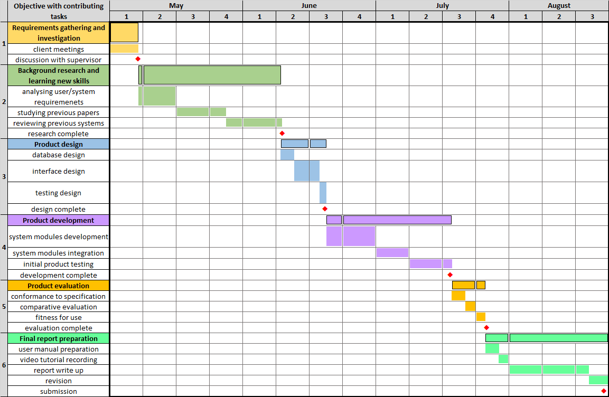
_Gantt Chart of the project_

The presented workflow was evaluated using the Plan, Do, Study, Act (PDSA) cycle. The PDSA framework consists of four parts which are continuously reviewed during the working process to be iteratively replaced by the most effective solution. The single sections ensure to examine the four components of quality management: planning, assurance, control and improvement. It is a suitable structure as the development is continuously tested, which does not lead to the confusions raised while reviewing the entire progress at once in the end. The actions taken in each of the elements have been listed in the particular sections of the diagram.


_Credit: [Tribal Evaluation Institute](http://www.tribaleval.org/cqi/plan-do-study-act-pdsa/)_

In order to mitigate the issue, the iterative concept of PDSA cycle was blended with each of the tasks mentioned in the figure above. Working under the two structures can make sure to push the project while iteratively improving the single dependencies.

## Technical background

The currently utilised techniques in the university department include the use of MIPAR, ImageJ, AZtec and HKL CHANNEL 5 software applications. Moreover, the researchers also employ entirely manual (pen-and-paper) approaches, such as the use of AGI method to detect average grain size diameter and mesh to calculate particle-size distribution, which might not be the most effective approaches in the times of automating various processes by accelerating the available computing power of digital transformation period. As discussed with the client, the current solutions are very time-consuming, error-prone and applied with no or little automation process, what will be improved in this project.

The manual methods tend to take from a few hours to around 30 hours to calculate, for example, the area distribution. Some of the staff tends to use some post-processing analysis software such as ImageJ; however, there is a lack of belief in the accuracy of the automatic processes, and research department prefers the complete manual methods most of the time. As such, the automatic micrograph analysis system developed in this project has to include an option to verify its segmentation before continuing with the analysis process.

The following table compares the cost and availability, which are one of the primary system requirements, as the solution should have an open code available to the client.

|   **Technology**   | **Type** | **Cost** |   **Availability**   |
| --- | --- | --- | --- |
|   Python   | Programming language | free | Windows, macOS and Linux |
|   MATLAB   | Software/scripting | commercial (free trial) | Windows, macOS and Linux |
|   MIPAR   | Software/scripting | commercial (free trial) | Windows, macOS |
|   ImageJ   | Software/scripting | free | Windows, macOS and Linux |

By analysing the costs, it can be determined that two of the four entries are not the most suitable for the project from the fact of having a commercial license. However, MATLAB and MIPAR allow the use of the trial version and often offer a student license which might find its use of research departments located at the universities.

All the techniques have the entire cross-platform availability on the desktop systems, except MIPAR, which does not run on the Linux operating system (OS) yet. Software unavailability on the Linux OS is still not a significant issue as according to the StatCounter report about the usage of desktop OS, in July 2018, Linux shares only 1.71% of the market, whereas Windows reaches 82.88%, and macOS 12.55%[^9], what places them on a market leadership position.

Moving towards the essential functions required in the implementation, the following table thoroughly analyses the technical possibilities of the four platforms.

|   **Technology**   | **Image analysis components** | **Advantages** |   **Disadvantages**   |
| --- | --- | --- | --- |
|   Python   | ·   Image processing (Scikit-image, OpenCV)  ·   Scientific operations (SciPy) | ·   Easy application of machine learning methods  ·   Extensive number of algorithms to apply  ·   Freedom of GUI implementation (web or desktop application)  ·   Great support from the users  ·   Well suitable set of libraries for image analysis | ·   Development requires good programming expertise  ·   Lack of direct functions that would satisfy most of the user requirements  ·   Time-taking development    |
|   MATLAB   | ·   Image segmentation (image processing toolbox) | ·   Availability of machine learning tools  ·   Better usability as of popularity among students/universities  ·   Great support from the users | ·   Lack of direct functions for image analysis  ·   In-software limitation |
|   MIPAR   | ·   Image processing functions  ·   Image analysis methods | ·   Directed towards research environment  ·   Lots of built-in image operations  ·   Option to record the steps  ·   Simple user interface  ·   Vast amount of built-in functions | ·   Closed application  ·   In-software limitation |
|   ImageJ   | ·   Image processing functions  ·   Image analysis methods | ·   Availability of machine learning segmentation  ·   Availability to write automation scripts in different languages  ·   Directed towards research environment  ·   Great community/support  ·   Lots of built-in image operations  ·   Multiple distributions focusing on different industries  ·   Open-source application  ·   Specific documentation | ·   Closed application  ·   In-software limitation |

All of the compared solutions are considerably expendable; however, MATLAB and Python are more general technologies and are not as functionally gifted for the image analysis operations as MIPAR and ImageJ.

### Summary of techniques

Taking all the system criteria and characteristics into account, the project has been developed in ImageJ application. The primary influence to decide for ImageJ was its pure dedication to image analysis and focus on the research environment. Moreover, in comparison to highly similar software - MIPAR, ImageJ has a broader community, is entirely free of cost, available on all the platforms and has a more significant number of add-ons. ImageJ also includes well-implemented programming language support and machine learning algorithms. Most importantly, the code used for automation is more self-explanatory and might benefit future researchers who would like to use and expand the system.

## Design

The simplified working of the system (presented in [this graph](https://pawelcislo.com/wp-content/uploads/2018/09/Micrograph_Analyser_Workflow_Graph.png)) reassembles the waterfall model with several loops in between, which check the input support, allow the user to verify the segmented particles and provide the option to run multiple analysis without opening the script separately for a single run. Because of many operations required to represent the entire system, the following workflow has been simplified for the reason to facilitate the system understanding. Additionally, the Micrograph Analyser workflow has been described in depth with user manual, video tutorials and in-code description using programming comments.

The following table summarises the system specifications required to perform the analysis. One of the ImageJ advantages over different application is its low storage space requirement, which in comparison to the minimum requirements of MATLAB, needs less than half of its space. On the other side, it exceeds the demand for a potential Python solution.

|   Storage space   | ·         Around 414 MB for all the necessary system files  ·         5 MB for the output of all the requested analysis of an average micrograph image (2.3 MB TIFF file with a 1024x768x24 resolution) |
| --- | --- |
|   Software   | ·         ImageJ or Fiji software  ·         Graph and NND plugin  ·         BioVoxxel and BAR toolbox |
|   Operational System (OS)   | Cross-platform system running as a desktop application on:  ·         Windows XP, Vista, 7, 8 and 10  ·         Mac OS X 10.8 "Mountain Lion" or later  ·         Linux on amd64 and x86 architectures |

### Algorithm

Image segmentation in the ImageJ software can be applied in two separate ways. The first one that has been applied in this project is through classical image thresholding, and the other is through a machine learning algorithm. Both of the available methodologies have their flaws and profits which have been summed up in the following table.

| **Methodology** | **Advantages** | **Disadvantages** |
| --- | --- | --- |
| Classical thresholding | ·   Can be used externally as a library  ·   Quick application time during the script’s execution  ·   Well-adjusted becomes suitable for many kinds of images | ·   Cannot perform well in all the micrograph types  ·   Time-taking development process |
| Machine learning segmentation | ·   Can be used externally as a library  ·   Learns how to perform thresholding on its own and does not need utilising any other image pre-processing tools  ·   Longer application time during the script’s execution  ·   Sufficient optimisation can perform better than any other thresholding method  ·   Versatility – can be used for segmentation, boundary detection and object detection | ·   High computational cost  ·   Needs separate adjustment for every different kind of micrographs  ·   Requires great development time in order to perform better  ·   The user is required to perform input labelling – drawing multiple lines across different classes on the image |

The machine learning available in ImageJ is not entirely self-learning. In the current project, the given dataset of images only contains training data, missing testing examples, what does not stop from using the algorithm. Utilising the "Trainable Weka Segmentation" designed by Arganda-Carreras et al in 2017 is possible only through input labelling[^10]. That means, ImageJ requires from the user to draw lines across different classes on the image, so the machine learning algorithm can differentiate between them and apply the segmentation. The good thing about this option is the ability to pretrain the model and save its classifier for further analysis.

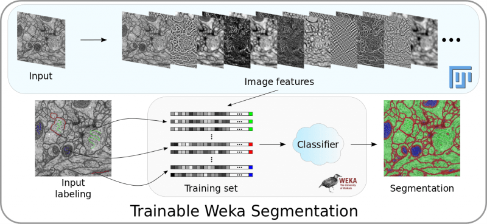
_Trainable Weka Segmentation pipeline overview[^10]_

The utilised segmentation algorithm in this project utilises the following workflow:

1. Run machine learning segmentation instead of automatic thresholding (optionally)
2. Transform input into the 8-bit image
3. Apply automatic threshold (IsoData algorithm) by taking the pixel values \[latex display="true"\]threshold = \\frac{average\\quad background + average\\quad objects}{2}\[/latex\]
4. Convert input into binary values
5. Remove small particles from the image (outliers) (optionally)
6. Fill holes in particles on the image (optionally)
7. Apply watershed algorithm on the image (optionally)
8. Exclude particles on edges during the analysis (optionally)
9. Include holes of particles in the analysis (optionally)

The reason for using and predefining manual thresholding in this project is because of its usability. Once defined it can be used for any images; however, the machine learning algorithm has to be predefined for every new kind of a micrograph structure which makes it not the best choice for the whole project. Furthermore, the testing stage showed that the manually defined thresholding was very effective on all the kind of micrograph images submitted by the client.

### Code

The following snippet is just a part of the entire script to calculate and generate the area distribution plots. The code snippet shows one of the advanced possibilities of using ImageJ Macro code, what is done in less than a second and doing it manually would highly increase the time and make the process error-prone.

```
// ==========RUN AREA DISTRIBUTION (OPTIONALLY)==========

if(chosenOption[3]==1) {
    // SET BATCH MODE OFF (DISPLAY IMAGES WHILE RUNNING MACRO)
    setBatchMode(false);

    // MAKE SLICES OF THE IMAGE
    run("Montage to Stack...", "images_per_row="+input_images_per_row+" images_per_column="+input_images_per_column+" border=0");
    stack = getTitle();
    run("Set Measurements...", "area mean centroid feret's area_fraction stack display redirect=None decimal=3");

    // GET NUMBER OF SLICES AND ASSIGN IT TO THE VARIABLE
    n = nSlices;

    // MAKE DIRECTORY FOR PLOT OUTPUTS
    dir_plot=dir3+"PLOTS"+File.separator;
    File.makeDirectory(dir_plot);

    // MAKE MONTAGE
    if (image_montage==true) {
        selectWindow(stack);
        run("Make Montage...", "columns="+input_images_per_row+" rows="+input_images_per_column+" scale=0.50 font=50 border=3 label");
        selectWindow("Montage");
        saveAs("Tiff", dir_plot+"Montage of "+image_title+".tif");
        close();
    }

    // START OPERATIONS
    for (slice=1; slice<=n; slice++) {
        showProgress(slice, n);
        selectWindow(stack);
        Stack.setSlice(slice);
        if(image_slices==true) {
         saveAs("PNG", dir_plot+"Slice #"+slice+" of "+image_title+".png");
        }
        else {
            rename("Slice #"+slice+" of "+image_title+".png");
        }
        rename(stack);
        run("Analyze Particles...", "  size="+min_size+"-"+max_size+" circularity="+min_circularity+"-"+max_circularity+" show=Nothing slice");
        saveAs("Results", dir_plot+"Overall Analysis Results of slice #"+slice+" of "+image_title+".csv");
        run("Distribution Plotter", "parameter=Area tabulate=[Number of values] automatic=Freedman-Diaconis bins=24");
        low_resolution_plot_title = getTitle();
        Plot.getValues(x, y);
        // CLEAN "RESULTS" TABLE AND TRANSFER PLOT VALUES TO IT
        run("Clear Results");
        Table.setColumn("X",x);
        Table.setColumn("Y (bin value)",y);
        Table.update;
        saveAs("Results", dir_plot+"Distribution Plot (bin) values of slice #"+slice+" of "+image_title+".csv");
        run("Clear Results");
        run("Close");
        // GENERATE HIGH RESOLUTION PLOT
        Plot.makeHighResolution("Histograms for slice #"+slice+" of "+image_title+"",4.0);
        // SAVE THE PLOT
        saveAs("PNG", dir_plot+"Distribution Plot of slice #"+slice+" of "+image_title+".png");
        high_resolution_plot_title = getTitle();
        // CLOSE THE WINDOWS
        selectWindow(low_resolution_plot_title);
        run("Close");
        selectWindow(high_resolution_plot_title);
        run("Close");
    }

    // CLOSE "STACK" WINDOW
    selectWindow(stack);
    run("Close");
}
```

The overall code of this project takes around 2000 lines, as so, not all the code snippets will be analysed in this post; however, the entire code contains comments preceding each functionality, just as visible on the first line of the snippet above (“RUN AREA DISTRIBUTION (OPTIONALLY)"). The code is also well aligned using indentations to mark the dependency from loops.

All the files (together with the code) required for the system execution have been placed in the [GitHub repository](https://github.com/pyxelr/automatic-micrograph-analyser).

### User interface

Every user of the Micrograph Analyser is required to open Fiji, which on auspicious start opens as a single narrow window in which most importantly, the user can:

- Open images
- Apply modifications using functions/tools available in the toolbar
- Save modifications
- Write new plugins.

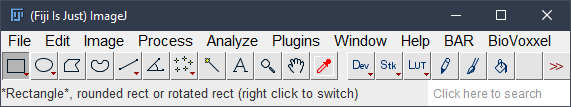
_Fiji (main window)_

After installing my script and running it, the user is welcomed with the following window presenting two options. The first radio button allows selecting only one file in the consecutive menu, whereas the other the entire directory of files. The purpose of the additional message is to make it clear to the user what is offered through each of the options.

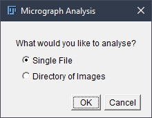
_Starting window of Micrograph Analyser_

The micrograph’s script supports only the image file types. In a case when the user, for example, submits a .pdf file, he will be presented with the following message.

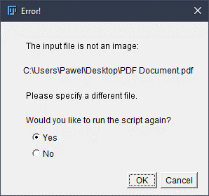
_Error prevention_

After selecting one of the available options and later the micrographs taken into the workflow, the user has to define the analysis specifications.

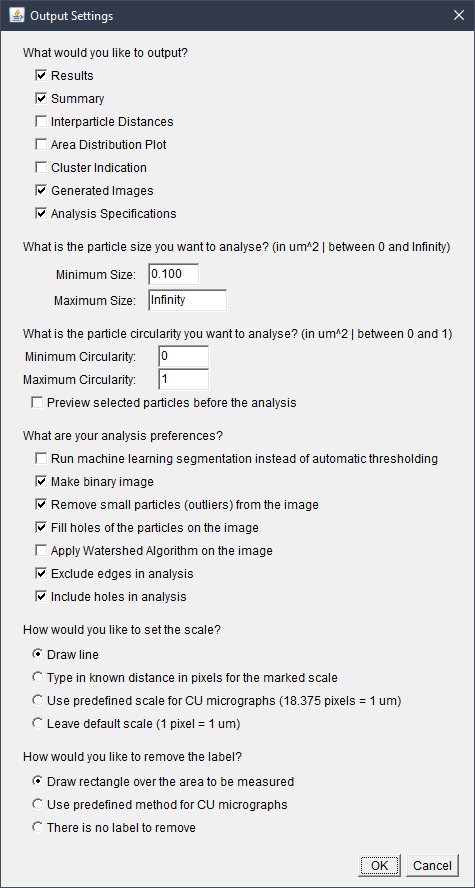
_Settings specifications_

By default, the most desired parameters are selected/prefilled in all of the menus, and one of them is defined to mark the micrograph’s scale manually. To manually set the scale, the user is required to use the pointing device (mouse/touchpad) and drag a line across the marked scale. The displayed hints in the background inform the user about the available shortcuts to zoom in for better precision. Afterwards, the operation of removing the label looks similar, but the requirement is to draw a rectangle over the ROI, leaving the label outside.

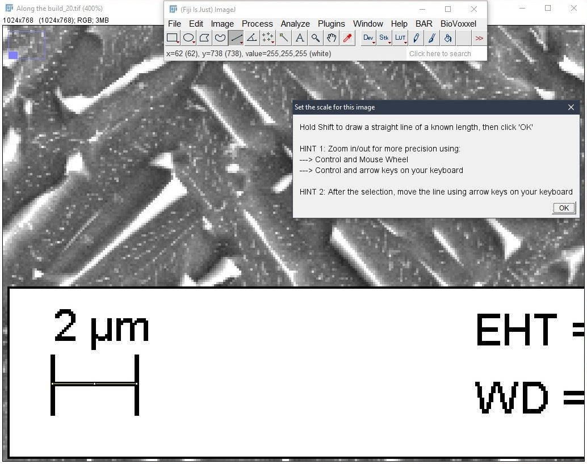
_Manual scale setting_

Clicking “OK” continues the workflow with a “Known distance” menu, where the default values of 2 um have been prefilled to save the time while analysing the most common micrographs.

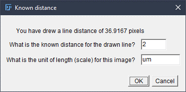
_Specification of known distance_

On condition of leaving a check mark next to “Preview selected particles before the analysis” option under particle’s size specification of “Output Settings” menu, the analyst can see the original and processed image to decide if the selection is satisfying, as presented below ([click here for better resolution](https://pawelcislo.com/wp-content/uploads/2018/09/Particle-verification.png)).

This option has a crucial meaning while making the right selection as some of the micrographs might present more than one type of particles, and the user might want to experiment with the particle size and circularity until the rights units are segmented.

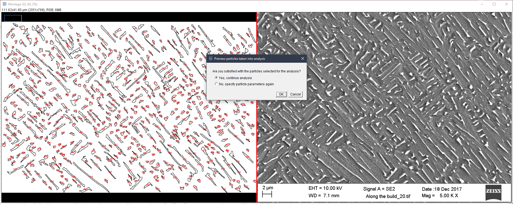
_Particle verification (left side: outlined image, right side: original input) ([click here for better resolution](https://pawelcislo.com/wp-content/uploads/2018/09/Particle-verification.png))_

On the successful analysis, the user will be informed about it and left with an option to run the analysis again.

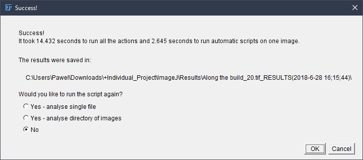
_Success message_

## Example results

_You can also directly view all the files in the [GitHub Repository](https://github.com/pyxelr/automatic-micrograph-analyser)._

The entire workflow starts with submitting one of the sufficient input files.

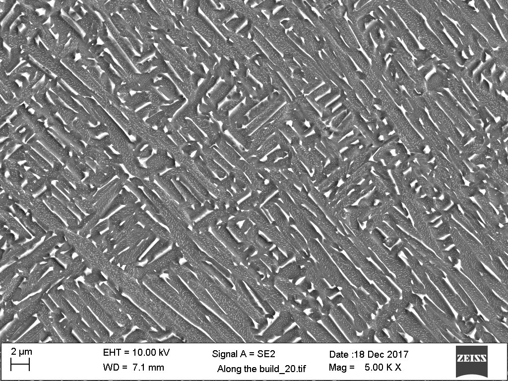
_Example input_

Later, on a successful analysis, the output data about each of the particle has been summarised in [this table](https://pawelcislo.com/wp-content/uploads/2018/09/Result-data-from-the-micrograph-stored-the-main-“RESULTS_filename.csv”-file.png). Most of the data is saved in calibrated units, like μm. The bottom part of the .csv file summarises entire data with minimum, maximum, mean value and standard deviation.

Furthermore, the separate summary of the overall results contains most importantly of precise information about the most desired information to the client: particle count, the total area of the micrograph, area fraction and calculated particle density.

The visual results present as follows:

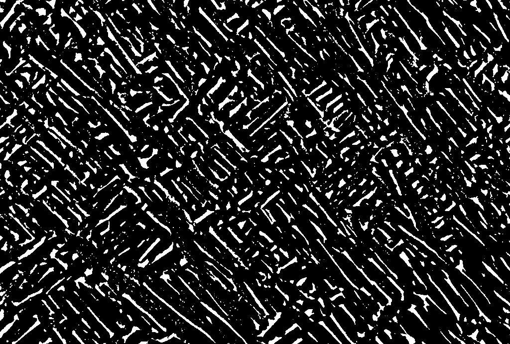
_Segmented micrograph with white particles and black background (example)_

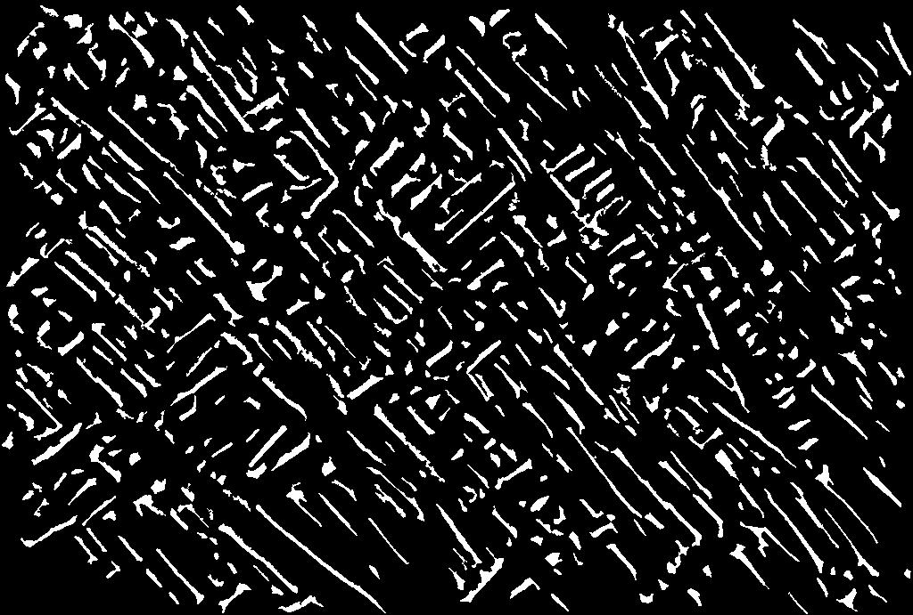
_Cleaned micrograph (example)_

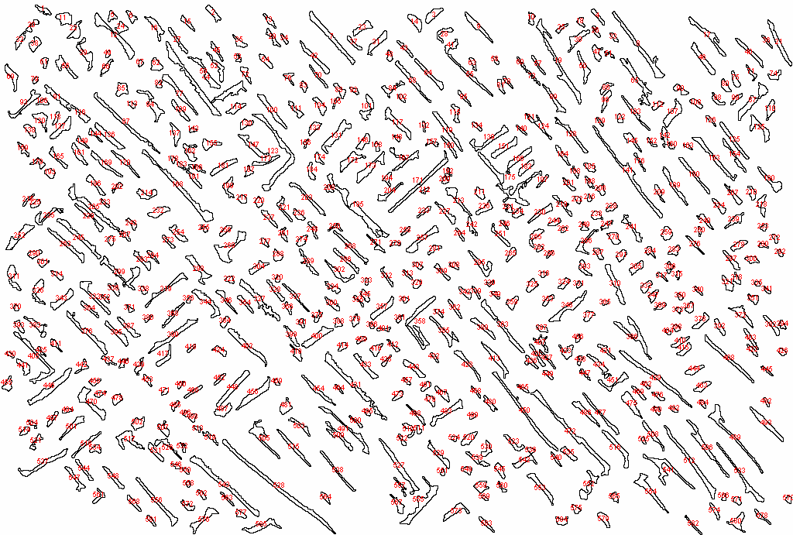
_Micrograph with outlined and numbered particles (example)_

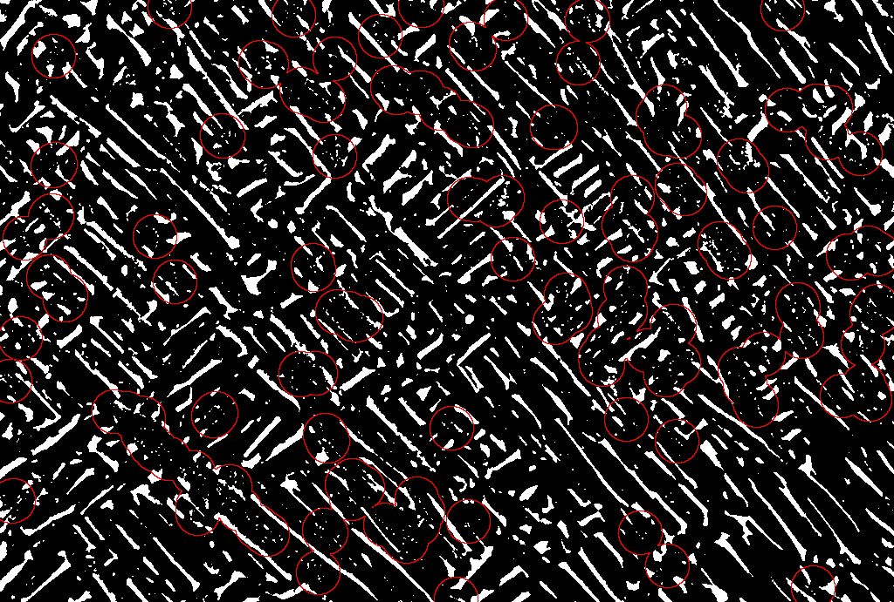
_Cluster identification with red circles (example)_

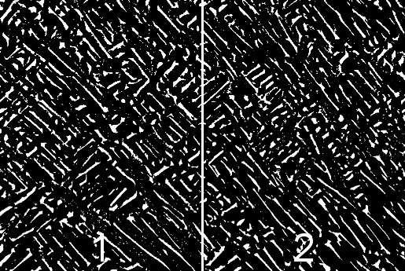
_Montage of different particle's area for area distribution plots (example)_

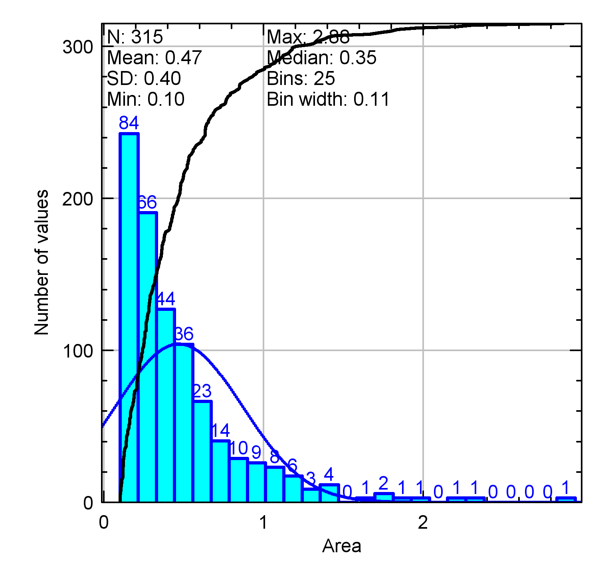
_Area distribution plot (example)_

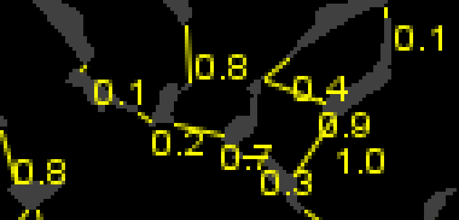
_Part of an image with interparticle adjacencies (example)_

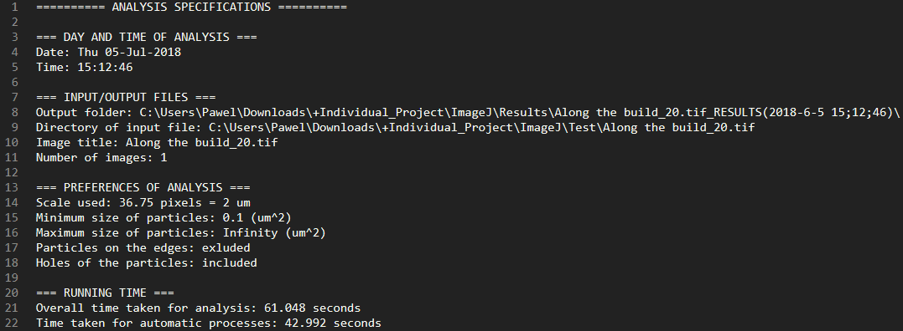
_Overall analysis preferences (example)_

Summarising, the system can generate data that can satisfy the different needs of the researchers. In case of another feature inclusion or system modification, the code has been prepared to be extendable.

## Comparative evaluation

Running the two algorithms (automatic thresholding and weka machine learning) on the example micrograph gives the following results of time and CPU consumption.

| Characteristic | **Automatic Thresholding** | **Trainable Weka Segmentation** |
| --- | --- | --- |
| Time | 1-2 seconds | 20 seconds for manual labelling and 45 seconds for automatic training |
| CPU Usage | Almost without change | Increase from 17% to a range of 50-100% |

The results indicate that Automatic Thresholding takes much less time, usually around 2 seconds, whereas Trainable Weka Segmentation can extend to more than one minute of the overall segmentation process, depending on the base hardware, as it requires much more processing power to give the results.

The example micrograph presented below (left) has been segmented using both algorithms, which indicates that although the Trainable Weka Segmentation (middle) uses much more resources, its result is only slightly more accurate in this case. The right part of the image presenting the Auto Thresholding result did not perform the cleaning step and particle selection process yet, that afterwards removes the secondary-α particles segmented from the background and looks like “Cleaned micrograph (example)” presented in “Examples of Results” subchapter.

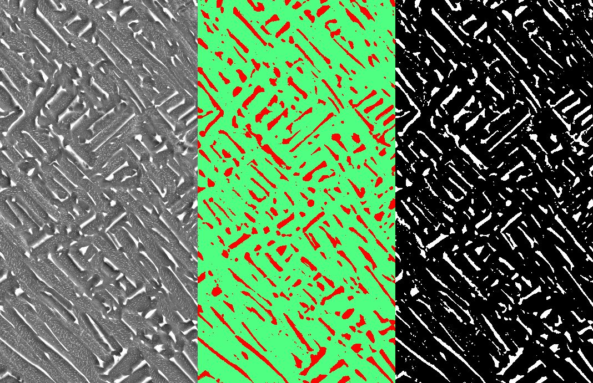
_The original area (left) segmented with Trainable Weka Segmentation (centre) and Automatic Thresholding (right)_

Not to leave the testing using only one example, the algorithms took into consideration more advanced images. The more complex structure presented below is tested at the initiative of one of the Coventry University researchers, who used it in one of his research papers[^11]. Because of its low quality, it was a good testing example, where different algorithms were applied to verify the segmentation.

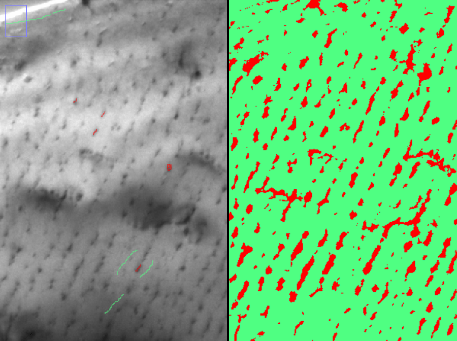
_Example of Trainable Weka Segmentation (left side – input with marked classes, right side – output)_

Unfortunately, the implemented thresholding algorithm in the developed system could not perform well, due to a complex structure of the image. However, applying Trainable Weka Segmentation available in ImageJ generated the image on the rights side in only one minute. Afterwards, the image would need to be inserted into the Micrograph Analyser in order to generate the analysis results.

To summarise, the advantages and disadvantages of the mentioned techniques have been compared in the table below.

| Algorithm | Advantages | Disadvantages |
| --- | --- | --- |
| **Automatic Thresholding** | ·   Does not require user’s effort  ·   The fastest method of all the available | ·   Does not inform about the error-bound  ·   Does not perform well for all types of images |
| **Trainable Weka Segmentation** | ·   Can adapt to complex images  ·   Provides error-bound information on the selection process | ·   Requires from user to add traces over the ROI  ·   More time-consuming than Automatic Thresholding |
| **Completely manual (pen and paper)** | ·   Does not require any hardware and software installation | ·   Low-quality results  ·   Time-consuming  ·   Does not inform about the error-bound |

## Project evaluation

The entire project has been a great exercise over the management and development of a “software engineering” type project. It was a great lesson, which taught the author a lot about time management, working with a client, software development and image analysis techniques. To summarise the evaluation, strengths and weaknesses of the project have been grouped in the single table.

|   **Strengths**   |   **Weaknesses**   |
| --- | --- |
| ·         Background insight given by the project client and PhD students  ·         Communication with the client leading to mutual understanding  ·         Detailed requirements collecting  ·         Project management plan  ·         Fitness for the use of the system  ·         System workflow  ·         Usability of the final product  ·         In-depth project explanation leaving a comfortable open space for further work | ·         Current limitation lacks machine learning segmentation  ·         Lack of time and possibilities for extended testing (EBSD scan data comparison)  ·         Problem with meeting the client regularly (solved by continuous meetings with PhD students)  ·         Testing limitation mainly to ImageJ technology    |

## GitHub repository

Under the next heading, you will find the implementation process; however, you might simply prefer to read it on the [repository page](https://github.com/pyxelr/automatic-micrograph-analyser).

### Implement it by yourself

Taking into consideration the potential usefulness of the script, I thought of sharing all the essential files with a short instruction for your appliance. I understand that some of the end users might prefer to choose between text and graphical based tutorial, as such, I have prepared both versions of the tutorial.

#### Option 1 (text-based)

_Recommended for more technical users, especially those familiar with the use of Fiji._

The 8-page manual consists of the essential knowledge, which steps by step informs the installation process.

Here you can download the text user manual:

[📄 User Manual](https://pawelcislo.com/wp-content/uploads/2018/09/User-Manual.pdf)

#### Option 2 (video-based)

_Recommended for everyone, especially for less technical users._

In case you prefer to follow on-screen instructions, you might want to watch these five videos of a single playlist. In comparison to the user manual, the following YouTube playlist discusses the entire process of implementation in a more specific way, from downloading the files to reading the analysis results.

<iframe
  width="560"
  height="315"
  src="https://www.youtube.com/embed/videoseries?list=PLMzKVaLgphQcEBCz313qfkpeq3UDqXlAg"
  title="YouTube playlist"
  frameborder="0"
  allow="accelerometer; autoplay; clipboard-write; encrypted-media; gyroscope; picture-in-picture"
  allowfullscreen>
</iframe>

## Further work

The first proposition is to try to develop the system which would satisfy the same user requirements using the technology that is available at the moment (especially U-Net, Python, Scikit-image). Because of the continuous advancement of the digital information, especially the possibilities under the term of artificial intelligence, the same kind of a project might be created in a better way, achieving better results, time and ease of use. I believe that it will be possible to use a specific neural network for biomedical scan analysis, that would require only submitting the input image and all the workflow will be handled by the algorithm, from setting the scale, removing the label, segmenting the particles and generating the results in a better time.

Secondly, from the comments of one system tester, it would be an excellent step to further compare the results with the data generated from EBSD scans.

Some of the micrograph scans are saved with a DM3 extension, instead of the most popular TIFF. In comparison to other types of formats, DM3 stores metadata about micrograph scans inside itself, such as the used scale and resolution. ImageJ offers reading DM3 files; as such, it would make a possible extension to include the support of this format so that the user would not need to set the scale[^12]. The file format was not used in this project, as the research department provided preferred TIFF files which take less time in the generation process.

The last proposed extension possibility is to try and include the addition of a sensitivity analysis of the results. The measurement of reliability would most probably require the implementation of machine learning algorithm, that would be trained to understand what is the correct output and would likely inform about the correctness of the segmentation. Such a feature is already offered in Trainable Weka Segmentation that plots a result graph which presents model performance chart. I̶m̶p̶l̶e̶m̶e̶n̶t̶i̶n̶g̶ ̶t̶h̶e̶ ̶W̶e̶k̶a̶ ̶S̶e̶g̶m̶e̶n̶t̶a̶t̶i̶o̶n̶ ̶i̶n̶ ̶t̶h̶e̶ ̶s̶y̶s̶t̶e̶m̶ ̶w̶o̶r̶k̶f̶l̶o̶w̶ ̶a̶s̶ ̶a̶n̶o̶t̶h̶e̶r̶ ̶a̶l̶g̶o̶r̶i̶t̶h̶m̶ ̶c̶h̶o̶i̶c̶e̶ ̶i̶s̶ ̶o̶n̶e̶ ̶o̶f̶ ̶t̶h̶e̶ ̶e̶a̶s̶i̶e̶s̶t̶ ̶a̶n̶d̶ ̶v̶e̶r̶y̶ ̶p̶r̶a̶c̶t̶i̶c̶a̶l̶ ̶s̶t̶e̶p̶s̶ ̶t̶h̶a̶t̶ ̶w̶o̶u̶l̶d̶ ̶e̶x̶t̶e̶n̶d̶ ̶t̶h̶e̶ ̶s̶y̶s̶t̶e̶m̶ ̶t̶o̶ ̶b̶e̶ ̶a̶b̶l̶e̶ ̶t̶o̶ ̶a̶n̶a̶l̶y̶s̶e̶ ̶c̶o̶m̶p̶l̶e̶x̶ ̶i̶m̶a̶g̶e̶s̶.̶  ← **Implemented in version 1.1 of the script.**

## References

[^1]: von Ardenne, M. (1938) 'Das Elektronen-Rastermikroskop'. _Zeitschrift Für Physik_ 109 (9–10), 553–572

[^2]: McMullan, D. (2006) 'Scanning Electron Microscopy 1928-1965'. _Scanning_ 17 (3), 175–185

[^3]: Carpenter, D.T., Rickman, J.M., and Barmak, K. (1998) 'A Methodology for Automated Quantitative Microstructural Analysis of Transmission Electron Micrographs'. _Journal of Applied Physics_ 84 (11), 5843–5854

[^4]: Rasband, W. (2008) _About NIH Image_ [online] available from <https://imagej.nih.gov/nih-image/about.html>

[^5]: Barry, E. (2008) _Three-Dimensional Reconstruction of Microstructures in A + B Titanium Alloys_. PhD Thesis. The Ohio State University

[^6]: Ronneberger, O., Fischer, P., and Brox, T. (2015) _U-Net: Convolutional Networks for Biomedical Image Segmentation_. [online] available from <http://arxiv.org/abs/1505.04597>

[^7]: Varando, G., Benavides-Piccione, R., Muñoz, A., Kastanauskaite, A., Bielza, C., Larrañaga, P., and DeFelipe, J. (2018) 'MultiMap: A Tool to Automatically Extract and Analyse Spatial Microscopic Data From Large Stacks of Confocal Microscopy Images'. _Frontiers in Neuroanatomy_ [online] 12. available from <https://www.frontiersin.org/article/10.3389/fnana.2018.00037/full> [15 September 2018]

[^8]: Miura, K. (2016) _Bioimage Data Analysis_ [online] available from <https://www.researchgate.net/publication/297738620_Bioimage_Data_Analysis>

[^9]: StatCounter (2018) _Desktop Operating System Market Share Worldwide | StatCounter Global Stats_ [online] available from <http://gs.statcounter.com/os-market-share/desktop/worldwide/#monthly-201807-201807-bar>

[^10]: Arganda-Carreras, I., Kaynig, V., Rueden, C., Eliceiri, K.W., Schindelin, J., Cardona, A., and Sebastian Seung, H. (2017) 'Trainable Weka Segmentation: A Machine Learning Tool for Microscopy Pixel Classification'. _Bioinformatics_ 33 (15), 2424–2426

[^11]: Rahnama, A., Clark, S., Janik, V., and Sridhar, S. (2017) 'A Phase-Field Model for Interphase Precipitation in V-Micro-Alloyed Structural Steels'. _Computational Materials Science_ 137, 257–265

[^12]: Baker, T. (2012) _Viewing Digital Micrograph DM3 Files_ [online] available from <https://cryoem.ucsd.edu/microscopes/DM3.shtm>
