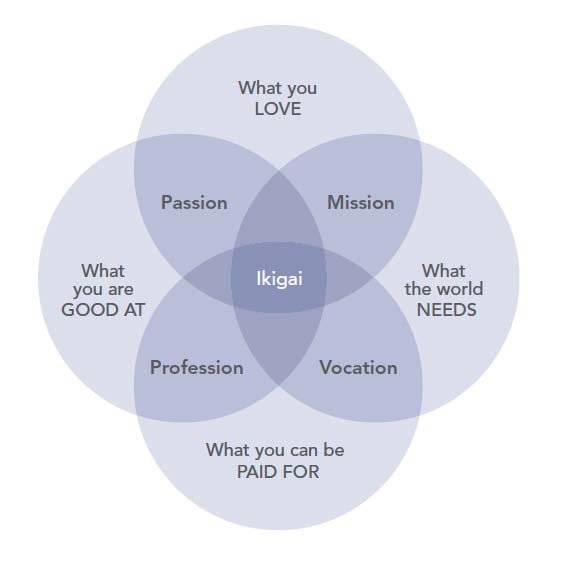

**Staying up-to-date with all the business aspects and at the same time trying to be innovative is quite a big challenge. Nowadays, the same applies to all the students, where the majority of graduates carries a higher academic degree, but struggles standing out in the eyes of recruiters. If so, how to win this game?**

## Introduction

Business & Technology. Last time, these two terms stick to each other more than ever before, such that it became a standard for every university to offer "Business Intelligence" modules. We all know that the world moves faster than ever before, creating a more rapid variation of Moore's law[^1]. So, how to stick to the current trends in order to prevent the failure or rise from it like Phoenix from the ashes? Well... first of all, we should hack our mind and start thinking how not to stick to the trends, but be ahead of the competition.

In the thumbnail/background image of this post, you may have noticed the term "[World Business Experience](http://www.wbexp.pl) (WBE)". Sounds intriguing, but what is it? Three days ago (27/09/2018) I have attended the all-day conference in Warsaw (🇵🇱), that did cost a little bit (~208 €), but just as every attendant, I will never regret spending any money for that time. The main star of the WBE was no one else but [Gary Vaynerchuk](https://www.garyvaynerchuk.com/) who was preceded with dozens of different stories from other business winners. All of the presenters were so great that I had come home with a quite considerable pile of notes ([pic](https://pawelcislo.com/wp-content/uploads/2018/09/WBE-Notes.jpg)), that I am trying to digitalise here, leaving the most fundamental framework.

Why did I decide to show up at the conference? What did I learn? What tools might help you with your business? My answer to all of these and more questions will be down below. Have a great time reading! 😉

_Gary Vee on stage!_

## Agenda

Let us start with summarising the core program of the day. My personal agenda would include much more activities (like waking up at 3 am for the bus 😴, ouch!); however, let's focus on the general timetable).

The agenda of the entire conference can be summarised into the 13 different presentations. All of the information can also be found on the [official website of the event](http://www.wbexp.pl); however, I have let myself to write it again, presenting only the presentation parts (pure fruit flesh of the day) and translating their titles (at the moment of writing this post, the 🇺🇸 version of the website returns my best friend - 404).

1. **Grzegorz Turniak** - Short networking session ← not exactly presentation, but a short introduction
2. **Paweł Danielewski** - "Small changes which are producing great results immediately. Marketing technologies for the 21st century"
3. **Janusz Kamiński** - "Building marketing strategies using many communication tools"
4. **Marcin Osman** - "Zero PLN Marketing – economy of gratitude in practice. Practical case study"
5. **Rahim Blak** - "Technologies of building your personal brand"
6. **Jakub B Bączek** - "How to create the industry of the future in Poland using business futurology, to make your business earn at least PLN 1 million a year and have no competitors?" ← this presentation was as massive as its title 😉
7. **Piotr Bijański** \- "Business, bankruptcy, satisfaction. How to start with 1 500 000 PLN debt to create your small empire**"**
8. **Melanie Nelson** - "Unstoppable business! Your business is only as good as yourself. Learn to master the common denominator of all your successes and failures"
9. **Daniel Kędzierski** - "How I earned 15 million in 3 years – Facebook Lead Generation"
10. Discussion Panel: **Barbara Sołtysińska**, **Lech Kaniuk, Paweł** \- "The latest models of promotion on the Internet"
11. **Cezary Lech** - "How to use content marketing to boost sales?"
12. **Łukasz Jakóbiak** - "What to do, to start executing?"
13. **Gary Vaynerchuk** - speech + about 1.5h Q&A

Looks impressive, doesn't it? Okay, now I will try to summarise the essence of that massive lineup.

I also encourage you to look into the [work of Draw the words](https://www.facebook.com/drawthewords/posts/1963690470351121?__xts__[0]=68.ARBj01CKukOg9aNMPmrSOg3Lzi9lxSHsa5KZ5BbbnNyxYeimstSSuv13uJj9HNO-DmlH6EfxzA5CTNZ71wQlVr7UwuGsm1Qb0wBjBG8o9864tq0_N_vgTIegH7UYr6u81sddqhviGqrakz4gm32dpUeg9OVCVaFydqHV65CiNaCAtYOZqZ1_Ow&__tn__=-R), who created summary infographics (in 🇵🇱) for most of the presentations.

## What I disliked in the conference and why small businesses fail?

The only part which I didn't like in the entire conference was in the beginning. Before the networking session, where we had about 20 minutes to talk with "as many participants" as we can, the introducer (Grzegorz) showed off that he got +1500 connections on LinkedIn, which was a useful fact in his eyes. Well, it is at some point, but I always preferred to be only around those that matter the most and don't necessarily mess my feed with irrelevant content.

The other thing that was the saddest to hear during the entire day was: "Networking is not for fun, but for money". Afterwards, Grzegorz asked if we planned any goals for this day, such as "I will make 10 more contacts", or the better one "I will look for as much inspiration as possible". Yes, it is good to plan your day, but I don't think that you should focus on numbers but quality when it comes to networking. I am mentioning all of that as this is one of the reasons why small businesses fail.

> _Keeping relations with people in your business just for the money may work in short, but not the long-term._
>
> — Own idea

Thinking about what I just scribbled down, you might see, that the previous problem indicates that people do not plan their goals for years ahead. You might get inspired by visiting my "[Three Goals](https://pawelcislo.com/three-goals/)" section on this website, where I encourage you to implement something similar. You might even copy my goals, and see how strong is your patience. Even if the goal sounds stupid, it might give you a significant advancement over your **regularity**.

**Patience** is another factor commonly mentioned by Gary Vee, together with **gratitude**, **passion** and **happiness**. You see, if you combine all of these, meaning that you work on something that makes you happy and keeps you focused, you need to stick to it. Master that skill and don't stop on your failures as everyone has to face them one day. Remember, without them, you will never learn. Moreover, **don't look for encouragement** from others and do what you like. **Don't be scared** of what others will think. **People hate change**, as we are taught in schools to follow the given rules in order to be safe and harmless to the world. Without a drastic transformation, you might at most be given a chance to live better by winning a lottery (but even that requires some effort to be in the prize pool). If you got someone who will support you in what you do (and it is not your mom), you have to understand, that it is better not to lose relation with this person, as it is rare to find someone like this.

_Wise words. Credit: wealthygorilla.com[^2]_

The other mistake people make in general is complaining. Complaining about everything – business problems, politics, education system, lack of time, headache. Listen, understand that everyone got some problems, even people who you consider to be successful. Now think, that if you come up to them with your complaints, they need to listen and store more issues in their head patiently. Maybe that can sound cruelly, but this is like spreading an invisible virus that makes other people unsatisfied in a slow process.

How to live then? Stop complaining? The solution is to start making the change from yourself. If you **begin these micro wins**, people around you will hopefully get inspired and do the same! I am the living example of someone who followed my inspirations long enough that today I am inspired to write this post for you on my own blog. You got the point; now I hope that you will be able to change at least a little bit in yourself. Most probably you already know that **you are the sum of 5 people you spend the most time with**, so now turn it the other way round and think about such a recursion "I want to motivate the 5 people that spend the most time with me, who will motivate another 5 people, who will motivate another 5 people (...)". Indeed, that has vast potential, but we need to start executing from ourselves!

**Do not look for approval in everything you do! Stop watching the evening news that makes you miserable** (you will notice that you are not going to die, not knowing what is going on in the world)! By the way, thinking that you are going to die is one of the best motivations.

Cool. Enough of _coaching_. Let's talk a little bit about what happened during the day.

## What did I learn?

### Notice the trends and predict them

Why do companies like to invest in business/data analytics? To notice what are the trends in the market and own organisation.

Why do companies like to hire data scientists? To predict the future; however, the data won't always indicate it right and might be futile.

The other way to get that information is to listen to someone with experience, like Jakub B Bączek, who introduced three upcoming trends. The sooner you act upon them, the more advantage you will have over your competitors.

1. **Migration** of multi-culture caused not only by the global warming. • _Description_: here in Poland we might expect to have more and more immigrants over the year who will come from different ethnicities. That will be partly caused by politics and partly by the global warming near the equator. • _Solution_: start modifying your business to satisfy immigrants from tier 3 (figure below). You can do that for example by offering multilanguage support and diversity of products.

_The Three Tiers of Noncustomers. Credit: Blue Ocean[^3]_
2. **Technologization** ---> AI ---> dying professions. • _Description_: 47% of jobs in the US are in the risk of extinction (99% call centre, 98% judges, 97% cashiers, 96% chefs, 94% waiters, 89% drivers (...) but less than 1% of archaeologists 🤔 • _Solution_: prepare to learn something that won't be automated in the near future. These are mostly professions that include emotions (motivator).
3. **Welfare** ---> civilization diseases (overweight) ---> loss (depression). • _Description_: rapid growth in IT causes civilisation diseases, making people feeling lost. • _Solution_: diversify your business for diversity, be innovative and solve global problems. Maybe you can get inspiration from the following graph:

_Aspects of physical exercise. Credit: Biohacker's Handbook[^4]_

Gary also added something from his observations, that were connected with the 🇵🇱 market.

- use Facebook/Instagram adds till they are cheap. Yes, especially here in Poland. You should do it now as later when big brands start investing in social campaigns, you will lose spending waay too much into sponsored posts. You might want to Google "how to make FB adds for cat food" if you are about to compete with Whiskas.
- promote yourself with podcasts. About 80% of the attendants raised their hand when Gary asked: "Who is listening to podcasts nowadays?". And you know what? Only 13 people did it when he modified the questions and asked: "Who listened to podcasts 3 years before".

### Give, give, give

Implement the principle of gratitude: **give, give, give, ask**. This rule is more specifically explained in "Jab, Jab, Jab, Right Hook" book by Gary[^5].

Remember, you should be grateful that people spend their time on consuming YOUR stuff as they could have been doing something else, like watching cat videos. Time is more important than money and you should know that.

Don't stop on making some good content as it is the drug that works.

### Be innovative, be a rebel

This advice was given not only by Marcin Osman but Jakub B Bączek, who was one of the first one to get standing applause. Indeed, he was one of the best speakers together with Łukasz Jakóbiak from the [20m2](https://www.youtube.com/channel/UC8iQVu0b7PZxL_LTl8-c0Kg) YouTube show. Lack of innovation is also one of the reasons why businesses fail, simply look on Facebook who took didn't leave any chance to Google+ service.

Rahim Blak is a great example of the rebel. Do you know that Rahim was one of the firsts to "sell himself" by having his personal token? He received a lot of critic about it; however he didn't care and in the end, he is proud of himself.

People are scared of things that are unknown… so try to do them! Big brands work comfortably with uncomfortable stuff and this is why they succeed. Moreover, remember that creative leaders are rebels.

> _New levels bring new devils. Stay unapologetically committed to your goals and let go of anyone who poisons your spirit._
>
> — Steve Maraboli

Did you know that to be recognised Łukasz Jakóbiak hanged a huge CV next to the headquarters of EMI Music Poland?

_Woah! Credit: WP[^6]_

### Don't waste time looking for the right tools

Another important advice from Marcin Osman. This was repeated in his slides many times, as so many of us stop doing what we want because we don't have the right skills or tools yet. His example was that we stop ourselves from recording vlogs looking for the expensive camera, which we cannot even use properly. So how to record? Use your mobile phone, eventually with an external microphone. Yes, you read it right. Do you know that most of Marcin's content was recorded with his iPhone, such as his most popular video (below)?

<iframe
  width="560"
  height="315"
  src="https://www.youtube.com/embed/a8shV4JR4UI"
  title="YouTube video player"
  frameborder="0"
  allow="accelerometer; autoplay; clipboard-write; encrypted-media; gyroscope; picture-in-picture"
  allowfullscreen>
</iframe>

As you see, the quality is great. He did mention an external microphone as people prefer to understand your voice than to see you well. You don't need anything better as you won't even know how to use it and you will lose your time researching the right camera + lots of money. By the way, as you might see "Don't drink latte for 15 PLN" on the thumbnail is done on purpose. It is controversial, and that is what gains views.

### Focus on video

"In five years, Facebook will be probably based only on video" ~ Cezary Lech.

How to find what is popular? If you look into the YouTube channel of Gary Vee and sort it by [his most popular videos](https://www.youtube.com/user/GaryVaynerchuk/videos?sort=p&view=0&flow=grid), you might notice that what sells is motivation. That is why you might consider advertising your product with a dose of motivation in the add.

Listening to all the presentations, I have noticed the word video regularly. The mix of visual graphics, audio and text is something that is the most comfortable to consume, and it is much easier than before to produce it. You will find the list of video tools down below in the "Tools" chapter.

#### Ads don't have to be boring

One of the examples given by Cezary Lech was this little ad of [SquattyPotty](https://www.squattypotty.com/).

<iframe
  width="560"
  height="315"
  src="https://www.youtube.com/embed/YbYWhdLO43Q"
  title="YouTube video player"
  frameborder="0"
  allow="accelerometer; autoplay; clipboard-write; encrypted-media; gyroscope; picture-in-picture"
  allowfullscreen>
</iframe>

Yes, it is an ad, yet so enjoyable to watch. Okay, let's analyse the magic of why it got 34,870,317 views so far and is entertaining.

1. Get attention (0:00)
2. Indicate the problem (0:16)
3. Strengthen the problem (0:25)
4. Present the solution (0:37)
5. Present the product (0:53)
6. Present the results and benefits (1:20)
7. Call to Action (CTA) (1:45)
8. Social proof (1:53, 2:04)

### Money = happiness

We shouldn't lie to ourselves. It is bloody true. Imagine someone riding his Jet Ski on clear water with dolphins jumping around. It was a good point given by Melanie Nelson.

However, when you pursue your goals remember that health is your #1 asset! Personally, I am not sure how, but I survived my busy last year of master's degree in the UK. I do know, that if I didn't follow the most typical healthy rules such as eating fruits, I could have been in hospital by now.

### Build a marketing campaign

Paweł Danielewski introduced one of the most efficient marketing frameworks.

1. Build awareness of your brand, answer "what am I doing?" • promote the motivational video to gain customers.
2. Get micro-actions (check "Tools" chapter below)
3. Get your contact • for example for access to a free webinar
4. Convert your contact into a client
5. Double the excitement • everyone likes two gifts more than one. Give something for free after some time of giving something for free before, like another e-book
6. Ladder of growth • build additional services

One more tip given by Paweł was to use the QUIZ method. Instead of a classic registration form to the newsletter (like on my website), you might start with asking an encouraging question. For example, what is your favourite car brand and what colour would you choose. After that, present the user with the registration form. Statistically more users might end up with registration.

Another tip is to include your phone number below the form as some customers prefer to solve everything by calling you.

#### Automate

Afterwards, Łukasz Kamiński presented a few ideas of what we can automate in our marketing campaign:

- progressive forms
- dynamic offer
- message cycles
- client segmentation
- segmentation after clicks
- automatic direction to the document
- recommendation systems like Amazon e-mails ("Recommended cat toys as you bought Whiskas")

Client segmentation for the automation purpose may be divided into three categories:

- hot (very little number of clients who will buy your product, no matter what)
- warm (you need to talk with them a little bit)
- cold (most of the clients who are the hardest to convince)

#### CUBE Marketing System

CUBE = Client, Understand, Beginning, Effect

Łukasz also let us take a picture of his secret practical table (filled with examples) that might help you deal with your customers:

|  | **Place, where is he now?** | **Place, where he wants to be?** | **Who will he become if he buys that?** | **What will he lose if he won’t buy it?** |
| --- | --- | --- | --- | --- |
| **Professional challenges** | sitting job, stress at the job, challenges, integration problems, learning cooperation in the team | energy for action, integration with a team, better score, promotion | becoming creative, fulfilled | chance for promotion, chance for a better job |
| **Social challenges** | anxiety, closure | attractive in the eyes of others, relations | interesting hobby, more valuable | social promotion, chance of networking |
| **Personal challenges** | fear of flight, health problems | better condition, being fit | being happy, having a passion | chance of personal development |
| **What does he buy?** | **Why does he buy? (Reason)** | **Why does he buy?** | **Who buys?** | **What can cause that he will not buy?** |
| confidence, passion, trust to others | localisation, instructors | to feel better, to meet someone new, to take care of health | students, active people, multisport, sitting job | localization, price, commitment |

Obviously, there is a golden rule given by Gary to every aspect. 😅

> _Parents raise children for themselves, to look good in the eyes of others, not for the kid. This is the problem that also applies in business._
>
> — Gary Vaynerchuk

#### Measure your performance

There are 3 most important Key Performance Indicators (KPI) to measure in your business:

1. CLV (Customer Lifetime Value) - try to raise ⬆
2. CAC (Customer Acquisition Cost) - try to lower ⬇
3. Daily sales

If CLV < CAC you need to reconsider your actions.

### Build a personal brand

Be a rebel, be original, be innovative. Yes, that is important.

Rahim also mentioned what the technology of building a personal brand is. content ---> facts ---> value ---> goal ---> call to action (ask question)

Act this way, and you will be one of the best marketers.

But how and when to start? First, you should choose a platform, and you got mainly two choices:

1. Blockchain - trust in technology. When something happens, nothing is lost. It's a distributed data platform
2. Traditional market - trust in the institution

Now it is up to you where you decide to invest. Keep in mind that it is good to be innovative.

#### Invest in yourself or the brand?

Do you know Elon Musk? He has dozens of great companies, but if you would be able to choose, would you invest in him or the brand, such as Tesla? Rahim claims that it's better to invest into a human, not the brand. Why? Because:

- most companies are not dividend
- a lot of projects fail, whereas the human is constantly developing

### Decide quickly

Piotr Bijańśki explained that the traditional business model looks somehow like this: idea ---> realisation ---> sale ---> profit

It is not bad; however, we might fall into the perfectionism problem and never start the business. So what to do now? Let's reconstruct the model: idea ---> sale ---> profit ---> realisation

This way, you might have more mistakes, but what to learn on, than not on mistakes?

### Be real

Remember to be aware of your business! Are you actually increasing your level of happiness? If the answer is no, what is the point of doing it, as you will be wretched in the long run.

Moreover, think about focusing on the core duties of your business. **Try to eliminate, automate and delegate what is possible**. Yes, automation can free you from answering the same question 20 times a day from your customers. Keep in mind that it doesn't mean that implementing more and more popular Messenger bots will increase the profit. The point of this message is that you should understand that even with the use of the most advanced Artificial Intelligence it is still hard to write something that will be directed towards that single customer. Moreover, remember that AI introduces a high risk of extinction to jobs such as those mentioned before (the ones that not necessarily include human emotions).

### Start from today

What to do, to start executing? Here is a solution presented on the example of Łukasz Jakóbiak:

1. Have goals ([like me](https://pawelcislo.com/three-goals/) 😉)
2. Be aware • meditate • think about death and how little time you have
3. Work on your mind • answer what makes you feel good and bad
4. Be consequent
5. Work
6. Control your life

Most importantly... **TRY, TRY, TRY!**

You don't have money to start the business? Public funds are a potential means of payment (it only costs your time). Maybe I will talk about it in depth in a different post as it wasn't the part of WBE.

Melanie Nelson also introduced a similar framework:

1. Have clear goals
2. Stick to them
3. Rinse and repeat!

What about Gary? He wasn't worse too:

Be patient, be humble. Business is like: hole, hole, hole, victory, hole, hole, hole, victory (…). Look at Michael Jordan who is considered to be successful although he missed many shots. No one is perfect.

_Failures are inevitable. Credit: Debbie Turner[^7]_

## Why you should attend this kind of events?

I would love to present how this day looked like from inside; however, I didn't record anything that day, apart from taking few pictures.

If you would like to have some more visual relation from the event, you might want to watch [MiroBurn](https://www.youtube.com/watch?v=P9cZ208DxAI) vlog from this day. If you are reading my blog, you might notice that he is one of my inspirations and I was lucky to finally talk to him after following his online activity for about 2 years. Same like Andrzej Krzywda and Maciej Anisrowicz. And this is one of the reasons why you should attend business conferences - **you might find your inspirations and practice your networking skills**. ;)

Most importantly **you will get inspired**. I hope that with this post you did feel a little bit, as this is a point of it to share all the exceptional values I was given.

Oh, you might also receive some free goodies, like stickers and a great magazine.

_Isn't that heart sticker cute?_

## Tools 🛠

The primary and most important tool is probably in your hands at the moment or if you are reading this on a desktop computer, perhaps in your pocket. Yes, it is your mobile phone which begun to be the standard of the IT world. It can be proved even with my little website, where 56% of the readers use their smartphone to read the posts. I am actually surprised that tablet is still being used (1%), but hey, if you are reading it on your tablet, let me know yourself. I would like to discuss with you how comfortable it is browsing the web on tablets nowadays. 😉

_Sessions by device at pawelcislo.com (Last 30 days from Google Analytics)_

Remember, that if you make your website, it should be responsive, like this one, so it scales appropriately for smaller (mobile) screens. Yes, for the tablets too. 🙂

Now to the essence of this subchapter. Here is the list of all the tools mentioned during the day:

- Get micro-actions
  - [BuzzSumo](https://buzzsumo.com/) ← analyse what content performs best for any topic or competitor
  - [ahrefs](https://ahrefs.com/) ← check your competitors and monitor your niche
  - visit any Facebook fan page and check "Info and Ads" to see their ads. Here is a [Humble Bundle](https://www.facebook.com/pg/humblebundle/ads/?ref=page_internal) advertising campaign for example. ← now you got open cards of the advertising game!
  - [Adespresso](https://adespresso.com/) ← create and analyse your digital advertising across social media
- Lead generation
  - [Zapier](https://zapier.com/) ← move info between your web apps automatically (between FB and phone)
- 10 tools to create video
  - [fiverr](https://www.fiverr.com/) ← purchase great videos from freelancers (for quite cheap)
  - [RPM](https://rpm.pl/) ← find polish lectors
  - [Voicebooking](https://www.voicebooking.com/) ← find any lector
  - [VideoScribe](https://www.videoscribe.co/en/) ← whiteboard animation software
  - [Promovideo](https://promovideolab.com/) ← animated video maker
  - [Animoto](https://animoto.com/) ← make great videos. Easily
  - [Videohive](https://videohive.net/) ← video effects and stock footage
  - [Lumen5](https://lumen5.com/) ← transform articles into videos in minutes
  - Format your video
    - [wave.video](https://www.kapwing.com/) ← remember that 1:1 (format of Instagram posts) is the golden middle
    - [Kapwing](https://www.kapwing.com/)

Unfortunately, that is all from the specific links. The entire conference focused on proposing precise workflows, not the tools; however, I might publish a different post about online business management as I feel like you might benefit from some of my practices. For now, I have stored many resources, but I would only like to recommend the stuff which I have verified and compared to all the alternatives.

Anyway, you shouldn't care about the tools as much. They are just tools. Sometimes you need to be patient and not change or judge them. The most critical tool is between your ears, and without mastering it, all of the arsenal will become useless.

## Summary

It was a great day indeed. What else can I say? I hope that you got something useful from this article.

It might seem like business presentations include some _coaching_ in it; however, there is no clear way to success, but motivate yourself and just do it.

Coming back to the question contained in the title of this blog post, is modern business complicated? I think each of us should answer it individually; **feel free to share your thoughts in the comment section**. ⬇

When that comes to me, I think the most challenging part comes not in finding out what we want to do, but how much dedicated we become to it. You see, knowing the future trends I have just explained, it is just the matter of fixing the stuff in your head and doing something that continually brings you closer to the success. All the people know that smoking is unhealthy, but they still do it, right? To be specific, modern business is definitely more diverse than before, but if you pay attention to what is going on in the market, it becomes easy and requires you only to work with patience and learn from the inevitable failures.

So what to wait for? Have a little time for yourself, take a walk and start changing the world for better!

> _An entrepreneur is someone who jumps off a cliff and builds a plane on the way down._
>
> — Reid Hoffman

Good luck my entrepreneur! 😁

## References

[^1]: Moore, G.E. (1998) 'Cramming More Components Onto Integrated Circuits'. Proceedings of the IEEE 86 (1), 82–85

[^2]: Western, D. (2018) Gary Vaynerchuk - Happiness [online] available from <https://wealthygorilla.com/31-gary-vaynerchuk-quotes-of-wisdom/>

[^3]: Blue Ocean Team (2018) The Three Tiers of Noncustomers [online] available from <https://www.blueoceanstrategy.com/blog/customers-first-how-about-noncustomers-first/>

[^4]: Arina, T., Sovijärvi, O., and Halmetoja, J. (2018) Aspects of Physical Exercise [online] available from <https://biohackingbook.com/chapters/work/>

[^5]: Vaynerchuk, G. (2013) _Jab, Jab, Jab, Right Hook: How to Tell Your Story in a Noisy, Social World_. First edition. New York, NY: Harper Business, an imprint of HarperCollins Publishers

[^6]: WP Finanse (2010) Olbrzymie CV Zawisło w Warszawie [online] available from <https://finanse.wp.pl/olbrzymie-cv-zawislo-w-warszawie-6114818144556673a>

[^7]: Turner, D. (2013) There Is No Failure. Only Feedback [online] available from <http://debbieturner.com/there-is-no-failure-only-feedback/>
