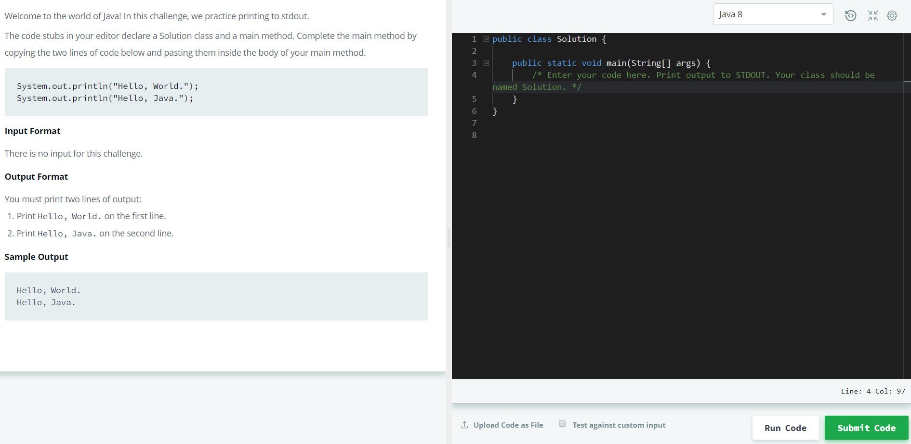
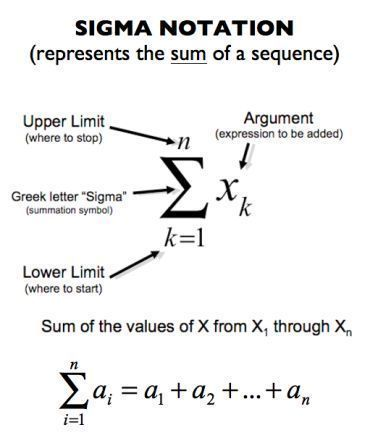

**Initially, most of us grasped our hands over programming in universities while developing our first Fibonacci sequence. But, can we all agree that it is the best way to start the learning curve?**

## Little update from my side

After starting my 1st position in IT consulting, it began to be a little bit more challenging to find the motivation to write something here; however, I did not set up this website to close it after the first few posts. On the contrary, I've decided to make small changes on this website to make it even more appealing to the visitors. From now on, you may have noticed that I have redesigned the newsletter sign up form and provided you with an option to support the time I spend for these articles. If you like what you read, you can scroll down towards the comment section ⬇, and buy me some Yerba Mate or dark chocolate, which always boost my creativity. Most importantly, you can encourage me to be more active by leaving some comments. :)

## This topic, again?

Today, I will discuss a common subject that is on my mind for a long time as before joining my current engineering consulting company, I have been advised by the recruiters to focus more on the software engineering section, rather than data science itself. As a result, I've spent a considerable amount of time trying to master the art of coding and tested various ways to acquire the most experience. As you might know, I'm a huge fan of optimising my life in each life discipline to be the most effective in everything I do, as such, it makes a great combination of interests to share some advice on today's topic. Everything here is based on my personal experience, therefore feel free to share your own ways of learning down below, not only in terms of software engineering.

Most importantly, **I believe that everyone can learn something from this post**, no matter if you are a coder or a driver of front-loader.

## Let's start by introducing Bob

Why Bob? It just seems like the most typical name for any example. I'm sorry if I offended any Bobs reading this article.

_Let's assume that Bob is a little clumsy, just like my drawings_

It is the beginning of the high school year, and Bob is looking forward to his new subjects. One of the mysteriously sounding classes is information technology, where our hero is going to put his hands-on programming for the 1st time. The classes start typically with drawing flowcharts and memorising multiple sorting and searching algorithms, such as bubble sort or linear search. Afterwards, Bob is instructed how to set up his first Integrated development environment (IDE) and implement what he just learned in C++, Java or Python (I hope it's not Pascal, like it was in my case).

Okay, so is there something wrong with it? I don't think so, unless Bob wants to become a Site Reliability Engineer at Google, where he can deal with sorting/searching algorithms every day. At more computationally advanced positions like this, reducing the Big-O complexity from _O(n quadratic)_ to _O(n log n)_ is worth a salary rise taking into assumption how much data is being processed on a daily basis whenever everyone loads another cute cat clip on YouTube.

So, how would I start as a teacher? As long as I would be free from the restrictions of the education programme, I would introduce Bob with a very wide-set of **interactive tools** that stimulate his brain to practice coding challenges daily by providing small prizes and counting day streaks. The exercises should start with the most simple "Hello World" problems and later eventually introduce the algorithmic problems, only if Bob would feel that it is what he wishes to do. Now, why I would not recommend any type of programming book to Bob from the beginning? Let's take a look at the following graph of average learning retention rates:

_Average learning retention rates[^1]_

The pyramid presents that we learn the most effectively by teaching others and practising by doing. In contrast, we retain the least by attending lectures and reading.

Interactive tools, visual prizes to boost our level of serotonin, that is what will give us lots of concentration and enthusiasm to master every professional field. If we start with a book, especially in programming, we might get easily discouraged as we will not see our progress, nor work effects immediately. Some of us who are more patient and eager to read books might get along somehow, but remember that if you ask an Olympic swimming champion how he became so skilled, he will not advise you to focus on books.

### Impostor Syndrome

Reading books and watching online tutorials has another problem. As we dive more into the materials, we will start seeing that there is still lots of knowledge that we need to obtain before writing our first program. What's even worse, we will feel that everyone around us holds years of experience and we do not fit into the community.

Wrong! This way you are falling into the Impostor Syndrome (or "syndrome of sitting in a cave", as I tend to call it), where you will never leave it (do something practically) unless you feel 100% ready. It is a big problem of most of the early software engineers and used to be mine as well.

Just to make sure, I am not saying that reading books is the worst possible choice for the beginning, but most of the students might fall in the presented trap.

_Impostor Syndrome[^2]_

### Then, what do we suggest to Bob?

If Bob is already attending high school, he should have just kept doing/trying what is demanded by his professor. Even if it seems like learning another useless quadratic equation, it might come in handy one day. No one said, you will never work at Google, right?

In the meantime, Bob is advised to develop a daily habit of solving online coding challenges, on such websites like [HackerRank](https://www.hackerrank.com/). Below, you can find an example of your playground, with the 1st Java challenge requiring to output "Hello, World" message. As you see, every task includes a comprehensive description on the left side, which will be your book, whereas on the right side is where the magic happens. When Bob feels like his code is ready, shining bright like a diamond, he can try clicking the flashy green button "Submit Code", which runs his scribbles through series of tests to check if it works like it should for the predefined input.

_HackerRank "Hello World" challenge in Java_

What if Bob is feeling lost and lonely, scratching his head and wondering why the world is so cruel? In this scenario, he might want to look into the "Discussions" tab where he will find more Bobs like him. It's a place where it is good to come in, even when we know the answer, so we can benefit from comparing other solutions, inspiring from them and trying to be kind by supporting others.

Didn't I say that we learn the most by teaching others? Yes, I did, and it doesn't mean that you need to be as smart as your high school professor to be able to teach others. Keep in mind that there is always someone, who doesn't know something that you know about designing Java applications, even if he is a developer with ten years of experience. Moreover, you can rest assured about understanding any topic, **if the following doesn't apply to you**:

> _If you can't explain it to a six year old, you don't understand it yourself._
>
> — Albert Einstein

## Rest of my tips (filtered from dozens I approached)

### Done is better than perfect

First of all, try to become a professionalist, not a perfectionist. The difference between these two is that professionalist takes into account the time, delivers the best he can and accepts the last result. As such, don't waste too much time setting up your IDE theme, as soon you might switch into another one.

### Have a mentor

Having a mentor is really important. Look for inspirations in every area of your life, so the next time when someone invites you for a mountain trip, you can watch some Bear Grylls videos and move yourself.

What about coding, do I have any mentor? Well, if it was just one. Nowadays, I like to follow [Kevin's channel](https://www.youtube.com/channel/UCKvwPt6BifPP54yzH99ff1g), especially while eating breakfast to warm-up my brain cells. In his videos, you can mainly find explanations of LeetCode challenges and nowadays some advice for early coders. In the comments section, you can also get support for your coding interview if there is one on your way.

For example, in the following recording, Kevin gave me some inspiration for this post, where he agreed that over his long career, there wasn't any book that helped him as much as interactive challenges on LeetCode. Apparently, he struggled a lot in the beginning and required long coding sessions, but eventually, he got a lot of practical experience.

<iframe
  width="560"
  height="315"
  src="https://www.youtube.com/embed/c0d4QXxczpE"
  title="YouTube video player"
  frameborder="0"
  allow="accelerometer; autoplay; clipboard-write; encrypted-media; gyroscope; picture-in-picture"
  allowfullscreen>
</iframe>

Finally, when you join the corporation, try to keep the following in mind (I will let you think yourself why).

> _If you are the wisest person in the room, change the room._
>
> — Maciej Aniserowicz

### Make a daily habit

As already mentioned, having a daily habit is critical. It doesn't mean developing a new website every day, but trying to do at least one thing about the skill you wish to master. As such, the easiest would be to solve a single challenge on HackerRank a day.

Remember, don't think about long-term goals from the beginning, but divide them into smaller steps. I hope you will get the idea [basing on my example](/pages/three-goals/).

### Take your time

Never ever blame yourself over forgetting the simplest syntax issues, like inserting a semicolon at the end of the line or including that common library at the beginning of your code. Everyone learns on failures, and this is normal.

Don't rush in your learning. Nobody learned calculus in a day, but started with the most straightforward variables, trying to understand each element of the sigma notation before developing a neural network of the entirely new architecture.

_Sigma notation (example of step by step learning)_

### Present your results

Everyone is shy in the beginning to show his first project. "_Ahh, what others will think about me? This code looks like it was written with my eyes closed._".

No, this is the way every Bob will think. Lots of programmers never show their code, and it's their decision, but by uploading anything on [GitHub](https://github.com/), you make your recruiters aware of familiarity with git environment, and you present your level of confidence. Most importantly, you can get support from other developers in improving your code. As previously mentioned, we learn by mistakes.

### Prevent burnout

It's never the concern of junior engineers, who would love to stay after-time and make everything for free, just to have something new to include in their portfolios. Remember, never make anything for free as by that you're damaging the market so that employers can allow themselves to reduce the average salary.

Burnout is a state where you are not enjoying anymore your profession. As such, we can see employers being more and more eager towards the young, unskilled but motivated employees as providing training is more executable than instilling motivation. As a programmer, make sure to have a side-hobby (so-called plan B), in case you would like to retire from <click clacking> at your desk.

One of the solutions to prevent burnout is to maintain a healthy work-life balance. In general, remember that work is not 90% of your life. I hope that this popular video can give you some great time for reflection.

<iframe
  width="560"
  height="315"
  src="https://www.youtube.com/embed/SqGRnlXplx0"
  title="YouTube video player"
  frameborder="0"
  allow="accelerometer; autoplay; clipboard-write; encrypted-media; gyroscope; picture-in-picture"
  allowfullscreen>
</iframe>

## But

### I don't know which programming language to start with

tldr; start with Python.

Right, I know that you have heard about lots of different options, but if you are looking for a single language, no matter what, it is always good to know Python. Its ease of use should not scare you from writing the first for loops.

Lastly, if you would like to take a look at some interesting resources, you can check Dave's brief [description of 43 most popular programming languages](https://dev.to/raygun/top-43-programming-languages-when-and-how-to-use-them-515n), divided by their popularity on the job market, ease of learning and use cases.

If you know some 🇵🇱 or you give some trust to Google Translator, I can recommend Gynvael Coldwind's [blog post about choosing your first programming language](https://gynvael.coldwind.pl/?id=238).

Not enough? Too much to read? Review everything in a visual form:

- [Top 10 programming languages compared in a table](/images/top-10-programming-languages.png)
- [Which programming language should I learn first?](/images/which-programming-language.png)

### I'm lazy

Talk about your goals, such as I did yesterday before publishing this post. Sharing [this little picture](/images/upcoming-blog-post-instagram.jpg) on my Instagram/Facebook story pushed me more than anything else to sit down and write all that I wanted to share. A few times, I even fell into the magical flow, which is something that you should aim for while learning/doing anything, as it also means that you're doing what you love.

How does it exactly feel, you may ask? Do you remember when you played with Lego or did coloring books as a kid? This is the state when you don't care anything else, but you're entirely focused on your craft, and you're excited about the upcoming result. It's a beauty of humankind. We all want to leave something on this earth in our short lifespan that will make us remembered. Taking a look at another pyramid: Maslow's hierarchy of needs, we can even find the demand for self-realisation.

_Maslow's Hierarchy of Needs[^3]_

## Health > Work

**I will NEVER EVER sacrifice the unrecoverable resource like health over my work**. Now, please repeat the last sentence at least three times. There is lots of programmers who coded till they saw blood on their keyboard, that dripped straight from their nose. Meanwhile, they cheated on their mind by treating it with some artificial focus boosters like Red Bull and eating tons of pizza. Maybe this way you will be the most knowledgable coder in your neighbourhood, but you will regret it a ton when you're older, wasting lots of time at the nearest clinic.

### So, what are the simplest health improvements?

Last time, it is widely popular to discuss the way we should work by the computer. Should we sit, should we stand or why not both? In "[The TRUTH About STANDING DESKS](https://www.youtube.com/watch?v=yhkigA368mE)", Kevin sums up that it is up to our preference to choose over standing or sitting desk. Most importantly, we cannot forget to move around every 30-40 minutes, as either longer sitting/standing isn't good for our health.

You're getting tired, losing focus and constantly checking your social media feed? Put your phone away by the distance of your longest hand, so you will need to move in order to reach the productivity killer.

You're losing creativity and ideas for your code? Eat the darkest chocolate possible and if you're like me, try drinking Yerba Mate, which seems to be the healthy replacement of coffee (+ you'll be cool 😎).

You want more? Listen to the most energetic music before your work and to some ambient sounds (without vocals) while at the computer. Personally, I can recommend [Brain.fm](https://www.brain.fm/) for the best source of sounds, but if you want something free, take a look at [Noisli](https://www.noisli.com/).

And my last advice is to respect your sleep! Don't treat it like a must, but as a pleasure. Sleep at least 7 hours a day in the darkest and the quietest room possible, ideally different from the one where you code. Oh, and don't forget reducing the blue light of your monitor by using such tools as [f.lux](https://justgetflux.com/) (desktop) and [Twilight](https://twilight.urbandroid.org/) (Android).

## Learning Tools (my recommendations) 🛠

- Websites with resources 🌐
  - [A to Z Resources for Students](https://github.com/dipakkr/A-to-Z-Resources-for-Students#110-c-language) ← find even more resources to learn software engineering
  - [Build your own X](https://github.com/danistefanovic/build-your-own-x) ← resources to start developing your first website, database, you name it
  - [Coding Interview University](https://github.com/jwasham/coding-interview-university) ← complete computer science study plan to become a software engineer
  - [Data Structure Visualisations](https://www.cs.usfca.edu/~galles/visualization/Algorithms.html) ← interactive visualisation for most of data structures
  - [DevTube](https://dev.tube/) ← developer videos in one place. You can try replacing YouTube with DevTube
  - [Every Programmer Should Know](https://github.com/mtdvio/every-programmer-should-know) ← collection of (mostly) technical things every software developer should know
  - [JavaScript Algorithms and Data Structures](https://github.com/trekhleb/javascript-algorithms) ← algorithms and data structures implemented in JavaScript with explanations and links to further readings. Don't prevent yourself from taking a look, even if you're not a JS developer
  - [Learn X in Y Minutes](https://learnxinyminutes.com/) ← take a whirlwind tour of your next favourite language. Community-driven!
  - [My Pinterest Page about Software Development](https://pinterest.com/pyxelrr/software-development/) ← here I store the most interesting infographics
  - [Refactoring](https://refactoring.guru/refactoring) ← pleasant guide to clean your messy code
  - [Tutorialspoint](https://www.tutorialspoint.com/) ← programmer's ultimate Wikipedia
  - YouTube
    - [channels to learn programming](https://medium.freecodecamp.org/want-amazing-free-coding-tutorials-subscribe-to-these-youtube-channels-b91f154db543)
    - [playlists to teach you programming](https://www.youtube.com/user/ProgrammingKnowledge/playlists)
    - my personal recommendations
      - [The Coding Train](https://www.youtube.com/channel/UCvjgXvBlbQiydffZU7m1_aw) ← one of the most-enthusiastic coders
      - [Kevin Naughton Jr.](https://www.youtube.com/channel/UCKvwPt6BifPP54yzH99ff1g) ← LeetCode challenges solver
      - [Derek Banas](https://www.youtube.com/user/derekbanas) ← is there a topic on which Derek didn't record a tutorial?
      - [sentdex](https://www.youtube.com/user/sentdex) ← Python developer, mainly in the area of AI
      - [Computerphile](https://www.youtube.com/channel/UC9-y-6csu5WGm29I7JiwpnA) ← general computer science channel
      - [Pasja Informatyki](https://www.youtube.com/user/MiroslawZelent) (🇵🇱) ← general IT/psychology channel
      - [Niebezpiecznik](https://www.youtube.com/channel/UCe6nK69Yc1zna7QSJEfA9pw) (🇵🇱) ← security channel
- Desktop (practice in your browser through the interactive environment) 💻
  - [Binary Search](https://binarysearch.io/) ← create a room, invite your friends, and race to finish the problems
  - [CheckiO](https://checkio.org/) ← learn Python or JavaScript through the online game
  - [Codecademy](https://www.codecademy.com/) ← one of the biggest online coding platforms
  - [CodeCombat](https://codecombat.com/) ← coding games to learn Python and JavaScript
  - [CodeGym](https://codegym.cc/) ← online Java programming course that is 80% based on practice
  - [CodeSignal](https://codesignal.com/) ← the most popular website of this kind
  - [Codewars](https://www.codewars.com/) ← improve your skills by training with others on real code challenges
  - [CodinGame](https://www.codingame.com/training) ← learn programming through online sets of puzzles
  - [Edabit](https://edabit.com/) ← simple, new website in the market
  - [exercism](https://exercism.io/) ← 100% free service, where you submit solutions through your terminal
  - [HackerRank](https://www.hackerrank.com/) ← my personal choice. I've started with included 30-days coding challenge and can totally recommend it
  - [JetBrains Academy](https://www.jetbrains.com/academy/) ← dive into Java, Python, and other programming languages in a project-based learning environment that is integrated with JetBrains IDEs
  - [LeetCode](https://leetcode.com/) ← more advanced website, where you will mostly find problems asked by the world's largest tech companies. I recommend watching [Kevin Naughton Jr.](https://www.youtube.com/channel/UCKvwPt6BifPP54yzH99ff1g) who goes through many problems from there
  - [StrataScratch](https://www.stratascratch.com/) ← over 1000 data science exercises taken from real companies to practice SQL and Python
- Mobile (learn on the go) 📱
  - [Algorithms: Explained and Animated](https://play.google.com/store/apps/details?id=wiki.algorithm.algorithms&hl=en) ← great visual explanation of algorithms
  - [Brilliant](https://brilliant.org/) ← learn logic, math, computer science, physics and more. All the topics will help you with every programming challenge
  - [Grasshopper](https://play.google.com/store/apps/details?id=com.area120.grasshopper&hl=en) ← learn JavaScript for free from Google
  - [Mimo](https://getmimo.com/) ← try it if you want to go really simple
  - [SoloLearn](https://www.sololearn.com/) ← also works as a web app. There is a free course on almost every programming language/topic
- You really wanna books? Then take the universal ones 📖
  - [Clean Code: A Handbook of Agile Software Craftsmanship](https://www.goodreads.com/book/show/3735293-clean-code)
  - [Code Complete](https://www.goodreads.com/book/show/21899045-code-complete)
  - [Code: The Hidden Language of Computer Hardware and Software (Developer Best Practices)](https://www.goodreads.com/book/show/21948821-code)
  - [Cracking the Coding Interview: 189 Programming Questions and Solutions](https://www.goodreads.com/book/show/25707092-cracking-the-coding-interview)
  - [Design Patterns: Elements of Reusable Object-Oriented Software](https://www.goodreads.com/book/show/85009.Design_Patterns)
  - [Don’t Make Me Think, Revisited: A Common Sense Approach to Web Usability](https://www.goodreads.com/book/show/18197267-don-t-make-me-think-revisited)
  - [Elements of Programming Interviews in Python: The Insiders’ Guide](https://www.goodreads.com/book/show/34791936-elements-of-programming-interviews-in-python)
  - [Extreme Programming Explained: Embrace Change (The XP Series)](https://www.goodreads.com/book/show/67833.Extreme_Programming_Explained)
  - [Head First Design Patterns](https://www.goodreads.com/book/show/17374834-head-first-design-patterns)
  - [Implementing Domain-Driven Design](https://www.goodreads.com/book/show/15756865-implementing-domain-driven-design)
  - [Introduction to Algorithms (The MIT Press)](https://www.goodreads.com/book/show/44086616-introduction-to-algorithms)
  - [Junior Developer. Wszystko co trzeba wiedzieć, by zacząć pracę jako programista](https://www.goodreads.com/book/show/32998879-junior-developer-wszystko-co-trzeba-wiedzie-by-zacz-prac-jako-prog) (🇵🇱)
  - [Peopleware: Productive Projects and Teams](https://www.goodreads.com/book/show/18895165-peopleware)
  - [Refactoring: Improving the Design of Existing Code](https://www.goodreads.com/book/show/44719608-refactoring)
  - [Test Driven Development: By Example](https://www.goodreads.com/book/show/387190.Test_Driven_Development)
  - [The C Programming Language](https://www.goodreads.com/book/show/515601.The_C_Programming_Language)
  - [The C++ Programming Language](https://www.goodreads.com/book/show/18709954-the-c-programming-language) (4th Edition)
  - [The Clean Coder: A Code of Conduct for Professional Programmers](https://www.goodreads.com/book/show/11486819-the-clean-coder)
  - [The Complete Software Developer’s Career Guide: How to Learn Programming Languages Quickly, Ace Your Programming Interview, and Land Your Software Developer Dream Job](https://www.goodreads.com/book/show/35674293-the-complete-software-developer-s-career-guide)
  - [The Mythical Man-Month: Essays on Software Engineering](https://www.goodreads.com/book/show/6558055-the-mythical-man-month)
  - [The Pragmatic Programmer](https://www.goodreads.com/book/show/22404360-the-pragmatic-programmer)
  - [The Self-Taught Programmer: The Definitive Guide to Programming Professionally](https://www.goodreads.com/book/show/33580202-the-self-taught-programmer)
  - [Working Effectively with Legacy Code](https://www.goodreads.com/book/show/44919.Working_Effectively_with_Legacy_Code)
  - [Zawód: Programista](https://www.goodreads.com/book/show/36223075-zaw-d) (🇵🇱)
  - [Zrozumieć programowanie](https://www.goodreads.com/book/show/28457659-zrozumie-programowanie) (🇵🇱)

Last, but not least you can benefit from online courses. You will find most of the courses on [Udemy](https://www.udemy.com/), and if you want, you can also use a search engine for online courses: [Courseroot](https://courseroot.com/). Personally, I recommend going through the longest courses with most reviews, as they might be constantly updated with the most relevant content (remember that technology rapidly change).

## So, what we learned today?

Bob whispered to my ear that he felt like someone just presented the entirely different world to him. Well, I hope you also feel like it.

Most importantly, **don't spend too much of your time trying to find the perfect tool in the list above**. My tl;dr version advises you to create your account on HackerRank and go through the 30-day challenge in Python. Then, on your smartphone, download the SoloLearn app and do the same. After 30 days you will see if it's for you.

If you don't like it, maybe it's time to consider going into a different field, such as business management. On the other hand, if you loved it (I hope), try looking for a programming book for night reading.

Please let me know if you think that it is the way of learning curve you would like to see in universities. If you're a long-time experienced programmer, let me know what's your view on this topic ⬇.

Last, but not least, **remember about these ultimate living rules**:

1. "Life is too short, so get a life.
2. Know that you don't know everything, so don't get arrogant.
3. Don't get caught up in the various programming "religious" wars, there's more to life than a specific point of view.
4. Laugh and enjoy the wonderful beauty in the world around us.
5. You're as much an idiot as the person you consider an idiot.
6. Sometimes the "important things" one is working on are just not that important, so get a life."[^4]

## References

[^1]: acrlguest (2014) 'Tales of the Undead…Learning Theories: The Learning Pyramid'. [13 January 2014] available from <https://acrlog.org/2014/01/13/tales-of-the-undead-learning-theories-the-learning-pyramid/comment-page-1/>

[^2]: FAUHS Research Program (2018) _Impostor Syndrome_. [ 2018] available from <https://canvas.fau.edu/courses/36616/pages/impostor-syndrome>

[^3]: McLeod, S. (2018) 'Maslow's Hierarchy of Needs'. [ 2018] available from <https://www.simplypsychology.org/maslow.html>

[^4]: oldandtired (2017) 'A Collection of Things Software Developers Should Know'. [5 September 2017] available from <https://news.ycombinator.com/item?id=15174089>

**Thanks for reading and happy coding!**

_Hey Bob, just don't lose your excitement after the first weeks :)_
