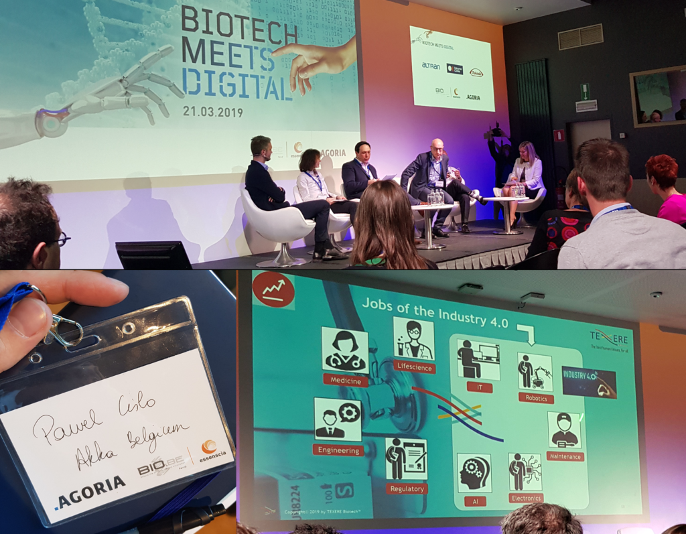
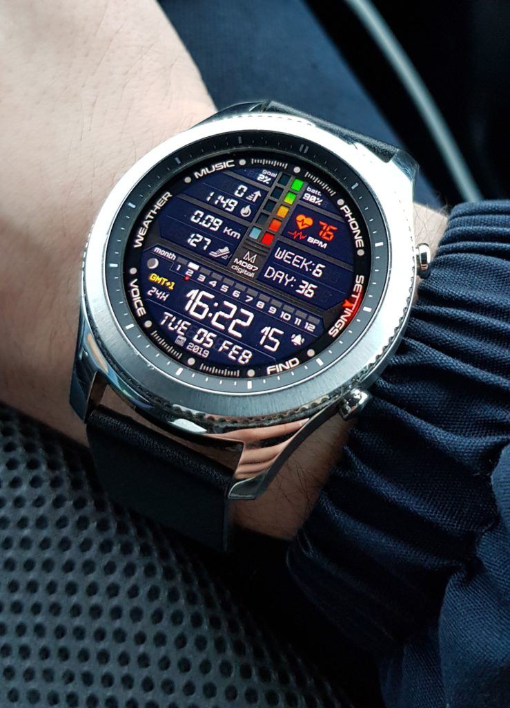

**It is more common to approach the statement "Data is the new oil", and it is already a fact, which will only expand its popularity. However, in order to get the pure nectar from our data, we need to apply specific "oil refinery", usually referred to as data mining.**

## BioTech meets Digital

Last Thursday I had an exceptional chance of being one of the representatives of AKKA Belgium at "BioTech meets Digital" conference, here in Brussels. During the 4-hours, which included a fantastic networking session, we were presented with 6 presentations, that were summarised in a final discussion panel.

At the moment, when it is a few days after the event, I decided to summarise the essence of this symposium, so that the rest of my colleagues from the office can be aware of the current technological trends. In order to make this wall of text more valuable, I decided to extend it and provide personal advice for aspiring students and businesses trying to adapt to the modern market of Data Science.

For those of you who might be specifically interested in the marketing world, a couple of months ago I attended and [summarised another conference in a single blog post](https://pawelcislo.com/2018/09/30/is-modern-business-complicated-my-summary-of-the-world-business-experience-conference-in-warsaw/). I feel like it is one of the most pleasant ways to find something interesting to share with all of you; however, instead of being on the more populated side of the room, I believe that once I will be the one holding the microphone. :)

### What was in for us?

The conference did target not only BioTech companies and their trends but also technological providers. Everybody could have learnt from it, such as me, a fresh graduate of data science master's course and current consultant at AKKA Technologies.

The scope of the mentioned technologies included:

- Data collection devices (including sensors, IoT, …)
- Data mining and processing (from R&D, production and distribution)
- Data safety / Cybersecurity
- Artificial Intelligence
- Advanced analytics
- Automation technologies (including robotics)
- Tracking & tracing
- Connectivity.[^1]

In general, the conference took a very rapid pace, leaving us with tons of valuable information about topics ranging from technology, business and medicine, up to the state of the current education. Each of the presentations was full of the current market trends, such as "Data Science", "AI", "Cybersecurity" and "Industry 4.0".

\[caption id="attachment\_1515" align="aligncenter" width="1024"\] BioTech meets Digital conference\[/caption\]

### The effect of applying data mining techniques to [my notes](https://pawelcislo.com/wp-content/uploads/2019/03/BioTech-notes-e1553423237867.jpg)

There were parts, which could have been understood only by participants with specific domain knowledge, specifically around biology and robotics; nevertheless, most of the content was directed to the general audience. As this blog isn't focused on the organic industry, I will share most of the key points around DS, with a slight addition of specific domain sectors.

In order to address everything concisely without the struggle of paying attention to different conjunctions, the summary will consist of bullet points for each of the particular speeches:

- **#1 Introduction**
  - BioTech market is holding a big capital in Belgium
  - Belgium needs to become a bio lead
  - AI will be a priority on the Belgian market
  - Only 1 out of 4 Belgians know what AI is
- **#2 Digital trends for Biotech – data for the best?** \[Benjamin Docquir (Osborne Clarke, partner), Hadrien Chef (Osborne Clarke, partner)\]
  - pharma and medical technology [scores only 27/100 points](https://pawelcislo.com/wp-content/uploads/2019/03/BioTech_trends_in_digital_transformation.jpg) in trends of digital transformation for healthcare providers
    - that is more than the public sector (22)
    - but less than telecom (37), retail (42), travel and hospitality (46)
  - pre-clinical and clinical activities are still paper-based and it has to change
  - AI needs to match patients with clinical trials
  - supply chain management needs real-time tracking
  - OncoDNA offers SAAS through the industry-leading bioinformatic platform (OncoKDM)
  - there will always be legal issues with data (privacy, cybersecurity, ethics)
  - key takeaway
    - experiment & protect
    - invest in skills
    - build new partnerships
    - tackle security & privacy concerns
    - think strategically about data & trust
    - data is an asset... not an isolation
- **#3 How to find the right patterns in order to turn data into actionable insights** \[Lien Van Den Berghe (Möbius Healthcare, Business Consultant Healthcare & Lifesciences)\]
  - data is the new oil
  - only [8% of companies know how to utilise data](https://pawelcislo.com/wp-content/uploads/2019/03/BioTech_8percent.jpg)
  - we lack skills in data analytics
  - presentation of clear data analytics process ([explanation graph](https://pawelcislo.com/wp-content/uploads/2019/03/BioTech_analytics_process.jpg))
  - understanding that business is vital - ask the right questions
  - Data Scientist is the 21st century's sexiest job (according to Harvard Business)
  - 5 key learnings
    - don't assume you understand data straight away
    - be pragmatic
    - make it comprehensible
    - change management is key
    - keep it simple
- **#4 When automation makes human tissue an affordable source for reconstructive surgery** \[dr. Denis Defrane (Texere Biotech, co-founder)\]
  - bone is the 2nd most donated organ after blood
  - in Europe, 50% of human tissue is wasted. 30% is discarded and 15-20% is recovered
  - the processes need to be improved by automation & robotics
  - the mission is to "fully robotise and automate, in a clean room environment, the production of bone tissue from the femoral head into bone allograft cubes"
    - it will result in
      - 1/3 cost reduction
      - more than 50% revenue increase
      - improved quality
      - 2-4 times yield improvement
  - in Texere, 50% of workers are robots, whereas in other companies it's usually 8%
    - clearly, robots are easier to be managed
  - analysis of the most wanted jobs of the industry 4.0 ([infographic](https://pawelcislo.com/wp-content/uploads/2019/03/BioTech_industry40_jobs.jpg))
- **#5 Early prediction on quality attributes & parametric release by a global smart GMP monitoring** \[Nicolas Tijs (NOVADIP Biosciences), Anne Cassart (Sapristic Biion, Sales Director - International Business Development)\]
  - introduction of next-generation monitoring including process monitoring
  - presentation of mirrhia (global monitoring system: clean rooms, lab environment & equipment)
- **#6 Biomanufacturing excellence through data sciences at GSK vaccines** \[Thibault Helleputte (DNAlytics, CEO)\]
  - data needs to be processed in real time
  - DS in biomanufacturing - a retrospective/prospective analysis ([infographic](https://pawelcislo.com/wp-content/uploads/2019/03/BioTech_DS_in_biomanufacturing.jpg))
  - a typical vaccine production process (types of data)
    - we have mostly 2nd-hand data
    - heterogenous
    - fat (100 rows/10000 columns)
    - confounding
    - incomplete
  - in this industry, data analysis isn't possible with a "push button" method, where we follow the typical ML process
  - GSK company needs more data scientists and is willing to train them
  - take home messages
    - a company such as GSK encourages students to embrace academic tracks leading to data science jobs
    - data science for biomanufacturing is exciting but complex
      - it requires open-minded and expert data scientists to work with pluridisciplinary teams
    - stop collecting data only for satisfying regulatory constraints
      - instead, generate high added value by proactively exploiting this gold mine
      - the sooner the better
- **#7 Conceiving the industrial organisms of tomorrow, digital transformation of biotechnology** \[Rémi Peyraud (IMEAN, CEO & founder)\]
  - nature (resource) ----(biotech)----> humans (needs)
  - major social issues of nature in the XXI century
    - green chemistry
    - human needs growth
    - innovative biosolutions
  - artemisia annua is an important/healthy plant
    - anti-paludic properties
    - fail to process cause life is like "black box"
  - to solve the issues, we have to use math modelling for organisms to understand "black box"
  - it's difficult to find the right skill set for the biotech industry
- **#8 Panel Discussion: Biotech meets Digital, Needs for Talent When two Worlds Meet**
  - the industry needs people who understand both: data & digital (IT)
    - they especially need people that understand their technology and can communicate with people from other professional disciplines
  - soft skills are becoming more important
  - we need to understand how to handle Big Data
  - by 2020, 30% of jobs will lack talents
    - Takeda is willing to train data scientists
  - we stay too much at our comfort zone
  - we need to change the way we study (it's best to mix practice and theory)
  - lifelong learning is the key
    - companies want employees that wish to learn continually
  - if you want to go fast, go alone
    - if you want to go far, go together
  - how to improve universities?
    - be more flexible
    - quick internships
    - more teamwork
    - focus on soft skills
    - it needs to be obvious what's needed for the training
  - how to attract students to STEM courses?
    - communication is key
    - you've to explain to kids what they will be able to do, not what job will they get
    - make it sexy
    - young people are highly motivated. It's difficult to motivate the older generation
    - mention good salary
    - offer impact (opportunity to growth)
    - attitude needs to be changed
    - coming back to companies after having own startup is hard
    - the key is to start from secondary school teachers (they need to motivate kids)
  - the conclusion by Dominique Demonté (Managing Director Agoria Wallonia, former Managing Director BIOPARK Charleroi)
    - digitalisation of BioTech is a necessity
    - there will be a shortage of talents
      - 75000 jobs won't be filled
    - lifelong learning needs to be popularised
    - war for talents starts today

Woah, that is a lot of information!

Luckily everything ended up with a productive networking session, full of [tasty sandwiches](https://pawelcislo.com/wp-content/uploads/2019/03/BioTech_sandwiches.jpg) and [various drinks](https://pawelcislo.com/wp-content/uploads/2019/03/BioTech_drinks-e1553434016959.jpg). :)

As there is still a lot to cover in this post, I will not elaborate on the conference. The need for data scientists will grow, and this is what I am going to facilitate in the rest of this article.

## D.A.T.A.  4.0?

**D**ata-**A**ware **T**echnological **A**ctivities - it's just a fresh acronym I coined for the need of this article, to connect the importance of data with Industry 4.0 that leads to automation in manufacturing technologies. Cyber-physical systems, cloud computing, the Internet of things, and cognitive computing is highly involved in both of these terms, as such it can be assumed that Industry 4.0 might be all about industrial data and analytics.

The current products are full of data, such as machines and robotics, which are authorising the swiftly growing universal truth that **all roads lead to data** in the emerging digitopia. Data is highly comparable to oil, because of its potential to generate real value; however, it won't do much without the right processing.

\[caption id="attachment\_1502" align="aligncenter" width="640"\] Big Four keep most of the oil\[/caption\]

If we look into the historical roots, the UK mathematician - Clive Humby was the first one to coin the term "Data Science is the new oil" in 2006:

\[su\_quote cite="Clive Humby"\]Data is the new oil. It’s valuable, but if unrefined it cannot really be used. It has to be changed into gas, plastic, chemicals, etc to create a valuable entity that drives profitable activity; so must data be broken down, analyzed for it to have value.\[/su\_quote\]

Okay, let's not just make idle threats, but support the growing popularity of DS with the usage of the Google Trends tool. Since the last 6 years, the interest over time for the "data science" term in Google Search, grew about 9 times! The interesting fact is that the graph looks almost identical for "[cybersecurity](https://trends.google.com/trends/explore?date=2012-01-07%202019-03-23&geo=US&q=cybersecurity)". I see that the market trends are being highly generous to both of my interest and it has a purpose, as unsecured data reveals a significant flaw to its owner.


_Google trends for "data science" from 01/02/2012[^2]_

Data, data, data everywhere, but how to get our head around that? To find the answer, let's move into another chapter.

## Start practising Data Science today

To answer the question from the title of this post, yes, let's be pragmatic and prepare for the inevitable cultivation of the upcoming cyber world.

The road to becoming the ultimate Data Scientist is long and full of stuff that might discourage you from staying on the track, such as linear algebra, or advanced neural networks, but it's almost impossible to be an expert in all the techniques mentioned in the ultimate "[Road to Data Scientist](http://nirvacana.com/thoughts/wp-content/uploads/2018/01/RoadToDataScientist1.png)".[^3]

You are more than encouraged to take this roadmap, print it, mark your progress and look up to it whenever you have doubts. To strengthen the effect, you are also recommended to include [Andrew Ng's](https://www.andrewng.org/) or [Yann LeCun's](http://yann.lecun.com/) portraits by the sides, or if you prefer it can be such a dynamic character as [Siraj Raval](https://www.youtube.com/channel/UCWN3xxRkmTPmbKwht9FuE5A) or [Harrison Kinsley](https://www.youtube.com/user/sentdex).

If you have a closer look at the roadmap, you can scratch your head around uncertain terms that will unavoidably cross your paths in the world of DS. I am going to prevent you, just in case you would say:

### Big Data, Data Science, AI, Machine Learning... I'm lost

Let's try to clear your mind and define each of the most popular terms in a human-readable way:

- Big Data - extremely large data sets, usually broken into 4 dimensions (volume, variety, velocity and veracity)
- Data Science - multi-disciplinary field that focuses on extracting knowledge from various types of data
- Artificial Intelligence (AI) - a non-biological system that is intelligent through rules
- Machine Learning - algorithms that learn models/representations/rules automatically from data/examples
- Deep Learning - algorithms that parameterize multi-layers neural networks that then learn representations of data with multiple layers of abstraction

Three of the defined technical terms can be aligned nicely on the Venn diagram:


_Connection between the fields_[^4]

If we would like to place Data Science on this diagram, it would fall as a superset of all the subsets (AI>ML>DL), as on the attachment below. It is such a generic term including all the different data operations, that it is introduced in almost all the jargon of the current revolutionary technology. Moving more in-depth, if we look purely at the Data Science term, there might be lots of different variations of its Venn diagram, the more serious and the more satirical ones. Most commonly you will find DS to be a mix of statistics/coding/marketing, where everything can be disassembled into even more specific areas, collectively with DS. Initially came Drew Conway's data science Venn diagram and the rest were trying to modify and improve it. The one that is most satisfying to me was prepared by Gartner (research team), about which you can read more straighTt from Christi Eubanks' blog post.[^5]


_Place of Data Science_

Huh?! Did I forget assigning Big Data to these charts? Let's leave it as a small task for you, as I believe it should be evident for now that Big Data is a part of \_\_\_(_each/none_)\_\_\_ of these terms.

### Domain knowledge, business, math, tech... What else?

As it was mentioned during the BioTech conference, finding a person who is skilled technically, but also being familiar with a specific domain, is like winning in a local lottery. Meaning, it is still possible, but this skill set will always be massively hunted by the employers.

Don't stress too much when you lack the skills, as many companies are eager to hire people who miss even most of the requirements for the job offers. Moreover, they are even willing to train you on the go with the popularisation of lifelong just in time learning.

On the diagram below, you can check, which skills you might want to focus on to achieve your dream position.


_Skill proficiency varies by data science role_[^6]

### But do I need to know math? You may ask

No, unless you are about to invent a piece of art neural networks for your next scientific papers, then you might want to get familiar with calculus.

Ah, and PhD is also not needed, even when you want to be a scientific researcher at bigger companies like Nvidia. Don't you believe me? Check the [answer by Bryan Catanzaro](https://youtu.be/AXBI5GxndkM?t=38) (0:38 - 0:49), one of the current Nvidia researchers.

### How to setup my environment?

I will allow myself to copy my answers from the FAQ section of this website.

#### **Should I go with Python or R?**

I always say that in Data Science it is the most important to train logic and math. Later, the language is like a suit you wear, and in my case, I mostly reach for Python. I found some senior R developers, who claimed that they would start with Python if they got another chance (mainly for the reason of ML-based resources); however, I’m jealous of their pretty looking RStudio.

Once I found a great comparison between the languages in a [single presentation](https://www.slideshare.net/VineetJaiswal8/r-and-python-a-code-demo), which might give you a nice contrast between both of the options.

You may also want to try and combine both languages to use the best part of each. I found [this blog post](https://www.business-science.io/business/2018/10/08/python-and-r.html) to explain how to do it most conveniently. tl;dr: • (R) reticulate for connecting R with Python • (R) tidyverse for data exploration • (Python) scikit-learn/TensorFlow for ML and DL • (R) ggplot2 for visualisation • (R) R Markdown for reporting and Shiny for web apps

#### **What about the IDE?**

[Jupyter Notebook](https://jupyter.org/) for the beginning and the reason of maintaining a well-documented code. Moreover, it runs in a browser and nicely displays your shiny visualisations, which makes it stand out for Data Science. Nonetheless, last time, [Google Colaboratory](https://colab.research.google.com/notebooks/welcome.ipynb#recent=true) is more and more popular choice that requires no setup and runs entirely in the cloud. As such, it is one of the best free options for running large deep learning models (don’t forget to change runtime type to GPU/TPU).

Personally, I enjoyed using classical [Sublime Text](https://www.sublimetext.com/) with few plugins, but nowadays, I am trying to switch to [VS Code](https://code.visualstudio.com/), which gets [pretty nice reviews](https://www.kennethreitz.org/essays/why-you-should-use-vs-code-if-youre-a-python-developer), especially from Pythonic community.

If you are not happy with those, you can also try [Spyder](https://github.com/spyder-ide/spyder) as a free solution and [PyCharm](https://www.jetbrains.com/pycharm/) for professional development.

If you want to try Jupyter, Spyder and VS Code, just install a famous [Anaconda Distribution](https://www.anaconda.com/distribution/) to have a clear overview and ease of management over your tools.

### My recommendations / tools 🛠

The amount of resources to recommend for studying DS is enormous, but I will try to do my best and select the most valuable ones. As the choice gets bigger, the greater the chance that you will not look into any of them. Am I right?[](https://vas3k.com/blog/machine_learning/)

- Theory 💡
  - [Machine Learning for Everyone](https://vas3k.com/blog/machine_learning/) ← blog post, which explains the most critical concepts in a funny and practical way. You won't be bored reading it, and it might take you around 30-40 mins
  - [Machine Learning Study Path March 2019](https://github.com/clone95/Machine-Learning-Study-Path-March-2019) ← GitHub repository with complete ML study path, focused on TensorFlow and Scikit-Learn
  - [Machine Learning on Coursera](https://www.coursera.org/learn/machine-learning) ← the must check course by Andrew Ng
  - [My Pinterest board](https://pinterest.com/pyxelrr/data-science/)
  - [Neural Networks](https://www.youtube.com/playlist?list=PLZHQObOWTQDNU6R1_67000Dx_ZCJB-3pi) ← YouTube playlist of four (20 mins videos) explaining the theory behind neural networks. I would say that it is enough to watch the 1st video in the playlist to understand the most important things. The well-known author (3blue1brown) explains it on the example of classifying numerical digits
  - YouTube channels
    - [Siraj Raval](https://www.youtube.com/channel/UCWN3xxRkmTPmbKwht9FuE5A)
    - [sentdex](https://www.youtube.com/user/sentdex)
    - [Two Minute Papers](https://www.youtube.com/user/keeroyz)
- Practice ✍
  - [Brilliant](https://brilliant.org/) ← learn logic, math, computer science, physics and more. All the topics will help you with every programming challenge
  - [DataCamp](https://www.datacamp.com/) ← customised set of very interesting challenges
  - [SoloLearn](https://www.sololearn.com/) ← there is a free course on almost every programming language/topic
  - Udemy
    - [Python for Data Science and Machine Learning Bootcamp](https://www.udemy.com/python-for-data-science-and-machine-learning-bootcamp/) ← highly practical. I always recommend it to my friends
- Math ➗
  - YouTube channels
    - [3blue1brown](https://www.youtube.com/channel/UCYO_jab_esuFRV4b17AJtAw)
    - [Domain of Science](https://www.youtube.com/user/dominicwalliman)
    - [Eddie Woo](https://www.youtube.com/channel/UCq0EGvLTyy-LLT1oUSO_0FQ)
    - [Krista King](https://www.youtube.com/user/TheIntegralCALC/featured)
    - [MindYourDecisions](https://www.youtube.com/user/MindYourDecisions/featured)
    - [Numberphile](https://www.youtube.com/user/numberphile)
    - [Think Twice](https://www.youtube.com/ThinktwiceLTU)
    - [Welch Labs](https://www.youtube.com/user/Taylorns34)
- News 📰
  - [Data Science Central](https://www.datasciencecentral.com/) ← more of a social network for data passionates
  - [DataTau](http://www.datatau.net/) ← Hacker News like. Still growing, but I prefer it mostly for the concise design
  - [KDnuggets](https://www.kdnuggets.com/) ← hub for news, jobs and more, just like Data Science Central
  - [Towards Data Science](https://towardsdatascience.com/) ← Medium for DS
  - [Twitter](https://twitter.com/) ← you can start with [#datascience](https://twitter.com/hashtag/datascience?lang=en) or [Follow Friday](https://followfriday.io/) (AI)
  - Newsletter
    - [Data Science Weekly](https://www.datascienceweekly.org/)
    - [Inside AI](https://inside.com/ai) (daily newsletter. You can also check the [recent issues](https://inside.com/lists/ai/recent_issues))

Ah, and don't forget to participate in the **amazing networks 👥**, full of passionate people that will inspire you to achieve your best. One of my recommendations would be:

- [Data Science Central](https://www.datasciencecentral.com/)
- Facebook groups
  - [Data Science PL](https://www.facebook.com/groups/datasciencepl/) 🇵🇱
  - [Data Mining / Machine Learning / Artificial Intelligence](https://www.facebook.com/groups/machinelearningforum/)
  - [Math for Data Science Meetup: Python, R, Scala, SQL, Excel, LaTeX](https://www.facebook.com/groups/mathfordatascience/)
- [Kaggle](https://www.kaggle.com/)
- [KDnuggets](https://www.kdnuggets.com/)
- Local groups
  - [Eventbrite](https://www.eventbrite.com/)
  - [Meetup](https://www.meetup.com/)
- Reddit (as there are many subreddits, I highly encourage you to check my custom feeds)
  - [~data\_science](https://www.reddit.com/user/pyxelr/m/data_science/)
  - [~data\_tools](https://www.reddit.com/user/pyxelr/m/data_tools/)
  - [~data\_viz](https://www.reddit.com/user/pyxelr/m/data_viz/)
  - [~machine\_learning](https://www.reddit.com/user/pyxelr/m/machine_learning/)
  - [~math](https://www.reddit.com/user/pyxelr/m/math/)
- Slack/Discord groups

### Not enough? My newsletter can give you a hand

In this post, I am not going to make a too extensive list of tools, as I didn't want to overwhelm you with a long collection of resources, that would prevent you from starting with anything.

Don't forget that by signing up for my newsletter, you will not only get notifications about my new blog posts; but because I am a very nice guy, you will also get my e-book "**Data Science Resources**" for free, where I have stored all the other resources (tutorials, articles, tools and databases) to help you with the first steps. Ahh, and most importantly you can unsubscribe at any time if you feel like I am not spreading out any more value.

Once you make a decision, you can sign up to the community of the coolest people in the world, by scrolling down to the end of this post.

## Machine Learning is nothing but geometry

For now, let's stop our fascination about everything involving data, and agree on one point about the practice of using algorithms on the data, which later on learn from it and then forecast future trends for that topic. Remember, there is no magic behind machine learning.

Regression is just a line of best fit. It's like taking a bunch of dots and finding a curve that fits nicely to them. Nonetheless, there are 2 ways to make it harder: make it curvier than just a line or make it multi-dimensional.

\[caption id="attachment\_1566" align="aligncenter" width="477"\] Linear Regression - just try to fit the line of the best fit, but this time you can't go with your eyeball and the ruler\[/caption\]

Classification is just taking a bunch of coloured dots and finding the curve that goes between them. Each row in the table is a feature vector and for each vector, we can draw a point on the grid. We can just draw a classification boundary between the points and when the new point appears, we can decide to which class it belongs. Ah, and it doesn't matter what the axes are or what the groups represent.

Some people like to say: "**machine learning is nothing more than glorified curve-fitting**".

### Typical ML model

The usual steps of every ML model look like that:

1. load data: `X,Y=load_data()`
2. instantiate the model: `model=MakeModel()`
3. train the model: `model.fit(X,Y)`
4. use the model: `model.predict(X)`
5. evaluate the model: `model.score(X,Y)`

Applying the steps above into a simple Python script, will end up with the following:

```
#Import libraries
import pandas as pd

from sklearn.model_selection import train_test_split
from sklearn.metrics import accuracy_score
from sklearn.tree import DecisionTreeClassifier

#Load data
df = pd.read_csv('titanic.csv')

#Define x and y
feats = ['Pclass']
X = df[ feats ].values
y = df ['Survived'].values

#Split data
X_train, X_test, y_train, y_test = train_test_split(X, y, test_size=0.3)

#Instantiate the model
model = DecisionTreeClassifier(max_depth=20)

#Train the model
model.fit(X_train, y_train)

#Use the model
y_pred = model.predict(X_test)

#Evaluate the model
accuracy_score(y_test, y_pred)
```

Taking that into consideration, we can do examples for different cases, but the code will usually look the same. All machine learning interfaces are the same, it's just a black box with 2 tasks: learn and make predictions. I understand that there might be minor caveats with this approach, but it's a topic for different discussion.

### No free lunch theorem

There is no easy way to choose the correct Machine Learning model.

Let's try to define the ones we know:

- Linear Models
  - very easy to interpret
  - problems can be divided into
    - linearly separable
    - non-linearly separable
  - examples: linear regression, logistic regression
- Basic Nonlinear Models
  - they aren't necessarily "better" than a linear model
  - examples: Naive Bayes, Decision Tree, K-Nearest Neighbor
    - Naive Bayes can reduce to a linear model under various assumptions
- Ensemble Models
  - Random Forest, AdaBoost, ExtraTrees, Gradient Boosted Trees
  - average the predictions from multiple trees (the result is very powerful)
    - XGBoost (variant of a gradient boosting tree) has been used to win many competitions on Kaggle
  - can be distributed across different machines with Apache Spark
- Support Vector Machine (SVM)
  - was the "go-to" method for a long time
  - today that is deep learning, but SVM used to beat neural networks
  - powerful and nonlinear, but they do not scale (if your dataset is too large (like most of the current ones), it becomes infeasible to use this model these days)
- Deep Learning
  - state of the art in CV and NLP
  - not "plug-and-play" (unlike Random Forest)
    - if you try it on any random data it may fail spectacularly
    - you can't always use SKLearn, but you can use more specific libraries
      - Theano, TensorFlow, Keras etc.

Now, to summarise everything in a single table:

| **Group** | **Examples** | **Linear?** | **Powerful?** | **Easy to interpret?** | **Scales?** | **Plug and play?** |
| --- | --- | --- | --- | --- | --- | --- |
| Linear models | Linear Regression, Logistic Regression | ✅ | ❌ | ✅ | ✅ | ✅ |
| Basic models | NB, DT, KNN | 🤔 (possibly) | ❌ | ✅ | 🤔 (possibly) | ✅ |
| Ensemble models | AdaBoost, RF, GBM | ❌ | ✅ | ❌ | ✅ | ✅ |
| SVM | SVM | 🤔 (possibly) | ✅ | ❌ | ✅ | ✅ |
| Deep Learning | MLPClassifier, MLPRegressor | ❌ | ✅ | ❌ | ✅ (with special hardware) | ❌ |

Remember that ML is a field of experimentation, not philosophy.

### Hey! I trained my first deep neural network and my device almost burnt! 🔥

Be careful if you leave your old laptop for a longer time next to a big pile of paper that can easily catch fire 😅.

In order to prevent it, you can use previously recommended Google Colaboratory and take advantage of Tensor processing unit (TPU), which is an AI accelerator application-specific integrated circuit (ASIC) specifically designed for neural networks ‘Google’s Tensor Processing Unit Explained: This Is What the Future of Computing Looks Like’. from [^7]. According to some of the researchers, with TPU you can train Keras model up to x20 times faster, completely free![^8] ‘How to Train Keras Model X20 Times Faster with TPU for Free’.

The other, more advanced solution is to set an account on Google Cloud, AWS or Microsoft Azure and create a VM instance specifically for machine learning. This way, we can flexibly rent more computing resources on the go, whenever we need them, and we can do all of these from our 10-year old laptop.

## Addendum

Let's end this post with a funny situation shared by Piotr Migdał on his social media channels:

\[su\_quote cite="Piotr Migdal" url="<https://www.linkedin.com/feed/update/urn:li:activity:6503583595418914816"\]Me>: I'm an AI consultant. I teach people to teach machines. Someone I met: I'm a psychologist. I teach people people.\[/su\_quote\]

Don't overwhelm yourself with data, as it's impossible to process all of it. If you are continually being overloaded with the information, I have some good news for you.

Last time I organised my first 2.5-hour training on "[Personal Organisation](https://pawelcislo.com/wp-content/uploads/2019/03/Personal_organisation_training.jpg)", which covered various topics around its broad title (remembering, optimising, focusing, learning, respecting health, planning & celebrating). For now, it had internal premiere inside the offices, and the first attendants provided me with excellent feedback, giving me the opportunity to continue my training for other co-workers. I believe that the values provided in the scope of the presentation can profoundly influence every human being and. Keep your fingers crossed and once I might provide the training to larger groups around the world!

As it will never take place to be able to deliver it to most of my readers, I can consider recording an online course, where I will go through the contents of my presentation in depth. In the end, I wish to let everyone change his state from :( ---> 🙂.

Lastly, as you see, even my watch is starting to run out of space for data:


_My Gear S3 raises so many ideas for data science projects_

## References

[^1]: Boehmke, B. (2018) 'The most practical data science skill'. [26 October 2018] available from <https://uc-r.github.io/data_science_skills> [24 March 2019]

[^2]: Rouse, M. (2017) 'Data science definition'. [updated in 2017] available from <https://searchbusinessanalytics.techtarget.com/definition/data-science> [24 March 2019]

[^3]: Donoho, D. (2017) '50 Years of Data Science'. Journal of Computational and Graphical Statistics 26, 745–766 [24 March 2019]

[^4]: Raschka, S. (2019) 'What Are Machine Learning and Deep Learning? An Overview.' [23 January 2019] available from <https://github.com/rasbt/stat479-deep-learning-ss19/blob/master/L01-intro/L01-intro_slides.pdf> [24 March 2019]

[^5]: Eubanks, C. (2016) 'Three Lessons CrossFit Taught Me About Data Science'. [26 May 2016] available from <https://blogs.gartner.com/christi-eubanks/three-lessons-crossfit-taught-data-science/> [24 March 2019]

[^6]: Hayes, B. (2017) 'Demystifying Data Science For All'. [29 October 2017] available from <http://businessoverbroadway.com/2017/10/29/demystifying-data-science-for-all/> [24 March 2019]

[^7]: Osborne, J. (2016) 'Google's Tensor Processing Unit Explained: This Is What the Future of Computing Looks Like'. [22 August 2016] available from <https://www.techradar.com/news/computing-components/processors/google-s-tensor-processing-unit-explained-this-is-what-the-future-of-computing-looks-like-1326915> [25 March 2019]

[^8]: Zhang, C. (2018) 'How to Train Keras Model X20 Times Faster with TPU for Free'. [16 October 2018] available from <https://medium.com/swlh/how-to-train-keras-model-x20-times-faster-with-tpu-for-free-cac6cf5089cb> [24 March 2019]
