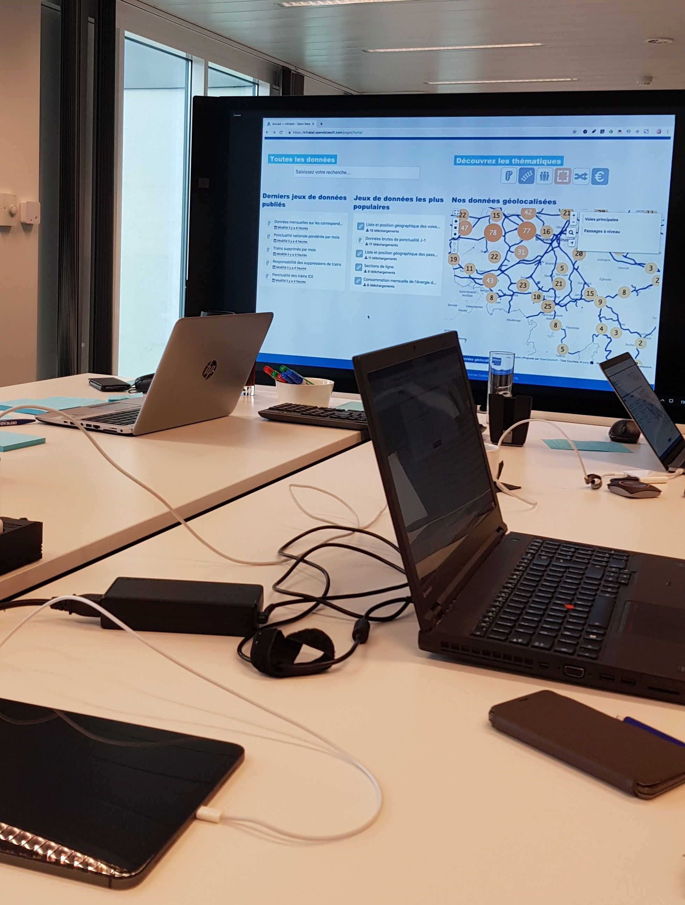

**#TRACKathon19 challenge let me have an insightful overview of what can I expect from data hackathons. On the last Sunday, at the Belgian headquarters of Infrabel, I was fortunate to be one of the first to access the datasets and come up with several ideas for improvement to the owner of the Belgian railway network.**

## TRACKathon

On the 28th of April (last Sunday), Infrabel decided to [publish 60 of their own datasets of different categories](https://opendata.infrabel.be/pages/home/) regarding the railway industry. Why did they decide for such a move, you may ask? As the publisher writes on their social media: "_Infrabel has a history of sharing data with the public, but we are moving away from static text to active data._" In the result, on the new portal, we can explore the regularly updated data, which has even more than 10 years of archival data for several sets.

To make the event even more memorable, it was connected with a "TRACKathon" challenge (hackathon focused on data analysis aspect) at Infrabel's headquarters in Brussels. It was a smart move, as otherwise all the data could have been quickly forgotten or not even discovered by the potential analysts looking for some fun on the web.

Everyone was able to join and try his analytical skills by registering on the [eventribe event](https://www.eventbrite.be/e/trackathon-an-open-data-hackathon-registration-56970650750#). The registration was limited, and through my curiosity in the extremely popular data events, I was keeping my ticket for more than a month before the final game.

It was quite challenging coming up with a good idea in such a short time, having in front of you loads of data of different categories, but in the end, we all had a lot of fun and learned a lot from each other. That is the point of hackathons, in general, to experience the sprint-like methodology.

In my group, I was able to share my insights with five other participants, and three of Infrabel's employees responsible for the company's data, who were eager to present their onsite experience, which narrowed down some of our investigations. I enjoyed the diversity of our interests ranging from technical aspects, up to law through business and data services, that let us look at the problem from different perspectives.

_I'm in (keeping cute stickers to myself)!_

Probably the most challenging part, was about coming to the same agreement with people from different backgrounds, that we just met. Everyone had to hide their ego and sometimes go for a compromise with a person from the other end of the table.

_Let the collaboration begin!_

To me, it is pleasing to see that another organisation makes a step towards the popularisation of the Open Data movement. I am always looking forward to more initiatives like that, as in the end, it can generate various project ideas and ease approaches to improving a specific sector for the good of humanity.

### Brief schedule

1. _09:00_ - Doors opening
2. _09:30_ - Welcome speech
3. _10:30_ - _15:30_ - Working on our ideas (with a free lunch in between ;))
4. _15:30_ - _17:00_ - Ending speech + 5 min presentation slot for each of the 12 groups + voting on the winner
5. _17:00_ - _18:00_ - Networking time!

In comparison to most of the hackathons, this challenge has been quite short, where the actual working time took only around 5 hours. In this time, some of the groups dived into deep discussions, whereas some focused on performing quick data analysis using a various technological stack, such as Python and R with different libraries.

If my current employer reads this post, then yes, I felt like being in Geneva once again and going through the entire AKKAdemy programme in a single day.

### Concerns of railway companies

All the TRACKathon's participants were free to decide on joining one of the following workshops to derive their solutions:

- Punctuality
- Infrastructure
- Safety and level crossings
- Smart mobility

Punctuality is still the primary concern of the transport companies, but apart from it, there are other areas waiting for our contribution. Because of my side-interest in cybersecurity, I decided to join the "Safety and level crossings" workshop, willing to add some value in securing the internal network. However, as I quickly noticed, by the "safety" term, the railway companies think rather about saving lives of careless pedestrians, drivers blocked between the barricades, people ready to commit suicides or animals willing to cross the road.

Our discussion has been enhanced with different clips of accidents being transmitted on the screen beside us. After having some severe discussion about Infrabel's daily concerns with a little bit of chit chat in between, we took a look into the data to support our decisions. Ultimately, it was the moment to doodle our ideas to have the same picture of all the different decisions.

_It's always better to visualise your thinking process_

After some time I ended with a set of notes of different approaches, where we had to direct ourselves into a particular plan, in order to elaborate it and prepare the presentation. Our roads focused on using cameras with object recognition technology and speed detection so that we can save lots of lives by optimising the process of the railway trespassing. For now, I will keep the rest of the details to myself, as no one knows if I might get into a collaboration with Infrabel to put this into action. :)

Shortly after the closing speech, together with a colleague from my group, we had our 5 minutes to describe our findings in front of around 60 people and cameras supported with the flashy lights. If you are afraid of public speaking, this is where you had a great chance to overcome it and learn on your mistakes. Coming back from the stage, feeling proud of my team, I couldn't wait to listen to the rest of the participants waiting for their turn.

### How can you start playing with Infrabel's data?

I advise you to start by having a 5-10 minute overview of the portal, as it hides many exciting features to ease your research. After getting familiar with the different options, you can start with searching through the data using the french/dutch keywords (remember, Google Translator is your friend), or try to dive deep into a specific category.

_At the moment, we can find 6 different categories_

By hovering your mouse over the icons, you can discover the following sections:

- Traffic management (24 datasets)
- Infrastructure (12 datasets)
- Human resources (9 datasets)
- Security (9 datasets)
- Clients and products (4 datasets)
- Finance (1 dataset)

Using the "[Useful links](https://opendata.infrabel.be/pages/links/)" tab, you can find directions to other open data portals, mainly of other transport companies, such as STIB - MIVB. Your imagination is the only end, and mixing datasets from different sources can enhance your data mining process and result in even more impressive output.

In all of this, Infrabel was kind enough to ease our job and next to each of the dataset, everyone was able to use the available features to display the dataset tables and even generate brief data visualisations.

_Infrabel's generosity offers you 5 different functions_

All the different options of each dataset are:

- Informations ← quick overview of the data. It also mentions the last update time
- Tableau ← here you can have a look on the tables, to check the sample entries and their features
- Analyse ← you don't need to pay for a Python course to generate your first visualisations
- Export ← CSV, JSON or Excel. The choice is yours
- API ← yes, you can also use the dataset via your favourite API

Remember that through the registration you can save for later all the generated maps/graphs on your account.

Moreover, keep in mind that if you have any remarks about the portal or the data it contains, you are more then encouraged to drop a message through the "[Contact](https://opendata.infrabel.be/pages/contact/)" tab.

## What is so magical about hackathons?

_Still not convinced?_

Is free coffee not enough? What about [all the delicious food](images/datathon-food-1.jpg)? I have to admit that it was hard to continue the work after tasting [all the different snacks](images/datathon-food-2.jpg).

Okay, you want to be serious? There are tons of benefits in attending hackathons and in my opinion, it is one of the best decisions you can do for the sake of your career.

Firstly, **you can learn from people sharing the same interest**, and if you wish to, you can maintain the relationship over a more extended period. If you are thinking in the business terms, well, you know that connections are essential.

Secondly, **you are getting an easy opportunity to showcase your technical and interpersonal skills**. If you are lucky enough, you might even get your dream position, or at least have a significant advantage over all the other applicants in the recruitment process.

There are many other reasons, but as the last one I would point out the **ability to enter a simulation of potential working space**. This is where students can highly benefit from having a chance to experience what it can be like after they finally graduate and get one of their own computer desks.

Lastly, you might meet your manager on the corridor, who will stop you with these words: "_Oh, hi Pawel, I saw you yesterday on the 1st channel of the Belgian TV!_". Speaking in front of [the camera](images/datathon-camera.jpg) during the hackathons is not a daily thing, but be prepared for it. :)

_And all the website traffic is ruined by a typo in my last name :(_

## Wonderful communities of Data Science

I discovered that nowadays data science events spring up like mushrooms after the rain, especially in the centre of the European Union. In order to keep up, I started collecting all the events into a single calendar and encouraging my colleagues to give them a try.

On the [DataScience.be](https://datasciencebe.com/) website, you can find the greatest community, where more than 12k people already subscribed to the newsletter. If you wish to keep up as I do, give them a like/subscribe to the social channels linked with the page.

I highly encourage each of you, not even interested in the technical aspect of data analysis, to have a look at what the future will look like, as usually on the DS meetups you can hear about the newest advancements of Artificial Intelligence, such as self-driving cars and so on. By participating in just one DS event, I was surprised by seeing such advanced projects waiting for the moment to be officially published and ease our daily struggles.

### Where to look for data events in Belgium?

Yes, I know that @DataScienceBe is not the only community and not the only source of data events for Belgian residents.

You can take advantage of my set of websites, that you can use to explore whenever you would like to know what is going on around:

- [Facebook](https://www.facebook.com/search/events/?q=data&epa=FILTERS&filters=eyJycF9ldmVudHNfbG9jYXRpb24iOiJ7XCJuYW1lXCI6XCJmaWx0ZXJfZXZlbnRzX2xvY2F0aW9uXCIsXCJhcmdzXCI6XCIxMDg0Mjk3OTU4NTU0MjNcIn0ifQ%3D%3D) ← check “This week”, “This weekend” and “Next week” from the sidebar menu
  - [AI Black Belt](https://www.facebook.com/pg/AIBlackBelt/events/)
  - [DataBeers Brussels](https://www.facebook.com/pg/brudatabeers/events/)
  - [DataScienceBe](https://www.facebook.com/pg/Datasciencebe/events/)
  - [DigitYser](https://www.facebook.com/pg/digityser/events/)
  - [Hackages](https://www.facebook.com/pg/hackages/events/)
- [AI4Belgium](http://www.ai4belgium.be/upcoming-events/)
- [dataMinds.be](http://dataminds.be/events/)
- [DigitYser](https://digityser.org/events/)
- [Eventil](https://eventil.com/events?utf8=%E2%9C%93&q%5Bcfp_open%5D=&q%5Bonline_scope%5D=&q%5Bpast%5D=&q%5Bsearch_for%5D=data&q%5Bwhere_scope%5D=belgium&q%5Btime%5D=&button=)
- [Eventribe](https://www.eventbrite.com/d/belgium/events--this-month/data/?page=1) ← (this month)
- [Hackathon.com](https://www.hackathon.com/city/belgium/brussels)
- [Hackathon.be](https://hackathon.be/calendar/)
- [Hack Belgium](https://www.eventbrite.com/o/hack-belgium-15695379932)
- [Meetup](https://www.meetup.com/find/events/?allMeetups=false&keywords=data&radius=50&userFreeform=Brussels%2C+Belgium&mcId=z1001379&mcName=Brussels%2C+BE&eventFilter=mysugg)
  - [AI4Belgium & Data Science Community](https://www.meetup.com/Data-Science-Community-Meetup/events/)

How to ease the process of event searching?

I already thought about trying some automation services like [IFTT](https://ifttt.com/discover) or [Zapier](https://zapier.com/) to insert the events automatically into my calendar, but not all of the event agglomerators are supported. Moreover, I prefer to read all the different event details before deciding to fit things into my schedule.

If you feel like you are highly interested in a specific community, make sure to look for their newsletter, join the group and afterwards make sure to check your mailbox regularly, as not all the events have unlimited spaces.

What I like to do whenever I need to look into the upcoming meetups, is using [Session Buddy](https://chrome.google.com/webstore/detail/session-buddy/edacconmaakjimmfgnblocblbcdcpbko) extension to open all the links above in a single click. As such, I can save a lot of time and focus on the process of event selection.

## Open Data for the win

I thought of sharing a few examples of what results can be driven through the initiatives of openly publishing the railway data. Two of the links are in Polish, but the quality of the analysis is of a very high standard, so you might want to try and reach for the help of Google Translator (or you can reach out to me).

- [Analysis and modelling of train delay data](http://keithbriggs.info/documents/Mark_Harris_MSc_Dissertation_colour.pdf)
- [Spark, czyli opóźnienia pociągów](https://blog.prokulski.science/index.php/2018/12/21/spark-czyli-opoznienia-pociagow/) 🇵🇱
- [Spóźnienia krakowskich tramwajów](https://aczepielik.github.io/post/kraktram/) 🇵🇱

You can always try yourself with the [data shared by Infrabel](https://opendata.infrabel.be/pages/home/).

If you don't like trains ([I hope you do](https://youtu.be/vyItidbjxLM)), then you can check [the aeroplane's data](https://www.kaggle.com/usdot/flight-delays) and collaborate to the awesome community of Kaggle.

Ah, and before you begin:

_May the data be with you!_

## Where can I find even more datasets? 🛠

No worries, I won't judge you if you don't like trains, as there is plenty of other areas where you can contribute through your analysis. Here you can find directions to the datasets ranging from financial and musical industries to images of cats and dogs.

- [50 Best Free Datasets for ML](https://gengo.ai/articles/the-50-best-free-datasets-for-machine-learning/)
- [Academic Torrents](http://academictorrents.com/browse.php?cat=6&sort_field=times_completed&sort_dir=DESC)
- [Awesome Public Datasets](https://github.com/caesar0301/awesome-public-datasets)
- [AWS Public Datasets](https://aws.amazon.com/public-datasets/)
- [Caffe2](https://caffe2.ai/docs/datasets.html)
- [Common Voice](https://voice.mozilla.org/data) ← dataset of voices that everyone can use to train speech-enabled applications
- [CORGIS](https://think.cs.vt.edu/corgis/) ← datasets for beginners
- [DataHub](https://datahub.io/search) ← easiest way to find, share and publish datasets online
- [Datasets for machine learning](https://www.datasetlist.com/) ← huge list (CV/NLP/Audio)
- [Datasets for mind reading](https://mindcodec.ai/2018/10/03/datasets-for-mind-reading/) ← fancy, huh?
- [FiveThirtyEight](https://data.fivethirtyeight.com/) ← economics, sports, politics
- [Goodbooks-10k](http://fastml.com/goodbooks-10k-a-new-dataset-for-book-recommendations/) ← new dataset for book recommendations
- [Google BigQuery](https://www.reddit.com/r/bigquery/wiki/datasets) ← public datasets from Google
- [Google Dataset Search](https://toolbox.google.com/datasetsearch) ← search engine of datasets from Google
- [How readers browse Wikipedia](https://blog.wikimedia.org/2018/01/16/wikipedia-rabbit-hole-clickstream/)
- [Kaggle datasets](https://www.kaggle.com/datasets)
- [List of lists with datasets](https://www.dataandsons.com/data-market/categories)
- [Mathematics Dataset](https://github.com/deepmind/mathematics_dataset) ← generates mathematical question and answer pairs, from a range of question types at roughly school-level difficulty
- [Million Song Dataset](https://labrosa.ee.columbia.edu/millionsong/)
- [Quantopian Datasets](https://www.quantopian.com/data?type=free)
- [Tencent ML-Images](https://github.com/Tencent/tencent-ml-images) ← largest multi-label image database; ResNet-101 model; 80.73% top-1 acc on ImageNet
- [World Bank Open Data](https://data.worldbank.org/) ← economic data
- [YouTube 8M](https://research.google.com/youtube8m/) – dataset of YouTube videos

Now, I provided you with the pond, but if you still need a fishing rod, please have a look into [my previous post](/posts/is-data-science-the-inevitable-cultivation/) to get an idea on how you can touch these sets.

## Addendum

I am glad to say that this month I am going to achieve the 2nd level of my "Marathon Runner" task. To be specific, I am going to take part in the [Spartacus Run](http://www.sport.be/spartacusrun/nl/) (10km + 30 obstacles) and [20 km de Bruxelles](http://www.20kmdebruxelles.be/en/the-race/). I tried running quite often during the last month, and I believe in passing both of these tests, doubting which one will be more challenging. Spartacus seems like a lot of fun, but my shoes might be completely destroyed after all the crawling, being in the water and whoever knows what else.

Once again, thanks for reading and staying up with this blog. I did not hold a specific schedule last days, and it always lets me being curious about the topic and the moment of finding inspiration to share another story. As an example, I got influenced to write this post while having a phone call with my co-worker, who asked for a 250 word summary of TRACKathon, which as you see, turned into a much longer piece of text in the end.

Writing a blog post is full of taking decisions which drain a lot of energy. As I heard last time in the "Head Strong" audiobook by Dave Asprey, even the smallest decision affect your performance, as such try to do the fundamental duties from the beginning of the day, to have a rest by night.

Lots of ideas come in the most unforeseeable moments, and this is the message you can take from this addendum. Do you remember [my text about Einstein's Miracle Year](/posts/my-2018-the-year-of-revolution/#expectations-for-2019)?
