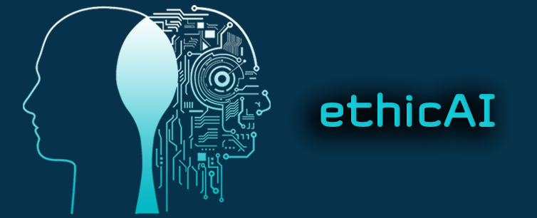

**What does it mean to behave in an ethical manner? What if we add all the law restriction on top of that? Moving on, how to write the appropriate if/else statements for the AI workflow to satisfy the strict, yet non-static regulations?**

## Preface

There is a lot of doubts in the area of law regulation of disrupting technology. Mixing the topics of AI, law and moral philosophy is a hard nut to crack, which I will try to tackle in this article, hopefully, while omitting the sensitive political topics and focusing on processing objective information from more than just a single source.

During this week, I left my attendance on [one of the local Data Science meetups in Brussels at DigitYser](https://bxl.legalhackers.org/2019/05/ai-ethics/), which tackled the topic of this deliberation, straight by the person dealing directly with the policymaking at the European Commission. In relation to this fact, the rest of this article will be supported by all the information I was able to gather from the presentation and answers to some of my questions.

## Ethics Guidelines for Trustworthy AI

Last Tuesday, [Nathalie Smuha](https://www.law.kuleuven.be/citip/en/ai-law-ethics-conference/nathalie-smuha) (Lawyer & Coordinator High-Level Expert Group on AI) was ready to share a presentation of the "Ethics Guidelines for Trustworthy AI" at the premises of DigitYser, here in Brussels[^1]. While tackling the problem more from a policymaker perspective, Nathalie did share a lot of insight information and cleared a lot of my doubts, such as if AI is already regulated in some way and what is the current process followed by the European Commission in order to apply the right policies.

_Title slide of the past evening_

### Defining ethics

Maybe let's start from defining what ethics are, as many of us might have a different view on it. According to the Internet Encyclopedia of Philosophy[^2]:

> _**Ethics** – the field of ethics (or moral philosophy) involves systematizing, defending, and recommending concepts of right and wrong behaviour_
>
> — [James Fieser](https://www.iep.utm.edu/ethics/)

That's still a very, very brief explanation of the term, leading to even more misconception, and if we would like to define it accurately, I would need to throw in the definition of three different pillars, which are associated with it (metaethics, normative ethics and applied ethics). But, let's make things easier. During the presentation, I loved the simple explanation of this broad and confusing term, brought by Nathalie, which says that "_**Ethics is about finding moral intuitions and rational explanations for them**_", as such it's not about doing things in your life according to the rule "because God told me so".

Before moving forward, another idea worth focusing on is how we observe the world. Scientifically speaking, you perceive a universe of facts and derive conclusions on which you act. However, according to the words of Jordan Peterson, it looks a little different: "_You perceive a landscape of pre categorised relevance that's dependent on your ethics_"[^3]. All of it brings us to the question of how to choose the right ethics to satisfy everyone's perception while deriving the legitimate regulations of AI.

The entire topic of ethics is always a great field of study for every philosopher. It's so important that we already have a specific [Wikipedia page designed just for the topic of ethics in AI](https://en.wikipedia.org/wiki/Ethics_of_artificial_intelligence).

### Main concerns of regulations

There are always two sides with a different view on the world. European Commission is bombarded from one side by voices from companies who wish to regulate AI because of the upcoming danger, while the other side wishes to let it go freely, to prevent the blockage of the digital advancement. At last, it's worth to take into consideration both of these rights and find the golden middle.

Impact of AI is still not fully understood, as it's moving incredibly fast to construct the right decisions in the social, economical, legal and ethical aspect. The entire case is context-specific, and lacking all the required answers makes it pretty challenging to apply the right policies. In order to make the final decision, it needs hours of conversation with different stakeholders, ideally all of them at the same time, where the overall message is understood by professionals of different background (engineers, lawyers, etc.)

For now, the EU tries to act according to the 3 pillars published in April 2018, before applying any policy:

- boost AI uptake
  - set digital innovation hubs to help startups with digitalisation using AI
- tackle socio-economic challenges
  -  think of "will AI take my job?" case
- ensure an adequate ethical & legal framework

_How to regulate AI, yet boost its uptake?_

### Classical question

So then, will AI take your job?

Most likely. It's just a matter of time. If you're doing something repetitive and you believe it could be automated, then I advise you to craft a "backup skill" in your free time. Always try to be open-minded and applicable to multiple disciplines.

If you are tired of reading newspaper headlines, drop on the website below, enter the name of your profession and see if you should start worrying. In my case, I feel completely safe for now, but even though I try to be ready for my eventual burnout.

➡**[willrobotstakemyjob.com](https://willrobotstakemyjob.com/)**⬅

Remember that with the inclusion of new technology in the market, everyone always becomes worried about the future of his career. Take the example of the agricultural market and how much it changed for the better, although how many people were stressed about its upcoming state.

> _It's a long-running concern — the Luddite concern going back 200 years ago — that each new form of technology will rob more jobs than it creates. Up to now, we haven't seen that. Each new technology eventually creates more secondary jobs than it eliminates_
>
> — [Wendell Wallach](https://www.carnegiecouncil.org/studio/multimedia/20160922-the-pros-cons-and-ethical-dilemmas-of-artificial-intelligence)

If you're a truck/taxi driver, better act as quick as possible. Once AI will finally automate your profession, please don't cry on the internet, and understand that you were warned already for about 20 years so that you could craft a 2nd skill in the meantime. Before closing the topic, I will bring up recent words of Gary Vee of what he thinks about AI effect on the job market:

> _AI is gonna do shit that below average humans do poorly. (...) that human could actually then go do something that he does like and does well_
>
> — [Gary Vee](https://youtu.be/sXzRmIEmlbg?t=494)

In all of this, if you want to find a negative point, you will find it everywhere and dwell in it. If you want to see a lot of upcoming opportunities and appreciate the greatest time to be living in, you will find it as well.

### ethicAI

Let's come back to the main topic of this article.

As mentioned in the beginning, ethics is a root of several branches, that come out of it, so to talk about the specific branch, please have a look at the spectrum of the basic distinctions:

- applied ethics VS normative ethics VS meta-ethics
- social ethics VS individual ethics
- ethics or Practical Philosophy VS Theoretical Philosophy

Again, let's not dwell into a definition of each of these terms, but keep in mind that while talking about AI, we focus on the applied ethics. This type comes into concern when talking about ethical norms to which we're trying to find the rational justifications about choosing one norm over another. It is used for specific applications such as abortion or the topic of our discussion (AI).

So, what's the process of delivering guidelines at the European Commission? Below, we can see that the first draft has been published just before the New Year's Eve, and by now the final document has been already published and welcomed about two months ago:

_Ethics Guidelines for AI - Process_[^4]

What is covered in all the guidelines? Firstly, it's worth mentioning that the term we can find here is "Trustworthy AI", so don't stress looking for the "ethical AI" keywords. Why trustworthy? Because even with the best ethical intentions, people are biased, such as they prefer pretty girls, and AI systems can help us to make more trustworthy (unbiased) decisions. For instance, Trustworthy AI can find its main applications in the hiring process, in order to avoid discrimination.

As such, Trustworthy AI has to meet 3 components:

- Lawful AI (respect of legal rules)
- Ethical AI (comply with ethical principles & values)
- Robust AI (ensure technical robustness, system security, unbiased state)

Finally, what are the next steps? On the day of June 26th, there will be a presentation of recommendations and the piloting will kick-off. In result, the commission will decide on the next actions, which will tackle the case of self-regulation/self-certification, standardisation, sectoral guidelines and overall regulation.

### Need to act expeditiously

Elon Musk, one of the AI pioneers, especially in the field of self-driving cars, already shared his worries last year, where he tried to speak with the US government to raise the awareness of AI potential. Unfortunately, the government acts too slowly, and it doesn't yet understand that AI will soon be out of human control. It might be very tempting to use technology as a weapon, and it will be used after all.

<iframe
  width="560"
  height="315"
  src="https://www.youtube.com/embed/Ra3fv8gl6NE?start=655"
  title="YouTube video player"
  frameborder="0"
  allow="accelerometer; autoplay; clipboard-write; encrypted-media; gyroscope; picture-in-picture"
  allowfullscreen>
</iframe>

Europe needs to act quickly, not just for the safety of others but for having some sort of impact on the global market of AI, where China and the US already took the lead.

What is the best strategy for Europe then? Both of the global AI leaders still lack the proper regulations; however, there already are countries, which have a very well defined set of guidelines, such as Canada, Singapore or Japan, which by the way performs pretty well in the AI market, for example by being able to read our minds[^5].

Moreover, don't think that AI wasn't yet regulated. GDPR is just one of the example regulations, and the anti-discrimination is another (I explained example situation, where AI became profoundly racist in the further part of this post).

_China and the US are battling to become the world's first AI superpower_[^6]

If I could throw in some of my ideas for improving the policymaking process, it's worth to think that AI's general concept is to use one general algorithm to learn things on its own, instead of using a bunch of programmers to write thousands of if/else statements, which will eventually fail. As such, what about trying to use AI to regulate itself? Well, not a long time ago, we were already informed that humans might not be the only ones to write scientific papers, and this is a big step[^7] ‘The First AI-Generated Textbook Shows What Robot Writers Are Actually Good At’.

### Your voice matters

The European AI Alliance is a "forum engaged in a broad and open discussion of all aspects of Artificial Intelligence development and its impacts"[^8]. Everyone is encouraged to share his view of the AI topic, so to help the European Commission in writing the appropriate law regulations.

Using the website below, you can register to the platform, which brings together citizens and organisations to dive into the topic of AI. There are already about 3000 members, who share their ideas to improve policymaking. Feel free to register to and start having an impact on the future of Europe and most probably the rest of the world!

Each stakeholder can direct the piloting process that will be kicked-off in summer 2019:

➡**[ec.europa.eu/digital-single-market/en/european-ai-alliance](https://ec.europa.eu/digital-single-market/en/european-ai-alliance)**⬅

In my humble opinion, ensuring the competitiveness of the European Region in the burgeoning field of Artificial Intelligence is of vast importance, as explained in the previous subchapter, Europe is not playing the highest role in this game. If we don't develop the right regulations in time, others will do it for us, taking already an advantage of the technology they possess.

### Experiencing the meetup vibe

Interested to know even more about was shared by Nathalie and feel like participating in the event (or finding my questions towards Nathalie)? Feel free to watch the entire meetup session under the following clip:

<iframe
  width="560"
  height="315"
  src="https://www.youtube.com/embed/JItsMV0c72E"
  title="YouTube video player"
  frameborder="0"
  allow="accelerometer; autoplay; clipboard-write; encrypted-media; gyroscope; picture-in-picture"
  allowfullscreen>
</iframe>

More or less, the text above summarised the 1,5h video recording, but everyone could have been interested in noting different pieces of information; hence, I am sharing the YouTube link. Hopefully, after watching the presentation, you will understand that you can start attending local meetups without knowing much about the topic of discussion, and you're not even required to share anything. Just come and start slowly by listening and getting familiar with the atmosphere, ideally slowly making some contact with participants of the same interest. Who knows, maybe your next co-worker will sit once next to you?

Moreover, if you would like to know more about the Data Science events in Brussels, head towards my previous article "[Data Hackathons – #TRACKathon19](https://pawelcislo.com/2019/05/01/data-hackathons-trackathon19/#ftoc-heading-7)".

## Moral Machine Problem

Nowadays, self-driving cars is a hot topic, when deliberating on the moral behaviour of the machines. On the road, due to not only the human error, there can be situations when the car will have to choose between killing one person over another. Unfortunately, the handling mechanism and physics won't let the vehicle to stop immediately, so when you put in front of the car two objects, it will need to hit one of them.

Probably the most classic example of this perplexity is the so-called [Trolley Dilemma Problem](https://pawelcislo.com/wp-content/uploads/2019/06/trolley-dilemma.jpg), which is not strictly related to self-driving cars, as it was in studies since 1905, as a part of a moral questionnaire given to undergraduates at the University of Wisconsin in 1905[^9]. In this experiment, you are usually in a situation, where you can pull a lever to change the track of the upcoming train so that it will kill either someone closely related to you (such as your parent) or five strangers. What would you do?

### Test yourself

Moving on, to the more typical example of the current state of the world, let's focus on a self-driving car dilemma.

Let's say that we decided to go on a summer trip together with four of our best friends. All of us chose to use an autonomous car for the journey, which leads us to the destination through a fast highway and drives according to the road regulations with an acceptable speed. Suddenly, out of the blue, five kids manage to get on the road in front of our driveway, and if the car doesn't steer to the side, it will end up killing all of the youngsters, even while braking itself as much as possible. Nonetheless, using the alternative way will end up killing you and your friends immediately, due to the fact of hitting a solid barrier.

_What should the self-driving car do?🤔_[^10]

As you see, in such a situation, it's hard to program the car to choose the "right" decision. This kind of problem is a never-ending source of sleepless nights for all the philosophers. Before speaking a little bit about the most common decisions taken by the citizens of the world, I would like you to test yourself in a free online test published by a group of academics under the hat of MIT. It's likely that the majority of decisions will impact the workflow of self-driving cars, so your votes might matter in this scenario. Just drop on the website below and "start judging".

➡**[moralmachine.mit.edu](http://moralmachine.mit.edu/)**⬅

Other examples, which I would like to bring up quickly, involve the choice between hitting:

- 2 homeless people VS 1 female doctor
- 1 person VS 1 dog and 1 cat
- 3 people getting on the pedestrian crossing on a red light VS 1 person making his way on the green light.

The list can go on and on, so let's see what the answer of the global community is.

### Cultural differences

According to the post on the MIT Technology Review, it depends on the country's culture.[^11] ‘Should a Self-Driving Car Kill the Baby or the Grandma? Depends on Where You’re from.’ \[24 October 2018\] available from <[https://www.technologyreview.com/s/612341/a-global-ethics-study-aims-to-help-ai-solve-the-self-driving-trolley-problem/](https://www.technologyreview.com/s/612341/a-global-ethics-study-aims-to-help-ai-solve-the-self-driving-trolley-problem/) Nathalie brought the referenced example presented in the article, where MIT academicians decided to share the results of the online test after four years. In the effect, regions with more individualistic cultures, such as France or Greece, were more likely to turn the steering wheel towards driving into the elderly person, usually according to the principle, that "the person already lived his life".

On the opposite side, countries from the Asian regions, such as China or Japan, were more keen towards saving the elderly population, which tends to be honoured with much more respect in their society.

_A comparison of countries piloting self-driving cars (closer to 1 = spare the young, closer to -1 = spare the old)_[^11]

Although China and Japan came to the same agreement in the case of sparing elderly population over the young, they had completely different rights when choosing between saving the pedestrians over the driver. From two neighbouring countries, Japan was more keen towards protecting the pedestrians, whereas China took the alternative option.

### The solution

When deriving a concrete if/else solution for the programmed AI sitting inside the self-driving car, I believe that it's worth to think about the following options:

- calculate the risk and go for the lowest one
- make a random choice
- let the user set up the ethical preferences before using the car for the 1st time
- act according to the cultural difference of the country you're in
- sum up the "social credit" of the objects (basing on the system already tested in China[^13], as well as presented in one of the Black Mirror episodes ([Nosedive](https://en.wikipedia.org/wiki/Nosedive_\(Black_Mirror\))))

_Chinese social credit system is a fact_

To end up, the presented discussions should instead involve problems more with a risk analysis aspect, than just giving the choice of saving one life over another. The presented situations will always vary from lots of factors, such as the weather or other elements present on the road so that we can end up only harming the person. Moreover, there are many more scenarios, which will need to be analysed, not only the ones involving the situations on the road.

## What else can go wrong with AI?

> _Anything that can go wrong will go wrong._
>
> — Murphy's law

Can AI go wrong? Undeniably.

Deliberating on the matter with self-driving cars is just a drop in the ocean of all the problems. Do you remember the hot topic from 2 years ago, about a specific Twitter bot? Microsoft's bot of a name Tay? No? Well, let me remind you of this case.

Microsoft decided to perform a small experiment on releasing a chatbot, which would interact with humans in the online world, precisely speaking, on Twitter. It was programmed in a way to learn how to communicate based on the messages it received from anyone.

Theoretically, it was doing what it was supposed to do. Learning and maintaining conversation based on the data submitted by Twitter users. Nonetheless, it took <24 hours to turn the bot from "Hi, how are you?" into a full "nazi mode"[^14].

What was wrong in this case? Why the mighty AI failed in such a situation? If you carefully read the beginning of this post, you might have guessed right that it lacked the ethics, which let us human to walk every day on the street, having some sense of understanding, that most of the people are living with the same set of values that prevent them from pulling out a knife and stabbing us in the middle of the day.

AI learns on historical data and any type of data in general. It consumes it like water and learns to understand the difference between pics of cats and dogs; as such, it can learn pretty much everything with a little bit of effort. Most importantly, it can learn things very quickly, and it can do it better than human so that if it isn't regulated, it can cause a lot of harm, without having a conscious intention.

Maybe the following video will put your imagination into work, of what can happen with humanity if the organisations will do anything they want. Remember that 10 years ago, the Boston Dynamics robot still learned how to walk straight using 4 legs, but now...

<iframe
  width="560"
  height="315"
  src="https://www.youtube.com/embed/LikxFZZO2sk"
  title="YouTube video player"
  frameborder="0"
  allow="accelerometer; autoplay; clipboard-write; encrypted-media; gyroscope; picture-in-picture"
  allowfullscreen>
</iframe>

If you feel like having a little sneak peek over the next 10 years of the AI robots, have a look at Black Mirror's episode titled as "[Metalhead](https://en.wikipedia.org/wiki/Metalhead_\(Black_Mirror\))".

Let's not introduce all the possible states, as one would need to write a comprehensive book with all the examples. Instead, I will leave you with this single GitHub repository, where you can spend a great part of your evening, getting familiar with all the introduced scary usages of AI in the [Awful AI repository](http://github.com/daviddao/awful-ai). As the author states, hopefully, it will depict the dark side of AI and "_raise awareness to its misuses in society_"[^15].

## A brief note before the farewell

In the end, please don't understand me wrong. **The goal of this post wasn't to make you scared or doubtful in the sense of further work on improving the AI state**. Technology is a great tool, and it can all make our lives better, as it did for all the years. Right, some things did not develop with the time, such as the matter of global warming, but please keep in mind that rapid development of technology isn't the major cause of one of the most concerned environmental problems. Looking on it from the brighter side, AI might be the answer to this and any other problems, as we might need some sort of inhuman intelligence to give us the right answer, as it was explained in the article of Renee Cho[^16]. No more than a month ago, Sam Altman (chairman of Y Combinator and co-chairman of OpenAI) also threw some words on this topic[^17]:

> _The best way to solve climate change is to build really strong AI first. I think it's that hard of a problem_
>
> — [Sam Altman](https://www.youtube.com/watch?v=TzcJlKg2Rc0)

Okay, let's come back to the matter of the growing quality of life. Googling the term "quality of life over time" might give us some level of understanding, that the life expectancy increases, we have easier access to medical health, we are more secure, most of us live with a hood above our head, and we can afford a lot more by getting a job and earning a few bucks.

_Human life expectancy at birth, measured by region, between 1950 and 2050_[^12]

Being hired is also easier looking at the fact of continuously dropping unemployment rate. Hence, the main problem of people nowadays becomes depression, as by having everything, we're becoming to lack the human interaction and we tend to struggle with balancing our needs (just like in The Sims):

_Life was never easy, and unlike in Sims, there are no cheat codes :(_

If you're depressed and reading this text right now, the advice of internet surfers about going out and running does have some right in fighting your illness. But running is not enough, as life is much more complicated. I think the above example, which bases on a simple computer game, can give you a better view of what caused the Sim to have a red diamond over his head.

And again I stepped into another topic and almost forgot to explain the key message of this post. **Please value the developing technology, but also keep in the back of your head that digital advancement staying unregulated by the right policies, may act unethically, causing a lot of harm to the human population**.

## Addendum

⚠ Let me share with you a little bit of my uplifting news.

First of all, I am happy to announce that through my consulting role at AKKA Technologies, **I am assigned to a long time project at Alstom for the position of Data Scientist. Yay 📊!** The scope of the task is varied and surely challenging, involving the development of a new tool and a lot of data analysis. As one of my tutors used to say "_if you don't struggle, you don't learn_", so let's take as much experience as possible from this role and leave with lots of new skills for the future.

_Let's-a go towards a better future!📈_

From the other side, I know that my writing is still not as perfect, as I would like to, so I reached for the "[Essay writing guide](https://docs.google.com/viewer?url=http://jordanbpeterson.com/wp-content/uploads/2018/02/Essay_Writing_Guide.docx)" by Jordan Peterson, which brought me a lot of ideas on how to ease and improve my future blog posts. I recommend everyone to read it, as you should understand that writing is one of the most powerful skills we can possess, and it's worth to develop it whenever possible. If you're a programmer, take into your mind, that writing concise and precise messages will also apply in scripting a cleaner and more readable code for others, who would likely take it over or collaborate with you in the development process.

In addition, I hope you noticed and appreciate, that above every post from now on you can find the estimated reading time, which on average assumes that you process 300 words per minute. Thanks a lot to Stefano for requesting this feature!

### Update of my e-book

As for the last news of this post, taking advantage of having more free time this week, I decided to update my e-book with even more relevant links to help you on your journey in data science. Remember, that initially it has been published with the release of this blog (September 2018). As the industry is in rapid development these days, I couldn't leave the comprehensive resources to myself and had to use well the 3-4h of fighting with hyperlinks inside the .pdf document. ;)

_Don't wait and grab your free copy right now!_

In relation to this, I highly encourage you to sign up for the newsletter using the panel on the right-hand side (if you're viewing it on desktop) or the form below (no matter which device you're using). Besides receiving the free e-book, you will be notified from time to time about new posts on my blog, so there is nothing to waste than just a few seconds of filling the form and confirming the registration on your e-mail account.

Okay, that's it for now. Please enjoy the beautiful weather of June (at least here in Brussels) and use the sun as much as possible, as it is an extraordinary source of vitamins we need! 🌞

## References

[^1]: Vandepitte, T. (2019) 'Artificial Intelligence: What Framework to Use?' [16 May 2019] available from <https://bxl.legalhackers.org/2019/05/ai-ethics/>

[^2]: Fieser, J. (2019) 'Ethics'. [6 January 2019] available from <https://www.iep.utm.edu/ethics/>

[^3]: Peterson, J. (2017) Perception and Ethics [online] available from <https://www.youtube.com/watch?v=gEDShTeSwco>

[^4]: Smuha, N. (2019) _Ethics Guidelines for Trustworthy AI_. [online] available from <https://youtu.be/JItsMV0c72E>

[^5]: Clifford, C. (2018) 'Japanese Scientists Just Used A.I. to Read Minds and It's Amazing'. [1 August 2018] available from <https://www.cnbc.com/2018/01/08/japanese-scientists-use-artificial-intelligence-to-decode-thoughts.html>

[^6]: Bareham, J. (2017) _China and the US Are Battling to Become the World's First AI Superpower_ [online] available from <https://www.theverge.com/2017/8/3/16007736/china-us-ai-artificial-intelligence>

[^7]: Vincent, J. (2019). [4 October 2019] available from <https://www.theverge.com/2019/4/10/18304558/ai-writing-academic-research-book-springer-nature-artificial-intelligence>

[^8]: Robotics and Artificial Intelligence (Unit A.1) (2019) 'The European AI Alliance'. [4 October 2019] available from <https://ec.europa.eu/digital-single-market/en/european-ai-alliance>

[^9]: Chapman Sharp, F. (1908) A Study of the Influence of Custom on the Moral Judgment. 138

[^10]: Rahwan, I., Bonnefon, J.-F., and Shariff, A. (2014) What Should the Self-Driving Car Do? [online] available from <http://moralmachine.mit.edu/>

[^11]: Hao, K. (2018) 'Should a Self-Driving Car Kill the Baby or the Grandma? Depends on Where You're from.' [24 October 2018] available from <https://www.technologyreview.com/s/612341/a-global-ethics-study-aims-to-help-ai-solve-the-self-driving-trolley-problem/>

[^12]: United Nations (2017) World Population Prospects. available from <https://www.un.org/development/desa/publications/world-population-prospects-the-2017-revision.html>

[^13]: Ma, A. (2018) 'China Has Started Ranking Citizens with a Creepy "social Credit" System — Here's What You Can Do Wrong, and the Embarrassing, Demeaning Ways They Can Punish You'. [29 October 2018] available from <https://www.businessinsider.com/china-social-credit-system-punishments-and-rewards-explained-2018-4>

[^14]: Vincent, J. (2016) 'Twitter Taught Microsoft's AI Chatbot to Be a Racist Asshole in Less than a Day'. [24 March 2016] available from <https://www.theverge.com/2016/3/24/11297050/tay-microsoft-chatbot-racist>

[^15]: Dao, D. (2019) 'Awful AI'. [2 February 2019] available from <https://github.com/daviddao/awful-ai>

[^16]: Cho, R. (2018) 'Artificial Intelligence—A Game Changer for Climate Change and the Environment'. [6 May 2018] available from <https://blogs.ei.columbia.edu/2018/06/05/artificial-intelligence-climate-environment/>

[^17]: Altman, S. (2019) _Sam Altman in Conversation with StrictlyVC_ [online] available from <https://www.youtube.com/watch?v=TzcJlKg2Rc0>
