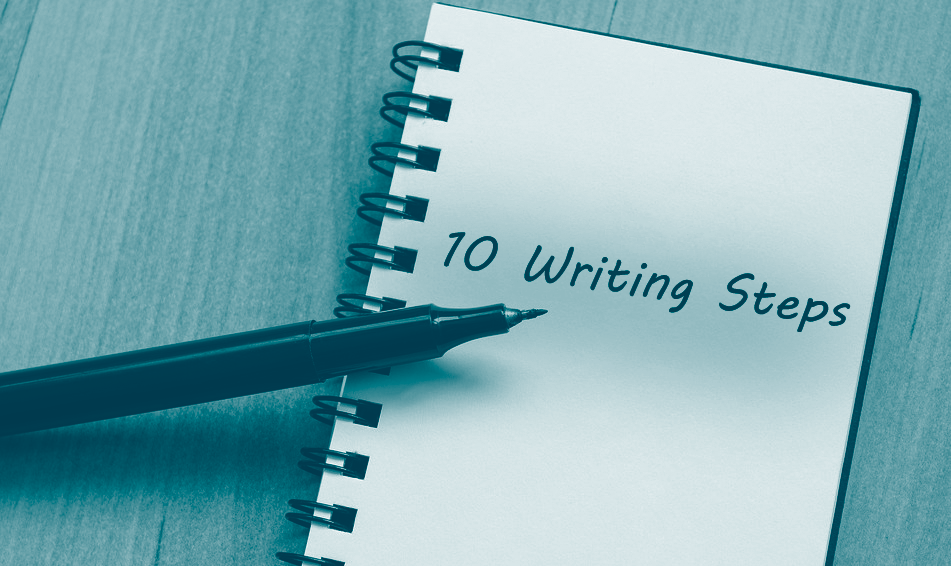

**Writing is one of the most extreme skills anyone can possess, and if you learn how to use it competently, there will be no lexical battle on your way to lose. Therefore, why isn't that so apparent to most of us?**

## Significance of expression

Unfortunately, since you were young, most possibly, you were told to write essays to achieve the best grade possible, so it commenced a sense of motivation in the form of competition. In this post, I will try to restructure that idea, as learning to speak and write is simply the best way to learn how to think critically and start making a significant impact on whatever you want.

The topic of writing popped in my mind mainly through Jordan Peterson – Canadian clinical psychologist, mostly recognised as the author of the bestseller: "_12 Rules for Life_". Just like Peterson, I strongly support the idea that the way we write highly impacts our logical abilities.

First and foremost, the psychologist tries to shape the real purpose of writing, unlike the one generally applied in schools, where we are usually told that it will result in a better grade, thanks to which our parents will be happy. Being more rational, it is writing, through which ultimately we can win arguments, get a pay rise or write better code and documentation so that newcomers could overtake the development.

Nonetheless, let's not stop on generalised logical/material benefits and extend the value of writing based on the example of writing an essay. To express it in a single sentence: the primary reason to write an essay is so that the writer can formulate and organise an informed, coherent and sophisticated set of ideas about something important.[^1]

> _If you can think and speak and write, you are absolutely deadly (…) It’s the most powerful weapon you can possibly provide someone with (…) those people, you don’t want to have an argument with them, they will just slash you into pieces._
>
> — [Jordan Peterson](https://youtu.be/bfDOoADCfkg?t=120)

This everything might sound pretty smart, but can we think of a broader rationale? After some time of quiet contemplation, I bet we might come up with a few additional reasons behind writing:

- above everything, it is important to think because action based on thinking is likely to be far less painful and more productive than action based upon ignorance
- writing extends your memory, facilitates editing and clarifies your thinking
- the person who can formulate and communicate the best argument almost always wins
- the Romans built buildings, and the Romans and the buildings are both gone. The Jews wrote a book, and they are still here, and so is the book. So it turns out that words may well last longer than stone, and have more impact than whole empires
- if you learn to write and to edit, you will also be able to tell the difference between good ideas, intelligently presented, and bad ideas put forth by murky and unskilled thinkers
- you will be healthier physically and mentally, as lack of clarity means unnecessary stress.[^1]

To strengthen out everything you just read, I encourage you to spend 4 minutes of your time with the following clip:

<iframe
  width="560"
  height="315"
  src="https://www.youtube.com/embed/bfDOoADCfkg"
  title="YouTube video player"
  frameborder="0"
  allow="accelerometer; autoplay; clipboard-write; encrypted-media; gyroscope; picture-in-picture"
  allowfullscreen>
</iframe>

Now, before we talk about a highly correlated form of communication, take into consideration that the goal of this post isn't to hail writing to be the one and only skill to handle logical conversations. For instance, without a basic understanding of math (some algebra and statistics), you might be fooled not even once by retailers and online news.

### Speak, speak, speak

Speaking is something I don't feel particularly good with; hence, I profoundly supported this part with a popular TED talk "_How to speak so that people want to listen_" given by Julian Treasure.[^2]

> "_Well-timed silence hath more eloquence than speech._"
>
> — Martin Tupper

This form of communication is merely an oral representation of writing, where the way we use our voice may deliver a message completely different from our intention. In addition to the sound, body expressions pay even more importance if we have a chance to see our conversation partner. Nowadays, in order not to lose these techniques in the written form of communication, some of us try to portray the vocal/body expressions in the form of pictorial representations, such as emoticons or emojis. ;)

Mastering vocal expressions come with the time, but you can significantly improve it through giving presentations at your job or university, or you can even get a vocal coach if you're determined enough. One day, it might help you a lot while trying to negotiate, get a salary increase or to sell your product to a new customer. At first, before applying the right techniques, can you spot one of the 7 deadly sins of speaking in your conversations?

1. Gossiping (speaking badly about those not present)
2. Judging the listener
3. Being consistently negative
4. Complaining
5. Giving excuses (avoiding responsibility)
6. Exaggerating (leading to lies)
7. Dogmatising (confusing facts with opinions).

I bet you do, not only by looking at yourself but a large part of your daily environment. Omit those bad habits like a fire, and instead, apply the HAIL technique so that people will enjoy talking with you:

- Honesty (be clear and straight)
- Authenticity (be yourself)
- Integrity (be trustworthy)
- Love (wish others well).

But even more importantly, it's not just about what you say, but how you say it. Improving your vocal techniques can't be easily summarised with words; therefore, I wish you a great 5 minutes of your time with the 2nd part of Julian's performance \[04:23 – 09:58\]:

<iframe
  width="560"
  height="315"
  src="https://www.youtube.com/embed/eIho2S0ZahI?start=263"
  title="YouTube video player"
  frameborder="0"
  allow="accelerometer; autoplay; clipboard-write; encrypted-media; gyroscope; picture-in-picture"
  allowfullscreen>
</iframe>

## Editorial tips in 10 steps

Coming back to the merits of this post (writing), it's worth to have an ultimate template which would improve the quality of our work. The following steps are mainly a summary of Peterson's essay writing guide ([available on his website](https://docs.google.com/viewer?url=http%3A%2F%2Fjordanbpeterson.com%2Fwp-content%2Fuploads%2F2018%2F02%2FEssay_Writing_Guide.docx)), with slight modification, including my suggestions. In general, the entire manual is based on the iteration process through our report, until the moment of achieving the supreme state.

1. **P1: Method of work (apply before writing)**
    - have a quiet place to work
        - tip for professionals: rent not the cosiest hotel room in a boring city (to avoid touring)
    - allocate enough time for your work, as stress won't work with you
    - define your audience before deciding on the topic
    - use 2 monitors: one for reference material, another for the essay
    - 3 productive hours are way better than ten hours of self-deceptive non-productivity, even in the library
        - you won't achieve more than 3/4 hours of productive writing
    - write more than you need, so later you can drop/rearrange your ideas
2. **P2: Process (words, sentences, paragraphs)**
    - respect the resolution levels
        - 1st: selection of word
        - 2nd: crafting of the sentence. The sentence itself should present a thought, part of the idea expressed in the paragraph
        - 3rd: each sentence should be properly aligned in the paragraph
        - 4th: all of the paragraphs have to be arranged in a logical progression, from the beginning of the essay to the end
        - 5th: essay, as a whole
        - additional
            - 6th: essay necessarily exists within a context of interpretation, made up of the reader
            - 7th: essay necessarily exists within the culture that the reader is embedded in
    - rule of thumb: paragraph should be made of at least 10 sentences or 100 words
    - if you are bored while writing, then, most likely, you are doing it wrong, and you will also bore your reader
    - you have to place yourself in the correct state of mind to write properly
        - the proper attitude is interested and aesthetically sensitive
3. **P3: Finding ideas**
    - list 10 interesting topics in the form of questions
    - there is no such thing as reader’s block. If you can’t write, it is because you have nothing to say
        - read more to find what to write about
    - assume you need 5-10 books or articles per 1000 words of essay
        - double-spaced page of typing usually contains about 250 words
    - list 10 of your reading sources and write notes for each of them
    - writing in your own words has a reason
        - this is the dialogue you are having with the writer of your findings. This is your attempt to say back to the author “_This is what I understand you are saying._”
    - you can read a paragraph, look away and say in your own words what you understood from the text
    - take about 2 to 3 times as many notes, by word, as you will need for your essay.
        - in order to write intelligibly about something, or to speak intelligently about it, you need to know far more than you actually communicate
4. **P4: The outline**
    - - your 1st draft should be longer than the final version (of about 25%)
        - outline is the most difficult part of writing an essay and not optional
        - it shows the skeleton of the document
        - 1000 words essay = 10 sentence outline
            - no longer than 15 sentences, no matter of the number of words
            - you can write it in bullet points (like a list of answered questions)
5. **P5: Paragraphs**
    - write 10-15 sentences per outline to complete the paragraph
    - don't forget to use your notes
6. **P6: Editing and arranging of sentences**
    - from each paragraph, place each sentence on a single line
    - then write another version of each sentence
        - example:
            - BEFORE: Liberal and conservative thinkers stress efficiency of production, as well as quality, and consider profit the motive for efficiency
            - AFTER: Liberal and conservative thinkers alike stress the importance of quality and efficiency, and see them as properly rewarded by profit
        - better sentence:
            - shorter and simpler (unnecessary words are eliminated)
            - each word is precisely and exactly the right word
            - don't need to impress the reader with an extensive vocabulary, which you wouldn't use in face to face conversation
        - read each sentence aloud, and try to say it in different words. Note what you said and replace the old version with the new one if it's better
        - list the paragraphs in comparison to the original ones and think of even more improvement by following the same editing process again
7. **P7: Re-ordering the paragraphs**
    - you might find that the order of the subtopics within your original outline is no longer precisely appropriate
    - think of re-ordering the paragraphs so everything seems good
8. **P8: Generating a new outline**
    - read the entire essay you wrote
    - without looking back at the essay, try to write a new outline of 10-15 sentences
    - reconstructing the argument from the memory might most likely improve it
    - generally, when you remember something, you simplify it, while retaining most of what is important
        - your memory can serve as a filter
9. **P9 (optional): Repeat**
    - you can repeat the process of rewriting and re-ordering, as well as paragraph re-ordering and re-outlining
    - you can wait a few days before doing it. Then you will be able to see what you have written, instead of seeing what you think you wrote
    - you are not genuinely finished until you cannot edit so that your essay improves
        - generally, you can tell if this has happened when you try to rewrite a sentence (or a paragraph) and you are not sure that the new version is an improvement over the original
10. **P10: References and bibliography**
    - fact/informed opinion picked from something you read, should be referenced
    - it's recommended to use a specific citation software (discussed in the further part of this post)
    - otherwise, you might be accused of plagiarism.[^1]

### The way I write blog posts

Let's make it clear that I do not always follow the 10 steps presented above, but I do keep them in mind. Don't take anyone's approach for granted, yet keep to yourself the ideas you value the most.

While creating this blog last year, I end up writing [several ideas for my upcoming posts](/images/post-ideas.png). At that time, some of them were dropped, some are still waiting, and some of them were combined into single great topics.

The topic you're reading now came to me as inspiration from a Facebook post of my friend, the other in the middle of a call, and the rest mostly from random walking/reflection sessions. My recommendation would be not to push yourself too much as the best inspirations tend to come in the most unpredictable moments.

After I got a problem I would like to cover; I usually start with defining my table of contents in the form of bullet points:

- _topic 1_
  - _subtopic 1_
    - _subsubtopic 1_
    - _subsubtopic 2_
    - _subsubtopic 3_
  - _subtopic 2_
    - _subsubtopic 1_
- _topic 2_
  - _subtopic 1_
- _topic 3_

The points typically go through high modification process as I finally perform my first keystrokes. Sometimes, I also include comments (notes) under the bullet points, preceded by // characters (probably a leftover from my C++ classes).

Another part that is profoundly important and takes a lot of my time is the preparation of images, and in the end, promotion of the fresh post on my social profiles, different communities and through the newsletter. All of it involves following a specific set of previously specified steps, which I might automate one day.

## The merit of reading

Reading is like sharping a sword before fighting. It doesn't only teach us different forms of communications and new words, but above all, it's a universal source to be more aware of our surroundings. You cannot expect to write trustworthy researches without reading several scientific papers and referencing them in your work.

After leaving your university you might be more flexible in terms of choosing your literature, therefore give it a try. Don't stay behind, as according to the latest research, people aren't reading less, since "_typical (median) American has read four books in the past 12 months_".[^3] Surprising? I don't think so.

Just as you might have guessed from the image above, it's listening that can let us read so many books from our overgrowing waiting list. As an example, last week I finished a 224 pages book in 5 days, only by using a part of the time I need to commute to my work. You can try various types of fiction and non-fiction, and it even turns out from my experience, that you can touch technical topics through audiobooks. However, when the book is heavily technical (such as consolidating programming/mathematical snippets), then I would advise reaching for a hardcover or e-book, where it's much easier to take notes.

In the end, make sure not to end up on continuous yet vacant book consumption. Don't rely on taking notes and leaving them for later with the idea that you might end up using it one day. Apart from summarising the book in your own words, try to take the stuff you learned into action immediately. Experiment if it works out in your life and give a greater sense to reading!

Apart from reading, I can give you an honest recommendation to try [Elevate app](https://www.elevateapp.com/), which is full of games that will improve your English vocabulary to a highly professional level. At first, try the free version, and if you like it, you can decide funding yourself a premium account.

_Elevate's "memory" game_

## Researching Scientific Papers

We wouldn't achieve all the technological advancement of our society if we weren't able to access the benefits of the research conducted by previous generations. Sadly, we still need to be careful with science, as even though many papers support it, it doesn't mean it can be entirely unbiased (e.g. we had a case of scientific corruption: [How the Sugar Industry Shifted Blame to Fat](https://www.nytimes.com/2016/09/13/well/eat/how-the-sugar-industry-shifted-blame-to-fat.html)).

Once we are fully aware of questioning the authority, we don't need to get out to the nearest library, but we can find all the required material online. There are various services; therefore, I can guide you to the most helpful resources I found during my research at the university:

- [arXiv](https://arxiv.org/) ← open access to the scientific papers
  - [Arxiv Sanity Preserver](http://www.arxiv-sanity.com/) ← web interface that attempts to tame the overwhelming flood of papers on Arxiv
- [DOAJ](https://doaj.org/) ← directory of open access journals
- [Google Scholar](https://scholar.google.com/) ← web search engine that indexes the full text or metadata of scholarly literature
- [JSTOR](https://www.jstor.org/) ← access to more than 12 million academic journal articles, books, and primary sources in 75 disciplines
- [ResearchGate](https://www.researchgate.net/) ← European commercial social networking site for scientists and researchers to share papers, ask and answer questions, and find collaborators
- [ScienceDirect](https://www.sciencedirect.com/) ← website which provides subscription-based access to a large database of scientific and medical research
- [Sci-Hub](https://sci-hub.now.sh/) ← unlock access to all scientific papers using its URL, PMID/DOI
- [Springer](https://link.springer.com/) ← access to millions of scientific documents from journals, books, series, protocols, reference works and proceedings
- [Wikipedia's List of academic databases and search engines](https://en.wikipedia.org/wiki/List_of_academic_databases_and_search_engines).

As at this time, many research papers are artificially restricted by copyright laws, you might quickly run out of money (especially if you're a student) during your thesis. I am not suggesting anything, but there is a friendly service: [Sci-Hub](https://sci-hub.now.sh/), that can help you with that, if you provide him with a specific document ID, such as digital object identifier (DOI). ;)

_Sci-Hub – saviour of the poor students' life_

Moving on to the next chapter, we will discuss what do with all the accumulated material, reviewed with the help of dozens of coffee mugs and loads of chocolate.

### Is there a "database" for all my papers?

It is worth to learn from the mistakes, and here you can learn on mine. Before writing any essay, make sure you have your citation tool open on the side and ready to roll. It will help you in many ways:

- you won't get lost in the pile of papers (even if you think that citing a few of them is enough, still go with the tool, as the situation might quickly evolve)
- you will always use the right style/syntax required by your educational institution. No more missing commas, hyphens and apostrophes
- it will become a great habit. After graduating, I am still using it to store the bibliography of each post on this page!

Now, what about utilising the goods of technology to store all the papers in a safe environment? I did try lots of citing tools, such as built-in Word function, EasyBib and even end up paying for the premium account for the Cite This For Me service. Hence, don't make my mistake and take advantage of the succeeding paragraphs.

At the end of my master's thesis, I discovered [Zotero](https://www.zotero.org/) (open-source, cross-platform application). Huge thanks to the community of HackerNews, where I heard about it, unfortunately, a little bit late. The program functions admirably and provides even more features than some of the premium tools on this market. You can save up a lot of metadata, have it automatically filled for you (with a [Chrome extension](https://chrome.google.com/webstore/detail/zotero-connector/ekhagklcjbdpajgpjgmbionohlpdbjgc)), and most importantly, you don't need to worry that one day the host will decide taking out all of your storage.

_Example of massive research organised in [Zotero](https://www.zotero.org/)_

If you can't install anything on your machine, you can also try the lighter/more primitive web version: [ZoteroBib](https://zbib.org/). The web application seems not to have an option to register your account and store your sessions, but there is a workaround. Cache files of your browser should save the data themselves, but I would suggest you not to trust your web browser, but create a "_Link to this version_". You can find this function on the main web page if you scroll down a little bit. Afterwards, keep a good note of the URL.

Maybe I am too biased towards Zotero, but if you feel that your solution should be reliable enough for the researchers, let us know down in the comments.

## Tools to ease the writing process

These days, you don't need to worry as much about typos, nor about handling your document for proofreading. There are several tools that you can apply by yourself easily, hence, here I would like to share with you my picks.

My favourite one – [Grammarly](https://www.grammarly.com/). All my university assignments have been validated with this tool and nowadays, likewise, my blog posts. Still, there might be some typos and grammar issues, but it's clearly more readable. Since last time, Grammarly is worth even more attention, as the developers included readability score and the way to verify your text based on correctness, clarity, engagement and delivery. Moreover, before commencing to compose the document, you can specify its intent effortlessly.

_Maybe now there's hope if you're bad at entertaining the audience?_

I tend to use Grammarly mostly in the form of Microsoft Word add-on, but including it as a browser extension also saves you from lots of errors. Sometimes, I also tend to use it merely through the official online app, as it guarantees the best support and performance. Moreover, if you have the budget, I recommend giving the premium version a chance, but before, try to seek out some discount coupons, especially on Cyber Monday.

Alternatively, if you prefer, you can also try proofreading available in good old Microsoft Word and Google Docs, which might be more accurate based on the fact of using machine learning to power their spell checking. Apart from document correctors, there is also [LanguageTool Plus](https://languagetoolplus.com/) extension that works well with other languages too, such as Polish or Spanish.

Apart from the aforementioned tools, you can also reach out for:

- [Parts of speech](https://parts-of-speech.info/) ← categorise words based on similar grammatical properties (noun, verb, adjective, etc.)
- [Readable](https://www.webfx.com/tools/read-able/) ← perform the ultimate readability test (base on Flesch Kincaid Reading Ease, SMOG Index and more...)
- [Word Frequency Counter](http://www.writewords.org.uk/word_count.asp) ← paste in the text and find out if you're not overusing particular words.

Oh, and remember! Just as machine learning algorithms, the proofreading tools aren't 100% right, so that keep your mind fresh while applying the suggested corrections!

### Okay, but my dictionary is poor

According to the guide, there is no need to overcomplex your craft, particularly if you're aiming toward a mass audience. However, if you would like to apply some exoticism into your script (such as I am doing in this paragraph 😎), you can help yourself by looking up for synonyms at all times.

Traditionally in Word, you can find a thesaurus dictionary, solely by right-clicking the term you would like to exchange, so to maintain some variance in your vocabulary range. Besides, you can always reach for [Thesaurus web service](https://www.thesaurus.com/) and get a more comprehensive view.

_oopsie_

Apart from Thesaurus, I tend to find even more synonyms, by merely typing down the phrase in [Google Translate](https://translate.google.com/), but you can also take advantage of previously discussed Grammarly by simply double-clicking the right set of characters.

From my experience at Coventry University, I was also recommended to check [Academic Phrasebank](http://www.phrasebank.manchester.ac.uk/) published by The University of Manchester, in order to avoid repeating the most traditional phrases, such as when introducing the paragraph, listing the examples or signalling transition. The web service contains a fair amount of expressions, but you can always get more ideas from the Kindle version (which might be a bit hard to explore), so you can try "googling" a .pdf version. ;)

In the end, don't forget to read more to solve the issue from inside, as previously mentioned!

## Should I worry about LaTeX?

If you aren't yet familiar with the LaTeX term, it is a document preparation system widely used in academia. In comparison to Word that is established on WYSIWYG ("what you see is what you get") word processing system, LaTeX extends the freedom of the user, by letting him specify the general structure of a document, such as its type (book or letter), style (bold or italics) or citations and cross-references.

If that still sounds confusing, think of LaTeX as a programming editor to compile (generate) your documents. By using LaTeX, you will type out all the processes on the keyboard, such as to include an image using _\\includegraphics{file}_ command, whereas in WYSIWYG editor, you could just click a colourful image button, which would do everything for you.

As such, what is the reason for using LaTeX instead of Microsoft Word? Well, although it takes more effort to write your essay in this system, you can still benefit from it, not only by getting tons of respect from your colleagues and tutors. Generally, you will:

- get more control and functionalities over your document
- generate much better-looking reports, as the set of characters, is aligned with more respect to the rest of them after the compilation
- use predefined packages and [templates](https://www.overleaf.com/latex/templates) to achieve your style in few seconds
- stand out in front of the employer by generating a [well-aligned CV](https://www.overleaf.com/latex/templates/tagged/cv)
- avoid pirating/paying for commercial software.

This list could go on and on, so if you would like to know more pros over MS Word, check out [this comparison](https://openwetware.org/wiki/Word_vs._LaTeX).

In general, the reason to type documents in LaTeX increases with the complexity of your documents.

### Set of LaTeX resources 🛠

If you feel like convinced to give it a try, but you're not sure where to start, please check the list of the following tutorials, links and tools to ease your way:

- Tutorials
  - [Introduction to LaTeX](https://www.overleaf.com/latex/learn/free-online-introduction-to-latex-part-1) ← 3 part presentations from Dr John Lees-Miller (recommended by Overleaf team)
  - [LaTeX Tutorial in a single 1h video](http://www.newthinktank.com/2019/01/latex-tutorial/) ← presented by Derek Banas
  - [LaTeX.md](https://github.com/virgili0/Virgilio/blob/master/Tools/Latex.md) ← short introduction to LaTeX in a popular GitHub repo
  - [Minimal examples of LaTeX with overleaf (v2)](https://www.youtube.com/playlist?list=PLnC5h3PY-znyDQKn3knfXfekZLgWyL7QW) ← YouTube tutorial by Dr Vincent Knight (recommended by Overleaf team)
    - [Text version of the tutorial](https://vknight.org/tex/)
  - [LaTeX Cheat Sheet](https://wch.github.io/latexsheet/latexsheet.pdf)
  - [LaTeX Notes for Professionals book](http://books.goalkicker.com/LaTeXBook/) ← free e-book
- General links
  - **[Awesome LaTeX](https://github.com/egeerardyn/awesome-LaTeX)** ← probably the only link I should include in the set of these bullet points
  - [How I'm able to take notes in mathematics lectures using LaTeX and Vim](https://castel.dev/post/lecture-notes-1/)
  - [Tips and Tricks for Writing Scientific Papers](https://github.com/Wookai/paper-tips-and-tricks) ← best practice and tips & tricks to write scientific papers in LaTeX, with figures generated in Python or Matlab
- Tools
  - [Mathpix Snip](https://mathpix.com/) ← convert images to LaTeX by capturing your screen
  - **[Overleaf](https://www.overleaf.com/)** ← online LaTeX editor, recommended not only for the beginners.

_Overleaf makes it fairly easy to start with LaTeX. You can auto compile your work to get an instant preview of the document and even collaborate with others on the same file![^4]_

## Additional learning material

After all of it, I wouldn't like to leave you and your thoughts deliberating on the rational use of LaTeX, but the central message of this post. The topic of writing is highly substantial; there are dozens of books you can review for a great time if you feel like it.

Being honest, I didn't get much into the comprehensive material that would solely cover this topic, but through my online research, I've been able to save some material worth checking out:

- [The Sense of Style: The Thinking Person's Guide to Writing in the 21st Century](https://www.goodreads.com/book/show/20821371-the-sense-of-style) – Steven Pinker ← on the modern art of writing
- [On Writing: A Memoir of the Craft](https://www.goodreads.com/book/show/6277039-on-writing) – Stephen King ← lots of autobiographical moments, but most importantly, many practical writing tips
- [On Writing Well: The Classic Guide to Writing Nonfiction](https://www.goodreads.com/book/show/53343.On_Writing_Well) – William Zinsser ← as the title suggests, it's focused on writing non-fiction books, full of practical ideas
- [Magia słów. Jak pisać teksty które porwą tłumy](https://www.goodreads.com/book/show/22468051-magia-s-w-jak-pisa-teksty-kt-re-porw-t-umy) (in Polish) – Joanna Wrycza-Bekier ← straight to the point, with the actual tips of how to write: choosing the right words, building sentences and emotions.

Nevertheless, this article wouldn't be complete without mentioning Neville Medhora, the author of KopywritingKourse – blog to reduce wasted communication time, talk with clients better, and make more sales. I strongly encourage you to get familiar with its content, and if you would like to extend the already mentioned writing tips, please check: [Editing Writing Process (w/ Examples and Cheat Sheet)](https://kopywritingkourse.com/editing-writing-process/).

Moreover, in this post, I didn't tackle the highly correlated topic of asking and answering questions. I might cover it individually in a further post, as it would greatly improve all social media communication. Many people end up being misunderstood from their assumptions that everyone else has the exact picture on the mind; therefore, we can find lots of undetailed messages, such as: BAD: Help! The script doesn't work properly on my laptop! BETTER: Launching the script on my 64-bit Windows machine ends up with the error code: 0x34053.

If you would like to know more about the topic, check out the guide of "[How To Ask Questions The Smart Way](http://www.catb.org/esr/faqs/smart-questions.html)" by Eric Raymond.

Right, it's time to end this long deliberation. I firmly believe that if you read everything carefully, you must have taken out something that influenced you to be more interested in the topic of writing. Don't hesitate to share your reflections down in the comments, and suggest your tips on this marvellous talking point. Let everyone learn and spread the passion for writing! ❤✍

## References

[^1]: Peterson, J. (2017) 'Essay Writing Guide'. [online] available from <https://docs.google.com/viewer?url=http://jordanbpeterson.com/wp-content/uploads/2018/02/Essay_Writing_Guide.docx>

[^2]: Treasure, J. (2013) _How to Speak so That People Want to Listen_ [online] available from <https://www.ted.com/talks/julian_treasure_how_to_speak_so_that_people_want_to_listen>

[^3]: Kerri, J. (2018) 'How Many Books Did The Average American Read In The Last Year? This New Study May Surprise You'. [19 April 2018] available from <https://www.bustle.com/p/how-many-books-did-the-average-american-read-in-the-last-year-this-new-study-may-surprise-you-8837851>

[^4]: Overleaf (2018) 'Try out Overleaf V2'. [1 May 2018] available from <https://www.overleaf.com/blog/641-try-out-overleaf-v2>
