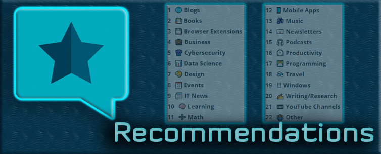
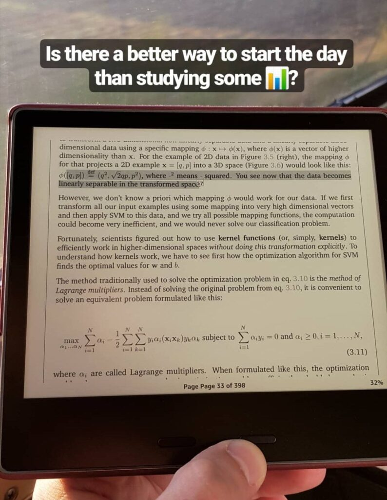
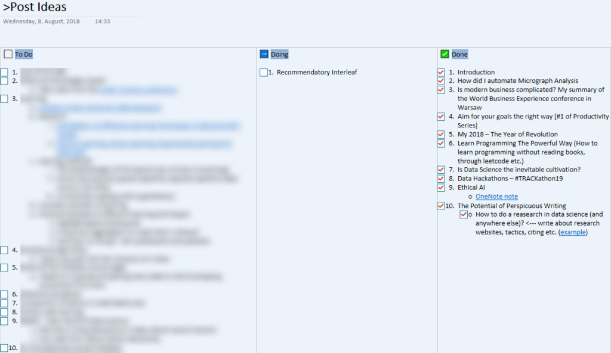
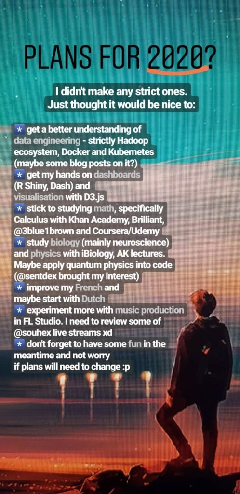

**This registry was created to catalogue the recently published set of recommendations and share a couple of updates from my side.**

## Recommendations for Engineers

As of today (12/03), my recent list of [Recommendations for Engineers](https://pawelcislo.com/recommendations/) managed to appear in my favourite [tech newsletter](https://news.mrugalski.pl/post/189347449362/28-listopada-2019) (1st position), hit 2103 page views and 14 stars on its [GitHub repository](https://github.com/pyxelr/recommendations-for-engineers). Those statistics motivated me to spread its existence even further with this blog index, since after its initial release in the last November, it counts 94 commits (updates) and counting (≈ 0.87 commits per day).

Enough on the statistical side, as at that point, you might still wonder what is inside this list that makes me want to brag about it today.

In short, I have aggregated all of my recommendations for aspiring engineers in a single place, coming from various areas of interest. The principal scope supports data science, programming, python, math, cybersecurity, business, and productivity. The entire content has been built for a vast amount of time thanks to my never-ending curiosity. With all of that, I intend to rise a bit of inspiration in everyone, as it already helps myself.

Although it is a personal list, do not hesitate to create a [pull request](https://github.com/pyxelr/recommendations-for-engineers/pulls) if I missed something interesting or if there is a dead link. Once again, before moving to the next section on a different subject, you are more than welcome to review my:

[⭐ Recommendations for Engineers](https://pawelcislo.com/recommendations/)

## Reason for my recent absence

Last time, I have been a bit off blog posting since my newest publication in July 2019, but it does not mean I completely forgot about this site and my online presence overall.

Principally, the reason for my absence was a new project to tackle at a railway company – Alstom, which I put a priority on, in order to deliver the best possible result and come back with a valuable experience. Apart from the working hours itself, I used to spend approximately 3 hours a day commuting with public transport, which I managed to use efficiently. All this time, let me consume lots of abandoned books, podcasts and audiobooks, focusing on my French and statistical proficiency.

In all this hassle, I did find some free time, which I used, for example, to scribble down my latest publication, but also to experiment with different learning methods that I am planning to describe in the upcoming posts. Nonetheless, I also had to give my mind a break and rethink my current actions and plans for the future.

\[caption id="attachment\_2943" align="aligncenter" width="472"\] Lately, reading is one of the main activities I devoted myself into\[/caption\]

Not to waffle on all the news, and to maintain a structured article, let's have a look at the succeeding sections.

## 📅 A brief timeline of my last events

As this is more of an "announcement" post, I will try to be as concise as possible and summarise below all of my recent activities (from June 2019 till March 2020). Please don't mind me all the emojis.

### 🌐 Changes on this website

- 🆕 \[June\] New post about the art of writing: #10 – [The Potential of Perspicuous Writing](https://pawelcislo.com/2019/07/28/the-potential-of-perspicuous-writing/)
- 🆕 \[November\] Completely new subsection on [Recommendations for Engineers](https://pawelcislo.com/recommendations/)
- ✍ Updated my [article on the use of Todoist](https://pawelcislo.com/2018/11/09/aim-for-your-goals-the-right-way/) with new projects, labels and priorities
- ✍ Added questions and answers on the [FAQ](https://pawelcislo.com/faq/) page. Some of the responses have been converted into the Recommendations for Engineers
  - I've mainly explained the reason behind each of the individuals that inspires me
- ✍ More citations in the [Favourite Thoughts](https://pawelcislo.com/favourite-thoughts/) segment
- ✍ Redefined objectives in [Three Goals](https://pawelcislo.com/three-goals/). Being honest, it is very challenging to keep up with all these challenges in the face of unscheduled life novelties
- ✍ Supplementary sections on the [About Me](https://pawelcislo.com/about/) page
  - Modified _Extra-professional Activities_
  - Summary of online presence within _My Internet Persona_
- ✨ Redesigned [newsletter signup form](http://eepurl.com/dDqG-z)
- ✨ Redesigned mobile navigation bar (visible on your smartphone)
- ✨ Improved layout of the [Favourite Thoughts](https://pawelcislo.com/favourite-thoughts/) page (it's a bit more explicit and has a TOC)
- 👨‍💻 Applied gzip-compressing to improve the site performance
- 👨‍💻 Improved SEO score of the entire website
- 👨‍💻 Specified 301 redirections. You can access all the posts using a number within the path, such as this one with _pawelcislo.com/11_. The same works for my social media, such as _pawelcislo.com/twitter_ or _pawelcislo.com/linkedin_.

### 🚹 Latest episodes of my personal life

This part would definitely challenge my memory if I wouldn't keep track of my daily journal. Living in the digital era, I also found it helpful to browse my photos with [scrcpy](https://github.com/Genymobile/scrcpy) conveniently.

- **June**
  - 📚 Listened to the _Lying_ audiobook ([my review](https://www.goodreads.com/review/show/2552323407))
  - 💼 **Start of a new project at Alstom**
  - 📚 Consumed [Head Strong](https://www.goodreads.com/book/show/31850600-head-strong) and [Anything You Want](https://www.goodreads.com/review/show/2847490814) audiobook
  - 📰 Found my [ethicAI](https://pawelcislo.com/2019/06/02/perplexing-ethics-of-ai/) write-up to be reshared on
    - [\[Twitter\] BXL Legal Hackers](https://twitter.com/LegalHackersBXL/status/1135256502049083395)
    - [\[FB\] DigitYser](https://www.facebook.com/digityser/photos/a.1425811514105483/2451036228249668/?type=3&permPage=1)
    - [\[LinkedIn\] Philippe Van Impe](https://www.linkedin.com/feed/update/urn:li:activity:6543012751583911936)
    - [\[Twitter\] Philippe Van Impe](https://twitter.com/pvanimpe/status/1137240155264364544)
    - [\[Twitter\] AI4Belgium](https://twitter.com/Ai4Belgium/status/1137241547550932992)
    - \+ more on Twitter but without additional context
  - 🎓 Graduated from an online
    - [R programming bootcamp](https://www.facebook.com/pawelcislocom/photos/a.2657957824278703/3231605053580641/?type=3&theater)
    - [Music Producer Masterclass: Make Electronic Music](https://www.udemy.com/music-producer-masterclass/)
  - 📚 Finished _The 10X Rule audiobook_ ([my review](https://www.goodreads.com/review/show/2515509357))
- **July**
  - 📅 Attended [symposium in Alstom Utrecht](https://www.linkedin.com/feed/update/urn:li:activity:6556130231953035264) to share feedback on students' projects
  - 🎮 Completed [To The Moon](https://store.steampowered.com/app/206440/To_the_Moon/) game (I bet the story will immerse everyone)
  - ⚽ Started [weekly football games](https://pawelcislo.com/wp-content/uploads/2020/03/football_field_view.jpg) with my colleagues in Brussels. Before, we managed to get the [appropriate equipment](https://pawelcislo.com/wp-content/uploads/2020/03/football_equipment.jpg)
    - together with another player, we committed to managing the data of each player (goals, assists, attendance)
    - later, thanks to all this information we began using different algorithms to select the teams automatically
  - 📚 Listened to _Steve Jobs_ biography ([my review](https://www.goodreads.com/review/show/2847488455))
  - 📚 Accomplished reading _The Subtle Art of Not Giving a F\*ck_ ([my review](https://www.goodreads.com/review/show/2480444228))
  - 📚 Published [The Potential of Perspicuous Writing](https://pawelcislo.com/2019/07/28/the-potential-of-perspicuous-writing/) (10th blog post)
  - 📼 Watched [The Great Hack](https://www.imdb.com/title/tt9358204/) (documentary on the Cambridge Analytica case)
- **August**
  - 📖 Changed the way of reading books by selling my Kindle Paperwhite 3 and switching to Kindle Oasis 3. Cannot regret this decision :)
    - I have also started utilising more often the feature of annotating Kindle books and taking benefit from syncing the reading progress between the [Kindle Cloud Reader](https://read.amazon.com/) and the e-reader
  - 🏃 Specified recurring tasks in my Todolist to exercise at home & run more often
    - as I am writing it, this decision did help me to establish a new habit!
  - ✨ Redesigned the look of all the covers of [my Instagram stories](https://www.instagram.com/pawel_cislo/)
  - 📚 Finished _Naked Statistics_ audiobook ([my review](https://www.goodreads.com/review/show/2910762313))
  - 👨‍💻 Learned the principles of RegEx so to use it in my next project
  - ⌚ Started using Mi Band 4 with [Notify & Fitness](https://play.google.com/store/apps/details?id=com.mc.miband1&hl=en) app
    - it quickly allowed me to generate interesting statistics on [the way I sleep and run](https://www.reddit.com/r/miband/comments/cx7csw/such_a_tiny_boy_so_much_data_in_a_day/)
    - up till now, I am still taking advantage of the generated data to optimise my physical performance
    - I still consider if I should achieve the same level of collecting and utilising data as [Dmitrii Gerasimov](https://beepb00p.xyz/my-data.html)
- **September**
  - 🧘 Achieved [365 days of meditation](https://pawelcislo.com/wp-content/uploads/2020/03/365_meditation_1.jpg), which originated back in the UK on 08/09/2018
    - I've [meditated in various ways](https://pawelcislo.com/wp-content/uploads/2020/03/365_meditation_2.jpg), observing [different results](https://pawelcislo.com/wp-content/uploads/2020/03/365_meditation_3.jpg) and ending up by [rewarding myself](https://pawelcislo.com/wp-content/uploads/2020/03/365_meditation_4.jpg) with zafu (a meditation pillow)
  - 📼 Watched and [summarised a fresh AI podcast](https://www.facebook.com/pyxelr/posts/2501327949927255) with Yann LeCun (father of CNNs)
    - Next day, I found my summary to be [retweeted by the interviewee](https://twitter.com/pawel_cislo/status/1170468355444285441) (Yann), as well as [reshared by the interviewer](https://www.facebook.com/lexfridman/posts/10103401245618416) (Lex)
  - ✍ Committed to highlighting and annotating all the online articles with Hypothesis to retain more information. Feel free to [check out what articles inspire me online](https://hypothes.is/users/pyxelr)
  - 👕 Commenced [selling my own merch](https://pawelcislo.com/wp-content/uploads/2020/03/own_merch.jpg)... nah, just kidding... or maybe I should consider it?
  - ⚽ My football games started showing out [some visible effects](https://pawelcislo.com/wp-content/uploads/2020/03/FitFive-my-goal.mp4) ;)
  - 👨‍🏫 Supported another student undertaking the same MSc Data Science course at Coventry University as I did
  - 👟 Advanced my running with a [new pair of shoes](https://pawelcislo.com/wp-content/uploads/2020/03/new_running_shoes.jpg) <bragging>
  - 🧠 Implemented active learning and spaced repetition with Anki. You can find all my publicly shared flashcards in this [GitHub repository](https://github.com/pyxelr/my-anki-decks-of-flashcards)
  - 🏅 Accomplished 10 km distance: "_Game of Trails_" in Flemmale. Like everyone, I ended up fully covered in mud, but I've got no photo here. You probably wouldn't recognise me anyway ;)
    - Here are [all my medals](https://pawelcislo.com/wp-content/uploads/2020/03/running_awards_2019.jpg) for the 3 runs I took this year in Belgium (+ a batch from a Data Hackathon at Infrabel)
  - 📅 Attended another session of a great networking meetup - [_DataBeers Brussels #12_](https://pawelcislo.com/wp-content/uploads/2020/03/data_beers_12-scaled.jpg)
- **October**
  - 📚 Consumed _Elon Musk: Tesla, SpaceX, and the Quest for a Fantastic Future_ and left [my summary online](https://www.facebook.com/pawelcislocom/photos/a.2657957824278703/3506896566051487/)
  - 📚 Read _The Hundred-Page Machine Learning Book by Andriy Burkov_ and shared [my summary online](https://www.facebook.com/pawelcislocom/photos/a.2657957824278703/3509388259135651/)
  - 📼 As most of you, I didn't miss to see [Joker](https://www.imdb.com/title/tt7286456/)
  - 🎹 Picked up [Roland-A49](https://pawelcislo.com/wp-content/uploads/2020/03/my_Roland_A49.jpg) and began seeking for more time to practice my music production skills
  - 🎓 [Finished](https://drive.google.com/drive/folders/1FcnaGSH_1wgdXblFlIjV5ZG_DMv7Pnu1) all the 5 weeks of the DataWorkshop challenge. The best part was to work with the simulation of a self-driving car
  - 🎶 Had my [1st dubstep party in Ghent](https://www.facebook.com/pyxelr/posts/2587067248019991) (_Monstercat Uncaged_)
    - my shoes were crying for help, but I also managed to [dance 25.58 km](https://scontent-bru2-1.xx.fbcdn.net/v/t1.0-9/72478689_2587066074686775_1973216187483422720_o.jpg?_nc_cat=100&_nc_sid=8024bb&_nc_oc=AQmuDwN_FE3dk9aY1aN5XvfqfkazScO_xJTxk654clfNiYnl6619hO6pBnxqjGwgFC2VWF7fjJU2NKYwdgXoSRZ1&_nc_ht=scontent-bru2-1.xx&oh=622b911efc52b2f7b4cce60e746ef639&oe=5E9830B4) during that night
  - 📅 Attended _School of AI meetup_ in Brussels
  - ✍ Updated my article on using Todoist after being contacted by someone from Pennsylvania Tech (as they wanted to share my idea with their students)
  - 📼 Watched [Data Science Pioneers: Conquering the Next Frontier](https://www.imdb.com/title/tt11023888/) at a local meetup in Brussels
    - after [sharing information](https://twitter.com/pyXelr/status/1189533577064730625) about the documentary session, I was [gifted with a set of goodies](https://twitter.com/pawel_cislo/status/1196907291053895687) from the directors
- **November**
  - 📅 Hat party at my friend's apartment. [Hou Hou Hou!](https://pawelcislo.com/wp-content/uploads/2020/03/santa_hat_party.jpg)
  - 📚 Read _Unlocking French with Paul Noble_ ([my review](https://www.goodreads.com/review/show/3002106778))
  - 📚 Listened to _Learn French with Paul Noble – Complete Course_ ([my review](https://www.goodreads.com/review/show/3002051547))
  - 📅 Last session of [_DataBeers Brussels #13_](https://pawelcislo.com/wp-content/uploads/2020/03/data_beers_13-scaled.jpg) this year. After the presentation, we [voted for the favourite beer](https://pawelcislo.com/wp-content/uploads/2020/03/data_beer_voting-scaled.jpg) of our members
  - 📚 Finished listening to _Next Steps in French with Paul Noble_ ([my review](https://www.goodreads.com/review/show/3024520857))
  - 📼 Watched [Pi (1998)](https://www.imdb.com/title/tt0138704/). How to stop thinking about algorithms now?
  - ✍ Explained the reason behind each of the person that inspires me in the [FAQ section](https://pawelcislo.com/faq/)
  - ✍ Published my [Recommendation for Engineers](https://pawelcislo.com/recommendations/)
    - it managed to appear in [#unknownews](https://pawelcislo.com/wp-content/uploads/2020/03/recommendations_in_unknownews.jpg), which brought [a lot of visits](https://pawelcislo.com/wp-content/uploads/2020/03/recommendations_stats_graph.jpg) in the first 5 days from [all around the world](https://pawelcislo.com/wp-content/uploads/2020/03/recommendations_map.jpg)
  - ✍ Wrote a quick article for my employer on the use of Anki/SuperMemo. I'll try to rewrite it with much more details on this blog at some point
  - ⛸ [Ice skating](https://pawelcislo.com/wp-content/uploads/2020/03/ice_skating-scaled.jpg) again after such a long time
  - 📊 "_In November, you had 942 users visit your website (Google Analytics)_" <bragging>. Well, cannot hide it's quite an achievement
- **December**
  - 🏫 Advised my Coventry University tutor with a design of a new _MSc AI and Data Science_ course at another UK university
  - 👨‍💻 Completely switched to [VS Code](https://code.visualstudio.com/) from Sublime Text
  - 👨‍💻 Worked with this site on a few technical changes
  - 📈 Came back to reusing [my good old set of productivity tools](https://twitter.com/pawel_cislo/status/1205989192125337601)
  - 👨‍💻 Redesigned [my CV](https://pawelcislo.com/wp-content/uploads/2023/04/Resume.pdf) with LaTeX
  - 📚 Finished reading _Math, Better Explained: Learn to Unlock Your Math Intuition_ ([my review](https://www.goodreads.com/review/show/2994941167))
  - 📸 Shared my [Nostalgia Time](https://www.instagram.com/stories/highlights/17863851583605666/) on Instagram. Check it out if you're curious what drove my interest in the young age
  - 🏎 [Drove go-karts](https://pawelcislo.com/wp-content/uploads/2020/03/go-kart-scaled.jpg) again in Poland
  - 📼 Watched the last (13th) episode of [Mr. Robot](https://www.imdb.com/title/tt4158110/) and finished this astonishing series
  - 👨‍💻 Achieved 2nd goal of [solving 120 coding problems](https://pawelcislo.com/wp-content/uploads/2019/12/Programmer-Goal-2.png)
  - 🎓 Completed [Machine Learning course on Coursera](https://www.linkedin.com/posts/pawelcislo_machine-learning-by-stanford-university-activity-6617024212051861504-kJ08)
  - 🎄 Admired [centre of my home city - Rzeszów](https://pawelcislo.com/wp-content/uploads/2020/03/rzeszow_centre_2019-scaled.jpg), for the last time this year
  - 📸 Went through the end of 2019 with a [flight full of reflections](https://twitter.com/pawel_cislo/status/1213511465795280897)
  - 🎊 New Year Party in Brussels
- **January**
  - ✍ I didn't make a summary of the last year, but I prepared [a draft of plans for 2020](https://pawelcislo.com/wp-content/uploads/2020/03/2020_plans.jpg)
  - 💫 Thanks to my friend, I found [someone who looks more like me](https://www.youtube.com/watch?v=LGewBnjywSY&feature=youtu.be&t=2646) than I do (right side in the background)...
  - 📬 Received [my 2019 year](https://twitter.com/pawel_cislo/status/1214956968063967240) review from Todoist
  - 📚 Finished reading _Calculus, Better Explained: A Guide To Developing Lasting Intuition_ ([my review](https://www.goodreads.com/review/show/2994941913))
  - 💡 Became deeply inspired by Adrian Olszewski's statistical knowledge shared [throughout his LinkedIn](https://www.linkedin.com/in/adrianolszewski/detail/recent-activity/)
  - 📚 Read _Machine Learning Yearning_ ([my review](https://www.goodreads.com/review/show/2979153699))
- **February**
  - 📅 Another hat party at my friend's house (and here I am, [shining with my wizard hat](https://pawelcislo.com/wp-content/uploads/2020/03/hat_party_wizard.jpg))
  - 💼 **Finished my mission at Alstom.** Since it's quite a tradition here in Belgium, I [brought some croissants](https://pawelcislo.com/wp-content/uploads/2020/03/last_day_Alstom-scaled.jpg) for my last day
  - 📚 Self-taught myself some automation with _Practical AutoHotkey_ ([my review](https://www.goodreads.com/review/show/3132333426))
    - later, I implemented a few scripts that save me a lot of time till this day
  - 📅 Attended [2-day Grakn Cosmos 2020 in London](https://www.linkedin.com/posts/pawelcislo_grakncosmos-grakn-activity-6631977852919250944-oFdm)
    - The conference focused on presenting the application of a knowledge graph, NLP, and ML pipelines in various industries, with a focus on life science, IoT and cybersecurity
    - I met a lot of inspiring people to whom I connected and keep in touch until this day
  - 👨‍💻 Pushed my _Log to CSV_ project on [GitHub](https://github.com/pyxelr/log-to-csv-parser)
  - 🎓 **3-day [graduation of The AKKAdemy program](https://pawelcislo.com/wp-content/uploads/2020/03/AKKAdemy-Graduation-day.jpg) in Geneva**
  - 🏔 Trip around Switzerland with some of The AKKAdemy brave warriors. You can find some [photos in my "_Switzerland_" Instagram highlight](https://www.instagram.com/stories/highlights/17998062739091785/) from:
    - Interlaken (the city itself + Schilthorn mountain)
    - Thun Castle
    - Zürich (Fifa Museum)
  - 💼 Back in AKKA Belgium office to work on an internal data visualisation project
  - ⚽ Regular football games brought [even better results](https://pawelcislo.com/wp-content/uploads/2020/03/My_goals_18_02_2020.mp4)
  - 📅 Attended [Data Access & Sharing forum](https://pawelcislo.com/wp-content/uploads/2020/03/data_sharing_conference-scaled.jpg) at Microsoft Innovation Centre in Brussels
- **March**
  - ✍ Started working on this post
  - 🎓 Finished [Mastering data visualisation in D3.js](https://udemy-certificate.s3.amazonaws.com/image/UC-fc91f31b-a6f6-4cc9-8622-2d17c592afe6.jpg) course for one of my current projects.

Phew... That will be it.

## What is next?

Now, let's not dwell on the past and talk about what's in front of us.

Below you can see a piece of note I reuse to store all the ideas to write about. This year it's counting 11 written posts (including this report) and 18 waiting in the queue ([1.5 year ago it wasn't like that](https://i0.wp.com/pawelcislo.com/wp-content/uploads/2018/09/Post-ideas.png)). For the moment, the subjects balanced between productivity, community events and a few technical matters. The line of ideas waiting to be described still considers a bit of learning-based concepts, accompanied by data science technicalities and other hard skills domains. There might also appear more data engineering topics, such as setting up big data pipelines into production, rather than common analytical procedures.

\[caption id="attachment\_2955" align="aligncenter" width="1024"\] As of today, my current list of post ideas in the "To Do" section counts 18 (but knowing myself it is a highly approximate number with my tendency to restructuring and adding new ideas)\[/caption\]

On top of that, I am considering to convert the entire website to [Gatsby.js framework](https://www.gatsbyjs.org/), although I usually receive positive feedback about the structure/performance of this place.

Why Gatsby.js?

Two of my blogging inspirations: [Victor Zhou](https://victorzhou.com/) and [Tania Rascia](https://www.taniarascia.com/) are presenting a perfect example of Gatsby's benefits. Whenever I step on their posts, I take my time admiring the smoothness of transitions between different pages and the overall user experience. In fact, I'm formally coming for the exceptional content they produce concerning machine learning and web development.

Transfer from WordPress to Gatsby.js is surely [time-taking and pretty stressful](https://pawelcislo.com/wp-content/uploads/2020/03/gatsby_pawelcislo.png), but in the end, it's full of positives. Mainly, we're taking advantage of the increased performance since our website becomes a single page app (SPA), which results in no reloads while traversing the HTML documents. Above all, this is an excellent web dev practice with a focus on JavaScript, which is especially important to me for the D3.js framework!

### Any particular plans for 2020?

Back in January, I have shared my initial set of intentions on what to prioritise for the next 12 months. Let's have a look and reflect on them after the last 2.5 months.

\[caption id="attachment\_2942" align="aligncenter" width="406"\] My sketch of 2020 from January\[/caption\]

January was filled with Python, Tkinter and RegEx. Later, 1st half of February was taken by tech conferences, The AKKAdemy graduation and exploration of the Swiss mountains. Now, my mind is mostly focused on data visualisation in D3.js, putting more effort into my French fluency and preparing for the practical experience in data engineering (Hadoop ecosystem, Docker and Kubernetes). Apart from that, I will try to present more projects with the use of AI, such as a simulation of self-driving car.

Summarising: so far, so good. Although this year didn't start well for the global population as we already know from the news, I believe that for me it's heading in the right direction. Reminding myself of the last point from the aforementioned graphic, I shall not forget to have fun throughout this process, and not stress as much if things do not work as I planned.

**For the moment, let us all do our best and enjoy our life. Till next time!**
