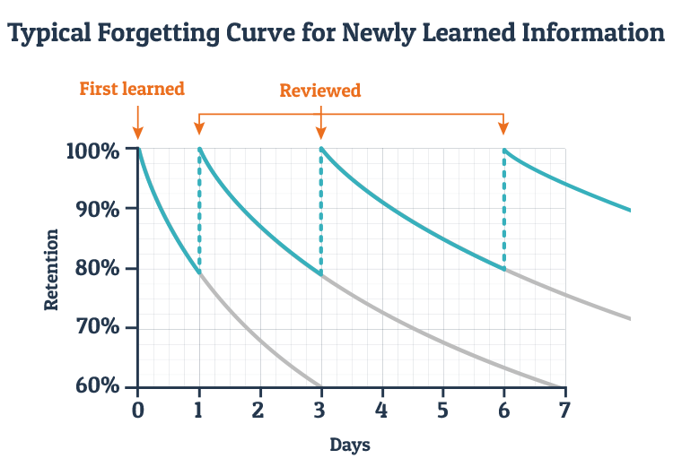
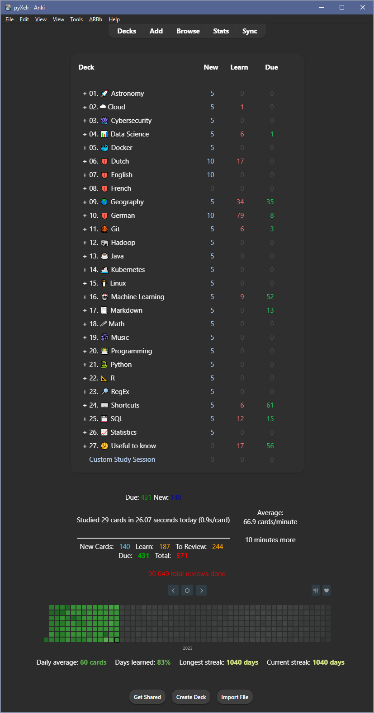
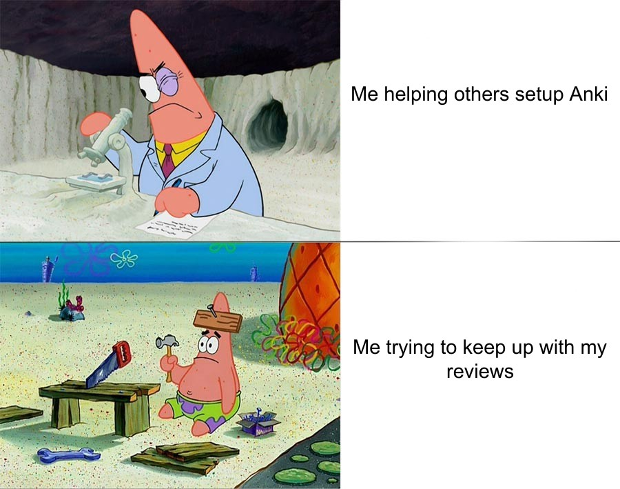
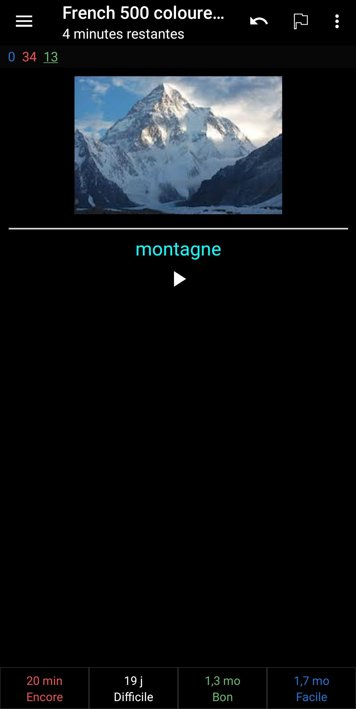

**No, this article is not about some novel machine learning techniques, but it does cover the part of preparing a down to earth "_learning_ _model_".**

## Countless benefits of learning

> _Leaders in every sector seem to agree: Learning is an imperative, not a cliché. Without it, careers derail and companies fail[^1]._

During our lifespan, we regularly study new technical or lexical skills for different projects, and this is what we'll look at - the way to enhance capabilities of the human brain.

Lifelong learning has dozens of benefits, and it's not only increasing our value on the job market. According to the article from Harvard Business Review[^2], it also leaves positive aspect on our health by improving memory, offsetting cognitive decline or delaying symptoms of Alzheimer[^3]. Although it requires us to dedicate some of our time to stay alone with our studying material, in the long term, we benefit from open doors to more social circles.

When we learn new stuff, mixing different approaches is a great strategy to stimulate our brain with more stimuli:

1. Analogy - tell me what it's like
2. Diagram - help me visualise it
3. Example - allow me to experience it
4. Plain English - describe it with everyday words
5. Technical definition - discuss the formal details.

Nevertheless, in this post, we will focus on a technique of digital flashcards that can embrace all the 5 methodologies and remind us of them in the right (algorithmically calculated) time.

### Spaced repetition vs cramming

If I would tell you right now that in the next month there is an important exam coming on, how would you prepare yourself to it? I assume that you would take your time and by the very last week apply the stressful cramming technique – absorbing large amounts of information in a short period, and eventually forgetting all the material a few weeks after.

Therefore, what is the more effective method that you can apply for the upcoming tests? Thanks to the concept of learning from flashcards, we can implement the two excellent systems of spaced repetition and active recall. Here, you become more prepared for your next exam and achieve a higher recall as the time passes.

Classically, there is no spaced repetition post without the forgetting curve, which shows how you can lose newly learned information if you don't attempt to retain it:


_Ebbinghaus Forgetting Curve_

In the latter (active recall) technique, we're actively stimulating memory during the learning process. It contrasts with reading or watching information - passive review method.

Nowadays, using digital software, you can apply these methodologies while reviewing flashcards in synchronisation with your smartphone and PC. The SM-2 algorithm implemented in the software automatically calculates and proposes the time of next reviews so that you can only focus on the one thing.

Spaced repetition on its own is mostly used by medical students such as [Ali Abdaal](https://youtu.be/W-EpiaPcgTk) (Cambridge University medicine graduate), but also by programmers such as [Derek Banas](https://www.youtube.com/watch?v=5urUZUWoTLo) or [Daniel Bourke](https://youtu.be/fPDy_qY1v1o).

As such, why spaced repetition isn't more popular over cramming? Well, people don't know about it, and it's not as straightforward in its use. We talk big about self-improvement but don't want to do any stinkin' hard work. Can you imagine a student who wants to type his notes back home into a flashcard app?


_le efficient studying is just around the corner. Image credit: [Reddit](https://www.reddit.com/r/Anki/comments/fbs7ma/le_efficient_studying_has_not_arrived/)_

## What can you study with flashcards?

Let me start with the fact that the use of a Spaced Repetitive Software (SRS) like Anki can be your greatest weapon while preparing for a TV shows like "_Who Wants to Be a Millionaire?_" or "_Jeopardy!_", where one player won almost $300 000[^4].

When it comes to me, If I am not mistaken, I started using Anki about a year ago, and it definitely wasn't consistent. Since then, I created a few decks (entire flashcard collections), but most of them were imported not only from the AnkiWeb but Quizlet and Memrise.

So far, the cards let me:

- improve my French (especially the cards based on the translation of sentences, not just pure words)
- become more fluent with RegEx
- learn Greek letters
- practice Google Search Operators
- relearn Polish voivodeships and the global geography
- improve my understanding of Machine Learning theory (huge thanks to the [deck by Chris Albon](https://machinelearningflashcards.com/)).

I didn't pay too much attention yet to the math or programming cards, but for now, I prefer to learn those topics from the online courses/books and then eventually facilitate them with the flashcards. Nonetheless, if you are wondering how flashcard can teach you programming, I would say that there are 3 main ways (types of cards):

- for me, the most enjoyable programming decks are showing a code on the front card, and then your objective is to guess what is its output (or maybe there is an error). An example deck: [Python code quiz](https://ankiweb.net/shared/info/51975584)
- some present an objective on the front side, such as "_What is the syntax to print your name_", and the back side reveals "`print("your name")`". An example deck: [Python programming from Brian Spiering](https://ankiweb.net/shared/info/1394656023)
- other decks like [Think Python Vocabulary](https://ankiweb.net/shared/info/1021974894) will teach you more theory. For example, the front side will say "_Define: Source Code_", and the answer will be "_A program in a high-level language before being compiled_".

Surely there are more applications of Anki, which I recently discussed in a [Reddit post](https://www.reddit.com/r/Anki/comments/gtjyos/my_current_main_decks_what_are_yours/) and brought up an engaging discourse of 93 comments.

### The "_magic_" behind the SM-2 algorithm

The SM-2 algorithm from the late 1980s is responsible in Anki for its core function of scheduling your repetitions, with the modification of considering each card's priority.

Briefly speaking, Anki determines card scheduling by the option we choose after revealing the answer ("_Again_", "_Hard_", "_Good_" or "_Easy_").  Depending on the selected option (our familiarity with the card), the following formula applies different `ease%` and `interval modifier`:

$$New\ Interval = currentInterval \times ease\% \times intervalModifier$$

Watching this great explanation will further and more intuitively illustrate how your use of SRS spaces the next reviews. I also recommend applying settings recommended by its author (presented in the form of screenshots at 07:31 and 12:34).

<iframe
  width="560"
  height="315"
  src="https://www.youtube.com/embed/1XaJjbCSXT0"
  title="YouTube video player"
  frameborder="0"
  allow="accelerometer; autoplay; clipboard-write; encrypted-media; gyroscope; picture-in-picture"
  allowfullscreen>
</iframe>

Another strong point of Anki is its way of providing us with lots of statistics, where some are summarised in the form of histograms. There I've got a sample estimation of the number of cards that I'm likely to study in the next 30 days of my French set.


_Positive forecast of my French Anki cards_

I know such dull explanations of spaced repetition can be tiresome, but luckily there are interactive simulations in your browser to help with that. For that, there is nothing better than Nicky's blog post: "[How To Remember Anything Forever-Ish](https://ncase.me/remember/)".

## Setting up Anki

At first, the use of this software won't be the most straightforward in comparison to [its alternatives](/posts/optimising-our-learning-retention-rate-with-srs-anki/#i-dont-like-anki-what-else-can-i-use), but as we know, there are no ideal solutions. In this section, I'll provide you with the information that will save you lots of time to start your first studying session.

### Quick installation guide

1. Create your [AnkiWeb account](https://ankiweb.net/account/register).
2. Download [Anki desktop application](https://apps.ankiweb.net/#download) (Windows/Mac/Linux).
3. Log in to your AnkiWeb account inside the desktop application and create or import your first flashcards.
4. Start learning!
    - Optionally, download the Anki mobile app ([Android](https://play.google.com/store/apps/details?id=com.ichi2.anki) or [iOS](https://apps.apple.com/us/app/ankimobile-flashcards/id373493387)) and learn on the go. Don't forget to log in to your AnkiWeb account inside the app and sync your repository.

### How to use Anki

Unfortunately, installing Anki doesn't make you ready to start your study sessions. It's somewhat comparable to buying a blank notebook from which you could've studied, but it's missing your notes. Luckily for us, the community is quite generous, and there're lots of great flashcards already available. You'll find some great examples in [the further part of this post](/posts/optimising-our-learning-retention-rate-with-srs-anki/#my-flashcards).

Just like before, it's best to present some things visually. Here is one of the most practical YouTube tutorials showing the most common Anki functions (card reveal, clozes, image occlusion). If you don't feel like watching the entire clip, you can use the predefined timestamps to go to the right part (to see them, open the video on the YouTube website).

<iframe
  width="560"
  height="315"
  src="https://www.youtube.com/embed/bJFw9gBkvcY?start=237"
  title="YouTube video player"
  frameborder="0"
  allow="accelerometer; autoplay; clipboard-write; encrypted-media; gyroscope; picture-in-picture"
  allowfullscreen>
</iframe>

As previously mentioned, we can get some premade cards, but it's like learning from someone's else notes. Making cards isn't as bad once we make at least one of them. I bet you'll also enjoy card formatting with the CSS code, so the card looks more eye-pleasing (but don't spend too much time on that!).

Nonetheless, there are ways to facilitate the card-creation process. For example, if you tend to annotate some text online (such as I do with [Hypothesis](https://hypothes.is/users/pyxelr)), you can use your annotation on the front side of the card and the highlighted part as the answer (back side). Apart from Hypothesis, you may also try using a different annotation tool – Polar that officially supports such conversion [straight from its software](https://getpolarized.io/docs/anki-sync-for-spaced-repetition.html). You can even get automatically generated cards from the displayed word definitions or highlights you create on your Kindle device (the required tools are mentioned in [the further part of this post](/posts/optimising-our-learning-retention-rate-with-srs-anki/#my-plugins)).

Once you have your cards, it's crucial to be consistent with your studies. To help yourself with it, you can use a review heatmap to have a quick glance over your frequency, as well as define a [goal similar to mine](/pages/three-goals/): "_Daily Anki Flashcards_". Try to do your studies at the same time of the day, so it will become a habit just like brushing your teeth. To contribute to the community, don't forget to [share some of your creations](https://ankiweb.net/shared/decks/).


_Sample of my 3 Anki goals of a [Three Goals](/pages/three-goals/) programme_

### Make effective flashcards

First and foremost, do not convert a topic straight into flashcards if you don't understand it! For example, you can memorise the history of Poland from the flashcards, but with such information, you'll most likely still not understand the overall picture. Therefore, remember, don't commit the offence of learning without comprehension.

After you understood the topic, here comes the time of designing your first flashcard. The fundamental rule of flashcard creation is the "**_Minimum Information Principle_**". It states that your questions and answers should be as simple as possible. A large number of simple cards is far more efficient to remember than a small number of big, demanding, awkward cards[^5].

| **Example of a bad card ❌** |  **Examples of good cards ✅** |
| --- | --- |
| Q: What are the main characteristics of Belgium? <br> A: Belgium, officially the Kingdom of Belgium, is a country in Western Europe. It is bordered by the Netherlands to the north, Germany to the east, Luxembourg to the southeast, France to the southwest, and the North Sea to the northwest. It covers an area of 30,689 km2 (11,849 sq mi) and has a population of more than 11.5 million | Q: What is the official name of Belgium? <br> A: The Kingdom of Belgium <br><br> Q: In which part of Europe can we find Belgium <br> A: Western Europe <br><br> Q: Who is bordering with Belgium and from which side? <br> A: The Netherlands to the north, Germany to the east, Luxembourg to the southeast, France to the southwest, and the North Sea to the northwest <br><br> Q: What is the area covered by Belgium (in km2 and sq mi)? <br> A: 30,689 km2 (11,849 sq mi) <br><br> Q: What is the population of Belgium (in millions)? <br> A: More than 11.5 million |

In addition to simplifying the information, try to use images where possible as they will further stimulate your senses. As an example, they work great for learning a new language and finding the word for the presented image. On the other hand, if the graphic contains all the information, you can still learn from it by hiding/unhiding the right areas.

I've just provided the basic, must known principles, but there is more to it if you would like to create the most practical cards. Dr Piotr Woźniak, the author of SuperMemo software, explained this topic thoroughly in 20 rules[^6] with a great set of examples.


_It's just like when you [stir your data unless the ML algorithm works](/images/stir-data-meme.png), right? Image credit: [Reddit](https://www.reddit.com/r/Anki/comments/g9otl1/shitpost_just_shove_dem_flashcards/)_

## My Anki Setup 🛠

While writing this sentence, I have been using Anki for around 1 year, and throughout that period, I tried different habits and setups of its software. In this chapter, I'll show you all the settings that I found useful, as well as how it presents itself inside the desktop and mobile app.

### Desktop App

Usually, after opening Anki on your desktop machine, you might be notified that one of your plugins has been updated. After continuing with the update process, applying the night mode, gathering some flashcards and installing a few plugins, this is how your Anki might look like:


_Anki on Windows (my main screen)_

On my version above, looking from the top, we've:

1. toolbar with the main commands
2. 5 options to choose "_Decks_" to learn from, "_Add_" new ones, "_Browse_" their content, check their "_Stats_" and "_Sync_" our progress
3. list of all the decks. I numbered them manually and added emojis, so it looks a bit more attractive and is sorted alphabetically (without numbers, the emojis break the order). The green "_Due_" number marks the cards to study before the next day, whereas the blue "_New_" presents the cards I can study now and didn't see before
4. some statistics with a review heatmap of a GitHub-like layout.

Nevertheless, most of your time with Anki will focus on the following template:


_Anki on Windows (French card with a revealed answer)_

This is an example of a flashcard to practice my French language, where I already revealed the back (answer) side, which was the French word for the image on the front (question) side. What's great about this card is that I am also allowed to press the play button to relisten the pronunciation of the word. To continue with the next question, I need to categorise my familiarity with the subject by choosing one of the four options: "_Again_", "_Hard_", "_Good_" or "_Easy_", which determine the time when the card will be presented to me again.

#### My flashcards

Naturally, flashcards are the heart of our study sessions, and in case I got you interested with my setup, here is a list of all my Anki decks (as of the date of publication/update of this blog post):

- 01\. 🚀 Astronomy
  - [Planets Plus](https://ankiweb.net/shared/info/466148461) ← simple deck for learning the planets in our solar system and some other extra details
- 02\. ☁ Cloud
  - [GFT\_GCP\_ACE](https://ankiweb.net/shared/info/1428257012) ← deck used to prepare for the Google Associate Cloud Engineer Certification
  - [Google Cloud Architect Exam](https://github.com/cfsmp3/GoogleCloudCertificationPreparation) \[_downloaded from GitHub_\] ← flashcards to prepare for Google Cloud Certification exams
- 03\. 👾 Cybersecurity
  - [Networking and security](https://ankiweb.net/shared/info/328238723) ← English for information security, operating systems and computer networks
  - [Sketch's CompTIA Security+ Acronyms 2018](https://ankiweb.net/shared/info/640688939) ← acronyms commonly used in the field of Information Security
- 04\. 📊 Data Science
  - [100+ Data Scientist Interview Questions and Answers!](https://ankiweb.net/shared/info/11274685) \[**_own deck_**\] ← questions scraped from the popular Medium article
  - [Data Mining Mid Term](https://quizlet.com/kr/235252963/data-mining-mid-term-flash-cards/) \[_imported from Quizlet_\]
  - [Data Science](https://quizlet.com/368191358/data-science-flash-cards/) \[_imported from Quizlet_\]
  - [Data Science Interviews](https://ankiweb.net/shared/info/1443276573) ← material behind common data science interview questions
  - [Decks by taivop](https://github.com/taivop/anki-decks) \[_downloaded from GitHub_\]
- 05\. 🐳 Docker
  - [DCA (Docker Certified Associate)](https://ankiweb.net/shared/info/1286756241)
  - [Docker Commands](https://ankiweb.net/shared/info/34837427)
  - [Docker](https://ankiweb.net/shared/info/1348756236) ← cards about Docker technology and containers in general
- 06\. 👅 Dutch
  - [Dutch 10 000 sentences sorted from the easiest to hardest](https://ankiweb.net/shared/info/62601322)
  - [Dutch Core 100](https://ankiweb.net/shared/info/1880481633) ← 101 common words and phrases
- 07\. 👅 English
  - My vocabulary list generated while reading Kindle books \[**_own deck_**\]
  - [English idioms with Polish translation](https://ankiweb.net/shared/info/1187642133) ← English idioms with example sentences and Polish translation
  - [Hard English Vocabulary](https://ankiweb.net/shared/info/1444020201) ← deck of words collected over the years from the 'A Word A Day' mailing list as well as some other sources
- 08\. 👅 French
  - My vocabulary list generated while reading Kindle books \[**_own deck_**\]
  - [5000 Most Common French Words](https://ankiweb.net/shared/info/893324022) ← 5000 most frequently used French words, sorted by order of frequency
  - **[16000 French sentences sorted from easiest to hardest \[1/3\]](https://ankiweb.net/shared/info/1089240419)**
  - [Coffee Break French](https://ankiweb.net/shared/info/1830587299) ← audio samples from the excellent podcast "_Coffee_ _Break_ _French_"
  - [French 500 coloured words with pictures and audio](https://ankiweb.net/shared/info/629972372)
  - [French accents](https://ankiweb.net/shared/info/19998762) \[**_own deck_**\] ← 5 French accents with written pronunciation and example words
  - [French alphabet pronunciation](https://ankiweb.net/shared/info/2020825047) \[**_own deck_**\] ← deck with a card for a single letter with audio and text pronunciation
  - [French months + seasons](https://ankiweb.net/shared/info/483187044) \[**_own deck_**\] ← French months and seasons with audio pronunciation
- 09\. 🌎 Geography
  - [**Ultimate Geography**](https://ankiweb.net/shared/info/2109889812) ← study sovereign states, territories, world regions, oceans and seas, continents and more...
- 10\. 👅 German
  - [10 000 German sentences sorted from easiest to hardest \[1/3\]](https://ankiweb.net/shared/info/785874566)
- 11\. 🐙 Git
  - [Pro Git Book Study Deck](https://ankiweb.net/shared/info/249030516) ← now you will get +10 to respect from your coworkers by knowing much more than just `pull`, `push` and `commit`
- 12\. 🐘 Hadoop
  - [Hadoop Cloudera](https://ankiweb.net/shared/info/2038454419)
- 13\. ☕ Java
  - [Java in 24 Hours](https://ankiweb.net/shared/info/1588132881) ← companion to Sam's Java in 24 Hours book
  - [Java Syntax, Etc.](https://ankiweb.net/shared/info/853812480)
- 14\. 🚢 Kubernetes
  - [CKAD Exercises](https://ankiweb.net/shared/info/2137552993) \[**_own deck_**\]
  - [CKAD Preparation Exercise](https://ankiweb.net/shared/info/2047891717)
  - [Kubernetes](https://ankiweb.net/shared/info/1593957582) ← general k8s questions
  - [Kubernetes FAQ](https://ankiweb.net/shared/info/1445477629)
- 15\. 🐧 Linux
  - [106 Linux Commands](https://ankiweb.net/shared/info/142660396)
  - [Linux Essentials](https://ankiweb.net/shared/info/269214285)
  - [Unix](https://ankiweb.net/shared/info/321161592) ← flashcards to help you become a neckbeard
- 16\. 🤖 Machine Learning
  - [deeplearning.ai](https://github.com/ViiSkor/Anki-decks-deeplearning.ai) \[_downloaded from GitHub_\] ← flashcard decks for the online Deep Learning Specialization
  - **[Machine Learning Flashcards](https://machinelearningflashcards.com/)** ← great deck of 300 illustrated cards by Chris Albon. After purchasing the deck, I've edited it using [Image Occlusion](https://ankiweb.net/shared/info/1374772155) by hiding the definitions and leaving the terms visible
  - [Machine Learning from Coursera](https://quizlet.com/338884156/machine-learning-from-courserateam-flash-cards/) \[_imported from Quizlet_\]
  - [ML Stanford Online Class 2011](https://ankiweb.net/shared/info/415036397) ← collaborative flashcards for the Machine Learning online Stanford class of fall 2011
  - Smart Decisions cards ← [SoftServe's cards](https://smartdecisionsgame.com/) turned into Anki flashcards
    - [Big Data](https://ankiweb.net/shared/info/2084344509) \[**_own deck_**\]
    - [IoT](https://ankiweb.net/shared/info/1786296494) \[**_own deck_**\]
    - [Machine Learning](https://ankiweb.net/shared/info/2099797890) \[**_own deck_**\]
- 17\. 📃 Markdown
  - [Github Flavored Markdown (GFM)](https://ankiweb.net/shared/info/684935796)
- 18\. 🖊 Math
  - [Khan Academy: AlgebraI](https://ankiweb.net/shared/info/133895080)
  - [Mathematics](https://ankiweb.net/shared/info/775039849)
  - [Precalculus](https://ankiweb.net/shared/info/421042922)
  - [Precalculus (Math 170 GWC)](https://www.memrise.com/course/720737/precalculus-math-170-gwc/) \[_imported from Memrise_\]
- 19\. 🎶 Music
  - [Piano Basics: Notes and Triad Chords](https://ankiweb.net/shared/info/621924764)
  - [Piano Notes and Keys](https://ankiweb.net/shared/info/2145130205)
- 20\. 👨‍💻 Programming
  - [AlgoSmart deck](https://ankiweb.net/shared/info/1097402891) ← extensive Polish deck
  - [Google Interview University](https://ankiweb.net/shared/info/25173560) ← prepare for a Google interview
  - [System Design Primer](https://github.com/donnemartin/system-design-primer) \[_downloaded from GitHub_\] ← learning how to design scalable systems
- 21\. 🐍 Python
  - [Coding Challenges in Python by Brian Spiering](https://ankiweb.net/shared/info/223286091)
  - [Fluent Python](http://www.marknagelberg.com/anki/anki_webpage_loaded.html) ← companion to a book on advanced Python use
  - [Interactive coding challenges](https://github.com/donnemartin/interactive-coding-challenges) \[_downloaded from GitHub_\] ← 120+ continually updated, interactive, and test-driven coding challenges
  - [Python code quiz](https://ankiweb.net/shared/info/51975584)
  - [Python - Programming Idioms](https://ankiweb.net/shared/info/2086567642) \[**_own deck_**\] ← memorise several Python code snippets
  - [Python Programming Language](https://ankiweb.net/shared/info/646738116)
  - [Think Python Vocabulary](https://ankiweb.net/shared/info/1021974894)
- 22\. 📐 R
  - [Big data in R](https://ankiweb.net/shared/info/2071776796) ← revision notes from a big data in R course. Covers things like mean, confidence intervals, R^2, standard dev
  - [R Programming](https://quizlet.com/332073218/r-programming-flash-cards/) \[_imported from Quizlet_\]
  - [Statistics with R by Nicole Radziwill DataGallos](https://ankiweb.net/shared/info/1154459026) ← flashcards for the book: Statistics (The Easier Way) with R: an informal text on applied statistics
- 23\. 🔎 RegEx
  - [RegEx – ultimate deck](https://ankiweb.net/shared/info/284568815) \[**_own deck_**\] ← all the essential RegEx snippets
- 22\. ⌨️ Shortcuts
  - [Google Search Operators](https://ankiweb.net/shared/info/1174604876) \[**_own deck_**\] ← become a Google Power User
  - [Visual Studio Code shortcuts](https://ankiweb.net/shared/info/1549461506) \[**_own deck_**\] ← Windows shortcuts from the official cheat sheet
  - [Windows 10 Keyboard Shortcuts](https://ankiweb.net/shared/info/1439005826) ← list of all Keyboard shortcuts you will ever need in Windows 10
- 24\. 💾 SQL
  - [SQL Terms and Concepts](https://ankiweb.net/shared/info/827899871)
  - [SQL](https://quizlet.com/295850599/sql-flash-cards/) \[_imported from Quizlet_\]
- 25\. 📈 Statistics

  - - [Introduction to Biostatistics](https://ankiweb.net/shared/info/1494347248)

  - [Mathematical Statistics](https://ankiweb.net/shared/info/343559677) ← mathematical statistics from the University of Tartu class
  - [Probability Theory and Statistics (Introduction)](https://www.memrise.com/course/50045/probability-theory-and-statistics-introduction/2/?action=next) \[_imported from Memrise_\]
  - [Statistics by Brian Spiering](https://ankiweb.net/shared/info/1185285155) ← collection of Statistics flashcards, including fundamentals, Bayesian, and challenges
  - [Statistics (UGA @ Toebben)](https://ankiweb.net/shared/info/1570817330) ← cards over the in-class notes in combine with the online notes
- 26\. 🤔 Useful to know
  - [Chess for beginners](https://www.memrise.com/course/625713/chess-for-beginners-2/) \[_imported from Memrise_\] ← memorise figures, their attributes and solve some challenges
  - [Greek alphabet with Modern Greek pronunciation](https://ankiweb.net/shared/info/1298930846) \[**_own deck_**\] ← useful for mathematics.

To stay up to date with the cards I've created, you can follow my GitHub repo: "[My Anki Decks of Flashcards](https://github.com/pyxelr/my-anki-decks-of-flashcards)".

Of course, there are other places to look for even more Anki decks of cards:

- [Anki Decks](https://ankidecks.com/) ← marketplace for buying and selling flashcard bundles
- [AnkiWeb](https://ankiweb.net/shared/decks/) ← Anki's official deck share platform
- [Awesome Anki](https://github.com/tianshanghong/awesome-anki#decks) GitHub repository
- [DJT Quizmaster Anki Guide](https://www.animecards.site/home) ← set of cards and extensive explanation of the practical way to study Japanese
- [Language cards](https://ankiweb.net/shared/byauthor/785874566) by Neri.


_Pretty much :). Image credit: [Reddit](https://www.reddit.com/r/medicalschoolanki/comments/fx4ted/it_is_what_it_is/)_

#### My plugins

Keep in mind that you can do absolutely fine without any plugin, but if you have some spare time to customise Anki, add-ons will be there to improve your experience.

Here is a list of all my Anki plugins (as of the date of publication/update of this blog post):

- [Add Hyperlink](https://ankiweb.net/shared/info/318752047) ←  adds dialogue to enter hyperlinks in your cards
- [Add Table](https://ankiweb.net/shared/info/1237621971) ← add tables in your cards
- [Advanced Browser](https://ankiweb.net/shared/info/874215009) ← enhance options of the card browser
- **[Advanced Review Bottom Bar](https://ankiweb.net/shared/info/1136455830)** ← extend the options of your review bottom bar
- [Always On Top](https://ankiweb.net/shared/info/1760080335) ← add option to keep your Anki window always on top (useful when creating new cards)
- [Anki themes](https://github.com/badlydrawnrob/anki) ← Anki theme for programming snippets
- [AwesomeTTS (Google Cloud Text-to-Speech)](https://ankiweb.net/shared/info/814349176) ← add audio to your notes (recommended for creating language-based cards)
- [BetterTags](https://www.patreon.com/posts/bettertags-v1-0-36497547) \[_requires $5 subscription_\] ← overhaul Anki's tagging system
- [Customize Keyboard Shortcuts](https://ankiweb.net/shared/info/24411424) ← if you're willing to modify any shortcuts
- [Deck name in title](https://ankiweb.net/shared/info/699175524) ← show the name of the deck you are currently studying, and the profile name
- [Fastbar](https://ankiweb.net/shared/info/46611790) ← improve the look of your card browser with better access to the most common functions
- [Frozen Fields](https://ankiweb.net/shared/info/516643804) ← introduce sticky and unsticky fields (useful when creating new cards)
- **[Image Occlusion Enhanced](https://ankiweb.net/shared/info/1374772155)** ← create cards that hide parts of an image to test your knowledge of that hidden information (must have!)
- [Improved Quizlet to Anki 2.1 Importer](https://ankiweb.net/shared/info/538351043) ← not enough cards in the AnkiWeb repo? Import some of them from Quizlet
- [Kindle Highlights Import](https://ankiweb.net/shared/info/1525149970) ← import and study your highlights from the Kindle e-reader. Besides, have a look at [Fluentcards](https://fluentcards.com/kindle) to import the words of which you checked the definition
- [memrise2anki](https://github.com/wilddom/memrise2anki-extension) ← download and convert a course from Memrise into an Anki deck
- [Mini Format Pack](https://ankiweb.net/shared/info/295889520) ← extend formatting of your new cards
- [More Decks Stats and Time Left](https://ankiweb.net/shared/info/1556734708) ← show extra information of the due cards and return the expected time to finalise (Due+New)
- [More Overview Stats 2.1](https://ankiweb.net/shared/info/738807903) ← even more statistics!
- [Progress Bar original](https://ankiweb.net/shared/info/1685464019) ← adds a progress bar and estimated time to complete current reviews (make sure to apply the right config mentioned in the plugin description)
- [Puppy Reinforcement](https://ankiweb.net/shared/info/1722658993) ← intermittent reinforcement with cute puppies to encourage card review streaks
- [Reset Card Scheduling](https://ankiweb.net/shared/info/300884351) ← ever imported someone else's deck that contained scheduling information associated with cards?
- **[Review Heatmap](https://ankiweb.net/shared/info/1771074083)** ← include heatmap graph to Anki's main window which visualises past and future card review activity, similar to the contribution view on GitHub
- [Show total review count in main screen](https://ankiweb.net/shared/info/1730200873) ← display the absolute review count in the main screen after the studied X cards after X time
- [Syntax Highlighting for Code](https://ankiweb.net/shared/info/1463041493) ← insert syntax-highlighted code snippets into your notes
- [True Retention by Card Maturity](https://ankiweb.net/shared/info/923360400) ← check your True Retention (pass rate calculated only among "_Review_" cards) and a few placebo stats by card maturity
- [Visual Feedback](https://ankiweb.net/shared/info/1749604199) ← display feedback for reviews by flashing a small transparent image at the centre of your screen. As of writing this post, I recommend using [v1.0.0.-beta.3](https://www.patreon.com/posts/visual-feedback-33559446), which is free of several bugs.

If you are looking to extend the functionality even further, please consider checking out these plugin repositories:

- [AnkiWeb](https://ankiweb.net/shared/addons/) ← list of add-ons
- [Awesome Anki](https://github.com/tianshanghong/awesome-anki#add-ons) GitHub repository.

In case when you can't find the right add-on and have the feeling of practising your Python skills, there is a [great guide](https://addon-docs.ankiweb.net/#/) to support you with the next steps.

### AnkiDroid

To stay as productive as possible and study on the go, Anki offers a great advantage of using its [AnkiDroid](https://play.google.com/store/apps/details?id=com.ichi2.anki&hl=en) (Android) or [AnkiMobile](https://apps.apple.com/us/app/ankimobile-flashcards/id373493387) (iOS) app. Unfortunately, the Apple variant requires a payment of $25, but in the long term, it is worth much more than that, as similar apps like Quizlet base on a subscription model of $19.99/year.

The best part about using Anki is that all your usage progress flawlessly syncs between your desktop and mobile app. It does it automatically when you close/open the desktop app; however, make sure to do it manually in the mobile app by clicking the sync button in the top-right corner.


_AnkiDroid (my main screen)_

The look of our app offers almost the same functionalities as its desktop variant, with the only exception of missing your lovely plugins. On my side, I'm usually studying with a desktop app, but when travelling, the mobile version suits me perfectly, and it's absolutely comfortable to use it with a single finger over the bottom part of the screen.

As previously displayed for the Windows app, here is the same card exhibiting the card with a revealed answer of a french word for "_mountain_" on Android:


_AnkiDroid (French card with a revealed answer)_

## I don't like Anki. What else can I use?

If by any reason you don't feel like using Anki, there do are other options which require less (or even zero) effort to set them up. I tried them all and used in companion to my Anki sessions, and can assure you that they mostly deliver a similar experience:

- [flashcards wizardzines](https://flashcards.wizardzines.com/) ← small set of flashcards from a great blogger: Julia Evans
- [Flashcards for Developers](https://www.flashcardsfordevelopers.com/) ← great place to practice CS, where you can also create an account to track your progress
- [Fluent Forever](https://fluent-forever.com/) ← paid alternative to study languages. You can also read its [accompanying book](https://www.goodreads.com/book/show/22304017-fluent-forever) and watch the [author's comparison between FF and Anki](https://youtu.be/fepSv0fqg5U)
- [Memrise](https://www.memrise.com/) ← learn a language and not only (there is an [add-on](https://github.com/wilddom/memrise2anki-extension) to convert Memrise content to Anki)
- [NeuraCache](https://neuracache.com/) ← automatically generate flashcards from Twitter posts, Markdown editors, Kindle or your favourite note-taking tools, such as OneNote, Evernote or Roam and study them all using a mobile app
- [Quizlet](https://quizlet.com/) ← more user-friendly alternative to Anki (there is an [add-on](https://ankiweb.net/shared/info/538351043) to convert Quizlet content to Anki)
- [RemNote](https://www.remnote.io/homepage) ← note-taking app that will convert your notes to flashcards with the use of specific syntax. Here you can check its [live demo](https://www.remnote.io/documentation/cJSBN4bczFCPMwBx7)
- [ShortcutFoo](https://www.shortcutfoo.com/) ← fun way to memorise shortcuts and commands
- [Tinycards](https://tinycards.duolingo.com/) ← flashcard app from the creators of Duolingo.

Maybe the nature of flashcards still doesn't suit you? Well, then I hope that finding something inside [my list of recommendations](/pages/recommendations/#flashcards) will satisfy you. Alternatively, you might apply spaced repetition in an old-school way while using pen and paper in The Leitner Box methodology[^7]:

<iframe
  width="560"
  height="315"
  src="https://www.youtube.com/embed/uvF1XuseZFE"
  title="YouTube video player"
  frameborder="0"
  allow="accelerometer; autoplay; clipboard-write; encrypted-media; gyroscope; picture-in-picture"
  allowfullscreen>
</iframe>

## Gamifying your study sessions

If you still bravely decided to stay with Anki despite all this plethora of information, there is a great reason to gamify your sessions. Why so? Have you wondered why Duolingo remains so popular and **enjoyable**? Well, its developers knew how to gamify the experience by providing us with achievements, sounds, day streaks, internal currency and variations of exercises. In fact, [Duolingo knows and applies spaced repetition in its sessions](https://blog.duolingo.com/how-we-learn-how-you-learn/).

Gamifying Anki will help us stick to it thanks to the additional reinforcement to do our best. We can do it by installing/developing plugins that will add [funny images every few cards](https://ankiweb.net/shared/info/1722658993), provide [visual feedback](https://ankiweb.net/shared/info/1749604199) and following a [progress bar](https://ankiweb.net/shared/info/2091361802) (I've mentioned all these plugins in [my previous list](/posts/optimising-our-learning-retention-rate-with-srs-anki/#my-plugins)).

<iframe
  width="560"
  height="315"
  src="https://www.youtube.com/embed/R634ytgt7fw"
  title="YouTube video player"
  frameborder="0"
  allow="accelerometer; autoplay; clipboard-write; encrypted-media; gyroscope; picture-in-picture"
  allowfullscreen>
</iframe>

In my case, I went a bit further and decided to add my Xbox One Wireless controller (but [8BitDo Zero 2](https://www.8bitdo.com/zero2/) might be even handier and unquestionably cheaper) to all of it. What is great about this solution is that whenever I take it into my hand now, I always think of doing Anki cards and enjoy them more like a game. Moreover, it's so convenient just to sit back, relax and focus on the only thing. Here is how it looks in my case (you can even do it one-handed):

<iframe
  width="560"
  height="315"
  src="https://www.youtube.com/embed/f58ojVwqqhQ"
  title="YouTube video player"
  frameborder="0"
  allow="accelerometer; autoplay; clipboard-write; encrypted-media; gyroscope; picture-in-picture"
  allowfullscreen>
</iframe>

If you would like to follow my settings in the video clip, I've mapped the buttons of the gamepad to the open-source solution, [AntiMicroX](https://github.com/AntiMicroX/antimicrox/):

```text
* Left Stick = `Mouse` (_fast_)
  * LS Click = `Mouse MB`
* Right Stick = `Mouse` (_slow_)
  * RS Click = `Enter`
* DPad (_scrolling_)
  * Left = `Mouse Left`
  * Right = `Mouse Right`
  * Up = `Mouse 4`
  * Down = `Mouse 5`
* Left Trigger = `Mouse Left Button`
* Right Trigger = `Mouse Right Button`
* Left Shoulder = `Ctrl` (_useful to hold for zooming in/out with DPad_)
* Right Shoulder = `4`
* A = `Space`
* X = `1`
* Y = `2`
* B = `3`
* Back = `C` (_skips cards_)
* Start = `R` (_replays audio in cards_)
```

## Reaching out to the community

You don't have to feel alone with your struggles of designing new cards. What is great about using Anki is the inspiring community that is always there for you:

- [Anki Forums](https://forums.ankiweb.net/) ← great place to ask specific questions regarding your technical concerns
- [AnKing](https://www.ankingmed.com/) ← Anki group started by 4 medical students (not surprised). You can find a lot of recommendations on their website and YouTube channel
- [Anki subreddit](https://www.reddit.com/r/Anki/) ← my preferred community and probably the most popular. If you enjoyed memes inside this post, [here](https://www.reddit.com/r/Anki/?f=flair_name%3A%22Fluff%22) you will find much more of them :)
- [Discord channel](https://discord.gg/hkdjxY) ← 800+ members to chat with you in different rooms
- [Medical School Anki Lounge subreddit](https://www.reddit.com/r/medicalschoolanki/) ← as I mentioned, Anki's pretty popular among medical students who even had to create their own subreddit
- [MedSchool + Anki](https://www.medschoolanki.com/) ← even more about the use of Anki in medical school with some of the greatest premade decks like Zanki.

Apart from the communities, there is a great contributor that made it much easier for me to immerse myself in the world of flashcards: [Glutanimate](https://glutanimate.com/). Not only he is the most popular plugin creator, but he also shares a lot of helpful tips on his YouTube channel. He definitely deserves to be mentioned here.

## Moving one step further

If you're still interested in the topic of learning, please have a look at the subject of incremental reading that you can implement with [SuperMemo18](https://super-memo.com/supermemo18.html). It's a more advanced tool over Anki, including the incremental reading feature, which definitely suits a smaller part of our population. In this approach, all the learning process bases on the idea of chopping long articles into shorter pieces to read over time, and review them using the SM-18 algorithm. In other words, we're "spaced-repetition-ing" our reading. It's best to see an example of such a study session:

<iframe
  width="560"
  height="315"
  src="https://www.youtube.com/embed/DoQoeK53bP8"
  title="YouTube video player"
  frameborder="0"
  allow="accelerometer; autoplay; clipboard-write; encrypted-media; gyroscope; picture-in-picture"
  allowfullscreen>
</iframe>

After watching the clip, we can try to drive some brief conclusions to compare both systems:

|  | **Anki** | **SuperMemo** |
| --- | --- | --- |
| Algorithm | Inferior (SM-2) | Superior (SM-18) |
| Time to get used to | Shorter | Longer |
| Incremental Reading | ❌ | ✅ |
| Interleaving | Micro | Macro |
| Aspects of learning | Remembering | Reading + Remembering |
| Mobile support | Android, iOS | ❌ |
| Platform support | Windows, Linux, Mac | Only Windows |
| Synchronisation | ✅ | ❌ |
| User interface | “Simple” | “Exhaustive” |

At this time, I believe we should know why Anki rules the market. It's more user-friendly and wins by far due to its platform support and synchronisation feature. Although SuperMemo offers a more robust system, it will only suit the most demanding students who are willing to spend more of their time to settle down.

Apart from the development of SRS, SuperMemo author dedicates a lot of time into the [science behind the learning topic](http://www.super-memory.com/). To me, this website is like a hidden internet gem that goes in-depth to the nature of learning.

Okay, I think it's much more than enough for you to start. My intend wasn't to make this post as something to read once and move further, but rather keep coming back to check different resources. **Please let me know in the comments section below if this is something new to you and if you will give Anki a try!**

Now, my dear digital traveller, practice what you just learned and spread the knowledge!


_Me explaining Anki to people. Image credit: [Reddit](https://www.reddit.com/r/Anki/comments/dh7vsh/me_explaining_anki_to_people/)_

## References

[^1]: Petriglieri, G. (2019) 'Learning for a Living'. [10 December 2019] available from <https://sloanreview.mit.edu/article/learning-for-a-living/>

[^2]: Coleman, J. (2017) 'Lifelong Learning Is Good for Your Health, Your Wallet, and Your Social Life'. [2 February 2017] available from <https://hbr.org/2017/02/lifelong-learning-is-good-for-your-health-your-wallet-and-your-social-life>

[^3]: Park, A. (2015) 'Mental and Social Activity Delays the Symptoms of Alzheimer's'. [10 June 2015] available from <https://time.com/3916777/alzheimers-symptoms-delay/>

[^4]: Haviland, L. (2020) '"Jeopardy!" Champion Arthur Chu's Old-Fashioned Strategy For Winning Paid Off Big Time'. [26 June 2020] available from <https://www.cheatsheet.com/entertainment/jeopardy-champion-arthur-chus-old-fashioned-strategy-for-winning-paid-off-big-time.html/>

[^5]: Nagelberg, M. (2020) 'How to Deal with Lists in Anki'. [6 July 2020] available from <http://www.marknagelberg.com/how-to-deal-with-lists-in-anki/>

[^6]: Wozniak, P. (1999) 'Effective Learning: Twenty Rules of Formulating Knowledge'. [February 1999] available from <https://www.supermemo.com/en/archives1990-2015/articles/20rules>

[^7]: Wikipedia (2020) 'Leitner System'. [10 July 2020] available from <https://en.wikipedia.org/wiki/Leitner_system>
