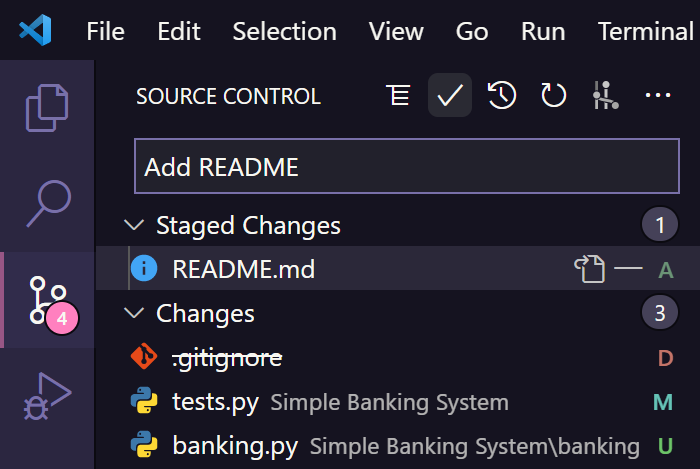
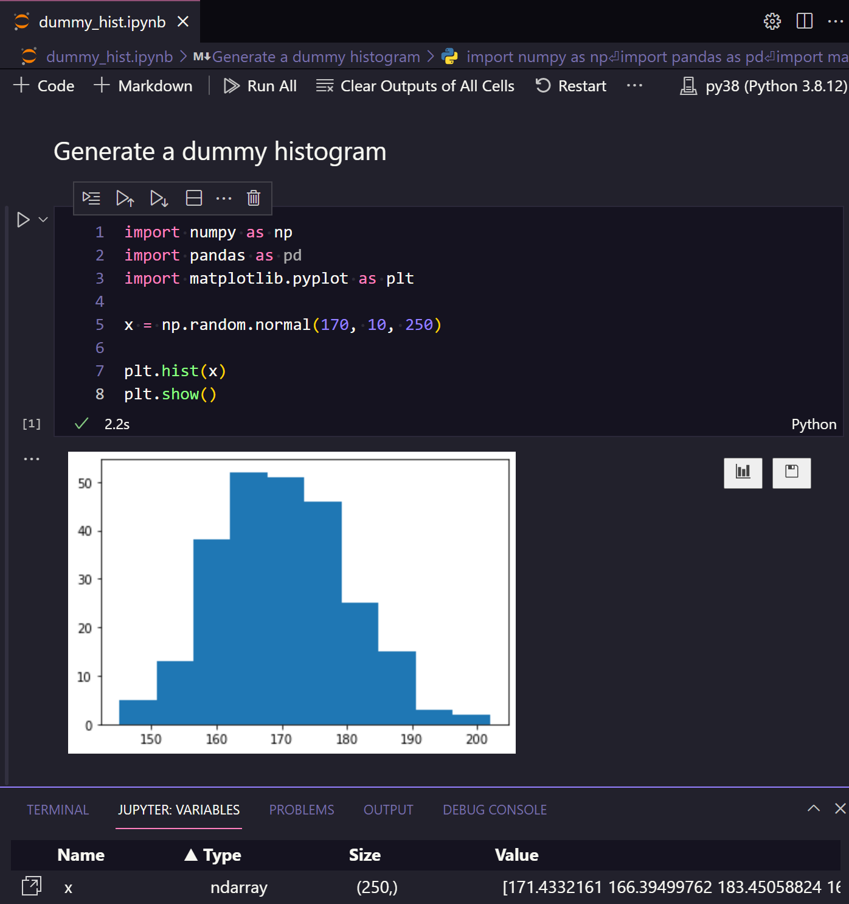
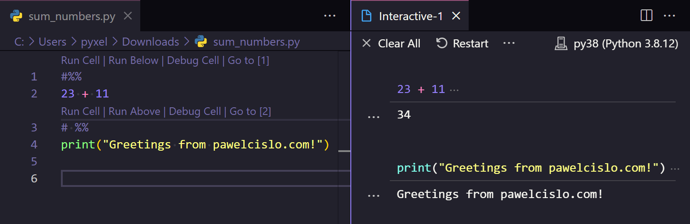
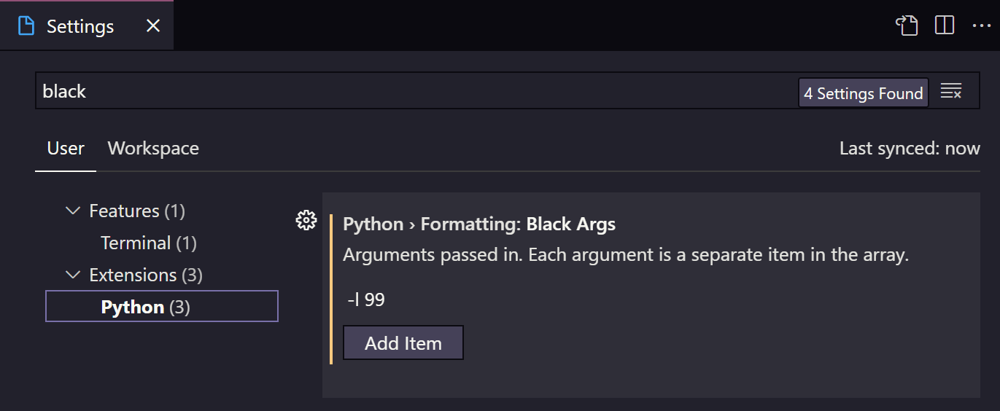
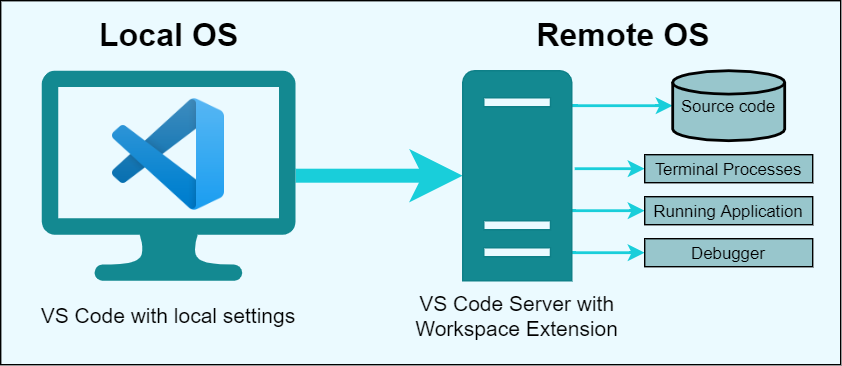
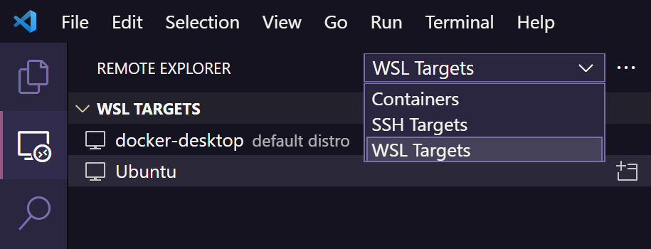
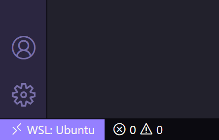
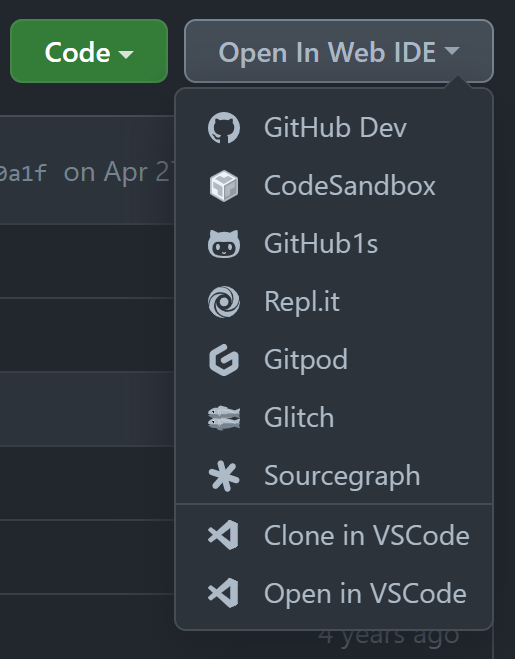
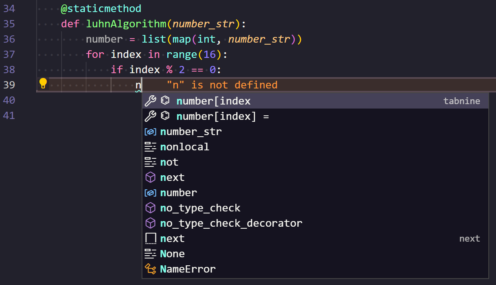
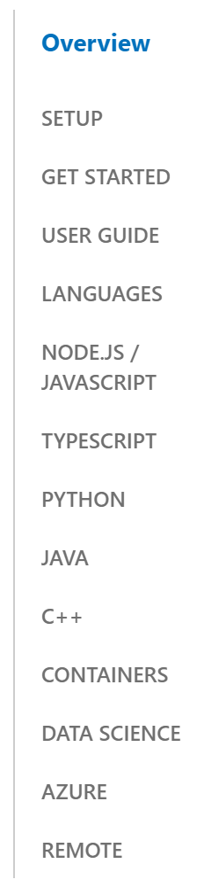

> You can find my VS Code profile under **[gist.github.com](https://gist.github.com/pyxelr/760dac032d0427377ecc1bb195499d9b)**.


**Compendium of impressions from an odyssey with my most preferred day-to-day code editor, not only for Python/MLOps.**

# Bumpy wandering

Back in 2018 while publishing this blog, I was slowly immersing in the use of Visual Studio Code as my #1 programming instrument. As I marked in this site's FAQ section at that time: “_nowadays, I switched over to VS Code, which gets pretty decent reviews, especially from the Pythonic community_”. All I can say is that this choice made my development experience much more convenient, and in this write-up I would like to share how.

Before the (hopefully) final environment transition, I spent likewise some time with different integrated development environments (IDEs) and code editors throughout my education and career:

- `Pascal` (Free Pascal IDE)
- `C++` and `C#` (Code::Blocks, Microsoft Visual Studio)
- `Java` (IntelliJ IDEA)
- `MATLAB` (GNU Octave, MATLAB)
- `R` (RStudio)
- `Python` (yhat/rodeo, IDLE, Atom, Sublime Text, Jupyter Notebooks, Spyder, PyCharm)
- `General text editors` (Notepad++, Sublime Text)


_Bumpy road from FPC to VS Code_

Driving through this rough path, most of the editors parked by the road, some continue its ride (Sublime Text, VS Code) and one is peeking through the bushes to be explored with curiosity (Vim).

Since I frequently shared my VS Code setup with friends and co-workers, I believe that you may want to stick with me on this journey. Down there, **you should find a set of my ultimate settings, extensions, keyboard shortcuts, different tips & tricks**, which I altogether intend on keeping up to date!

# VS Code

Over the years, the line between IDE and non-IDE has definitely blurred due to the extensibility of different programs. In the past, the border was clearly visible, where on one side we could either choose a more powerful text-editor defined as “source code editor” to ease some quick code adjustments, and on the other side we could reach for a memory hungry IDE with all the possible components like unit testing and database integration.

Nowadays, with a much greater and more advanced assortment of tools, it is much easier even for the less tech-savvy users to deal with the more complicated daily challenges.

In this post, I'm touching on a highly extensible and portable solution, which can amazingly well fit our deepest desires. The main subject of this essay: VS Code is not as long on the market, but it's already the most popular IDE according to the [Stack Overflow survey from 2021](https://insights.stackoverflow.com/survey/2021#integrated-development-environment): a choice of 71% of respondents, followed by its older brother (Visual Studio) with a score of 33%.

So, why all the noise around VS Code? Well, it's:

1. ⚡ One of the fastest code editors I've used so far. Definitely much more lightweight than PyCharm, while still providing all the functionalities I needed so far. Still, it's not quick enough to replace my preferred text editor: [Sublime Text](https://www.sublimetext.com/) (which in fact can also be used for some small Python coding).
2. 🥰 Free and open-source. There is just a small licensing caveat mentioned in the [VSCodium](https://vscodium.com/) project. Being honest, things sometimes seem too good to be true, and I hope that Microsoft will not disrupt that.
3. 🛠 Highly extendable due to its [marketplace](https://marketplace.visualstudio.com/vscode) of plugins.
4. 📦 Easily portable as a web app due to the fact of being based on a JavaScript framework: [Electron](https://github.com/electron/electron).
5. 🔄 Way too frequently updated, making it hard to keep up with the changes! Usually, about once per month, the users of VS Code will be greeted with a new tab inside the editor, presenting the [latest updates](https://code.visualstudio.com/updates/). I always try spending at least some time skimming through the changelog page, as it's written in an attractive way, surrounded with GIFs.
6. 💖 Having a wonderful community! Recently, VS Code became pretty active on [YouTube](https://www.youtube.com/c/Code/), sharing [release parties](https://www.youtube.com/watch?v=IKvtYHfzE3g), different [tips about its extensions](https://www.youtube.com/watch?v=rxKGgSLwOnU&t=1375s) or even [YouTube shorts](https://www.youtube.com/shorts/bx3aJyWy7Pc) (brief clips, usually up to 60 seconds).

Having gathered this bag full of candies, let's progress with setting it up to its finest!

## My user Interface

Before eventually settling down with my current theme, I transitioned through a great part of VS Code's Marketplace.

For a long time, I applied the default Dark+ theme, where I was only distracted by the bottom blue status bar, so I modified it to a grey one using the script below in JSON settings:

```json
"workbench.colorCustomizations": {
    "[Default Dark+]": {
        "statusBar.background": "#303030",
        "statusBar.noFolderBackground": "#222225",
        "statusBar.debuggingBackground": "#511f1f"
    }
}
```

Afterwards, I emigrated to a set of more violet rhythms: [Amethyst theme](https://marketplace.visualstudio.com/items?itemName=amodio.amethyst-theme), but it wasn't as easy on my eyes, so I switched to the fashionable [Dracula](https://draculatheme.com/visual-studio-code) monster. In fact, I liked Dracula so much that I browsed its official website to apply the same theme to my other programs (ConEmu, Ditto, Chrome, and more), even ending up with creating and publishing [my own palette for Directory Opus](https://resource.dopus.com/t/dracula-in-vs-code/39578).

When I was already feeling like I'm swimming in the clouds, I added icing on the cake by purchasing the [Dracula Pro](https://draculatheme.com/pro) set of themes. Upon ordering, I additionally received a book about the habits of highly productive developers, which I recently summarized on [Goodreads](https://www.goodreads.com/review/show/4303575143?book_show_action=false).

Focusing back on my current most favourite VS Code UI, it is composed of:

- [Dracula Pro](https://draculatheme.com/pro) theme
- [Material Icon Theme](https://marketplace.visualstudio.com/items?itemName=PKief.material-icon-theme) set of icons
- Personally customized terminal: [my-terminal](https://github.com/pyxelr/my-terminal) with [Starship](https://starship.rs/) prompt
- Two main fonts
  - Consolas (primary editor font)
  - [Jetbrains Mono](https://www.nerdfonts.com/font-downloads) of weight 350 (terminal's powerline font with a support for special characters like Git branches)


_Look of my VS Code instance with Dracula PRO theme and [my-terminal](https://github.com/pyxelr/my-terminal)

Certainly, each of us will have his preferred set of colours and panels (conveniently previewed through [vscodethemes.com](https://vscodethemes.com/)), so I'm curious to see what is your style (don't hesitate to leave a comment down there)!

There is still more to come, so please do not go anywhere, as all the different visible and non-visible extensions/settings are defined further in this write-up.

## Git in VS Code

In the past, I've used [Git](https://git-scm.com/) from the CLI, and later through the numerous GUI applications like [GitHub Desktop](https://desktop.github.com/) or [GitKraken](https://www.gitkraken.com/). At last, I settled myself with the simple Source Control panel integrated into VS Code, which can be swiftly accessed through the combination of characters: `CTRL` + `SHIFT` + `G`.

There is not much to say, as after applying some file changes to a folder with an initialized Git repository, VS Code will automatically detect which files were added (`A`), modified (`M`), deleted (`D`) or still reside there as untracked (`U`). Staging any file is as simple as clicking on the explicit (`+`) icon next to it, such that later we can continue with typing a message and committing the staged changes. 🚀


_Source Control menu in VS Code with 4 detected changes_

On the former screenshot, there is also a non-standard clock and graph icon, which respectively define the [Git History](https://marketplace.visualstudio.com/items?itemName=donjayamanne.githistory) and [Git Graph](https://marketplace.visualstudio.com/items?itemName=mhutchie.git-graph) extensions that I'm finding quite useful for surfing through the file history. Moreover, I'm ingesting the famous [GitLens](https://marketplace.visualstudio.com/items?itemName=eamodio.gitlens) extension that simply supercharges all the Git operations in VS Code through a separate sidebar menu.

With all that graphical ease of development, I'm not abandoning the in-built terminal, as from time to time it is necessary to rebase my branch of changes by running a couple of handy commands. Now, let's discuss another built-in feature that is waiting for all the data scientists to investigate.

## Jupyter Notebooks for Data Science

Are you still installing Anaconda to interactively use Python (IPython) through the Jupyter Notebook web application? With VS Code, there is no more need to do so, as Anaconda could be replaced by its non-commercial bootstrap version: [miniconda](https://docs.conda.io/en/latest/miniconda.html), and the data friendly [Jupyter Notebooks in VS Code](https://code.visualstudio.com/docs/datascience/jupyter-notebooks) may be operated directly inside another tab. You might only need to `pip install ipykernel` to start running the calculation cells inside the `.ipynb` file:


_Jupyter Notebook inside of VS Code_

Apart from keeping our favourite theme, VS Code automatically displays cell execution time, presents a variable pane, allows us to open plots in individual tabs and even generates a table of contents from the markdown entries.

The best part about Jupyter is that recently it is getting a lot of attention in the VS Code releases, making it even more attractive. Nevertheless, for those who are not the biggest fans of `.ipynb` files, there is also a possibility to run [Jupyter-like code cells](https://code.visualstudio.com/docs/python/jupyter-support-py#_jupyter-code-cells) within Python code (`.py`) using a `# %%` comment:


_Running cells within the Python code_

This neat trick is quite handy especially for debugging, but I find myself even more often setting conditional breakpoints within the functions, and inspecting the output using [The Python Debugger (pdb)](https://docs.python.org/3/library/pdb.html), which is a part of Python's standard library.

Okie dokie, how about learning now how to speed our interaction with this wonderful piece of software?

## Keyboard shortcuts

As every IDE, VS Code is full of keyboard shortcuts; therefore, the following list is containing the ones I found to be the most practical (on Windows/macOS). If you fancy memorizing all the hotkeys in your long-term memory (using spaced repetition), then I invite you to check my Anki deck of cards: [Visual Studio Code shortcuts](https://ankiweb.net/shared/info/1549461506).

- **Interf****ace** 🎨
  - `CTRL/CMD` + `SHIFT` + `P` ← command palette
  - `CTRL/CMD` + `B` ← hide/unhide sidebar
  - `CTRL` + `SHIFT` + `` ` `` ← open/focus on terminal
    - `CTRL` + `` ` `` ← open/close terminal
  - `CTRL/CMD` + `SHIFT` + `F` ← find in files
  - `CTRL/CMD` + `P` ← go to file
  - `CTRL/CMD` + `,` ← open settings
  - `CTRL/CMD` + `K`, `M` ← change language mode
  - `CTRL/CMD` + `SHIFT` + `-` or `+` ← reset zoom
  - `CTRL/CMD` + `SHIFT` + `0` ← toggle between light/dark theme
  - `"code ."` ← typed in a terminal opens up a VS Code instance
- **Split mode** 👀
  - `CTRL/CMD` + `\` ← split mode
  - `CTRL/CMD` + `1` ← switch to editor group 1
  - `ALT/OPT`, `V` + `L` + `S` ← fold the split view
- **Code** 👨‍💻
  - `CTRL/OPT` + `SPACE/ESC` ← IntelliSense
  - `CTRL/CMD` + `LMB` ← go to code definition
  - `CTRL/CMD` + `/` ← comment line of code
  - `SHIFT` + `ALT/OPT` + `F` ← format code
  - `CTRL/CMD` + `SHIFT/OPT` + `[` or `]` ← fold/unfold region
    - `CTRL/CMD` + `K`, `CTRL/CMD` + `0` ← fold all regions
    - `CTRL/CMD` + `K`, `CTRL/CMD` + `J` ← unfold all regions
  - `ALT/OPT` + `Z` ← text wrap
  - `F5` ← initialize the debugger
  - `F8` ← jump between errors
  - `F9` ← set up a breakpoint on the current line. Then hit `F5` to initialize the debugger
  - `CTRL/CMD` + `F5` ← run file in terminal
- **Manipulating** ✍️
  - `CTRL/CMD` + `D` ← select the word your cursor is at
  - `CTRL` + `F2` (or `CMD` + `SHIFT` + `L`) ← select all instances of the word
  - `SHIFT` + `ESC`← exit multi-cursor mode
- **Navigating** 🤸
  - `ALT/OPT` + `↑/↓` ← move line up/down
  - `CTRL/CMD` + `ALT/OPT` + `↑/↓` ← place a new cursor up/down the line
    - `ALT/OPT` + `LMB` ← place an extra cursor anywhere
  - `CTRL/CMD` + `L` ← select the current line
  - `CTRL/CMD` + `SHIFT` + `L` ← select all occurrences of current selection
  - `ALT/OPT` + `SHIFT` + `I` ← put the cursor at the end of all selected lines (e.g. with `CTRL/CMD`\+ `A`). Afterwards, use `HOME` and `END` to move from start to end

For a full list of shortcuts, have a look at the official PDF files: [Windows](https://code.visualstudio.com/shortcuts/keyboard-shortcuts-windows.pdf), [macOS](https://code.visualstudio.com/shortcuts/keyboard-shortcuts-macos.pdf), and [Linux](https://code.visualstudio.com/shortcuts/keyboard-shortcuts-linux.pdf).

## Python code formatting

While working with Python code, sometimes a blind following of the official [PEP 8 style guide can go wrong](https://youtu.be/S0No2zSJmks). Nevertheless, to reduce the confusion among devs, it's worth keeping the code organized and consistent across each working station such that the code reviews are also faster due to smaller diffs. Now, how can it be achieved?

For instance, the development team can agree to manage all the dependencies using [Poetry](https://python-poetry.org/) (keep a `pyproject.toml` file within a repo) or a `requirements.txt` file, but more importantly use the same linter and code formatter. Generally, the Pythonic community applies:

- [Flake8](https://flake8.pycqa.org/en/latest/) as a linter to apply to PEP8 style guide and signal bugs even before running the code. Alternatively, one may use a more strict [Pylint](https://pylint.org/)
- [Black](https://black.readthedocs.io/en/stable/) code formatter to keep consistent code across projects (e.g., only use double-quotes in strings and keep the code length to 88 characters in a line)
- [isort](https://pycqa.github.io/isort/) to sort imports alphabetically, and automatically separated into sections (standard library, third party, local)

Upon accessing the settings of VS Code, we can find out that the Python extension nicely groups the configuration options of Flake8 and Black, which can be promptly opened with `CTRL` + `,`. On the following example, we are extending the code length in each line to 99 characters by adding a simple `-l 99` argument:


_Black settings in VS Code_

All in all, not everyone may keep the same setup on their machine, so we can enforce specific rules with the use of [pre-commit](https://pre-commit.com/) hooks. Thanks to the `.pre-commit-config.yaml` file in the repo, one could set up hooks for Flake8, Black and isort with specific parameters, in order to make sure that our code is always equally formatted on every `git commit`.

Anyway, since Python is not the main subject of this post, I recommend having a read of: [Python Best Practices for a New Project in 2021](https://mitelman.engineering/blog/python-best-practice/automating-python-best-practices-for-a-new-project/) for more tips, which I also summarized in [this Twitter thread](https://twitter.com/pawel_cislo/status/1414656623759532035). In the future, I may write a more detailed view on Python from my perspective.

## Remote development

Let's imagine that you own a Windows machine, and you're joining a new team that highly integrates their projects with a Linux OS (e.g., extensively relies on Bash scripts). Does it mean that you should straight away abandon Windows and install Ubuntu or some other distribution? Not at all, as there are a couple of extraordinary workarounds!

With [VS Code Remote Development](https://code.visualstudio.com/docs/remote/remote-overview) option, you can develop everything remotely, reusing only your local VS Code setup (theme and extensions):


_VS Code Remote Development_

This approach uses tools or runtimes from the remotely existing development environment, which can be accessed from multiple machines or locations. Besides, it separates our local machine configuration to avoid any unintended development consequences.

Like many other VS Code options, this one is also designed as optional and can be seamlessly installed with a [Remote Development extension pack](https://marketplace.visualstudio.com/items?itemName=ms-vscode-remote.vscode-remote-extensionpack), consisting of these 3 extensions:

- [Remote - Containers](https://marketplace.visualstudio.com/items?itemName=ms-vscode-remote.remote-containers) ([tutorial](https://code.visualstudio.com/docs/remote/containers-tutorial)) ← to run Visual Studio Code in a Docker container
- [Remote - SSH](https://marketplace.visualstudio.com/items?itemName=ms-vscode-remote.remote-ssh) ([tutorial](https://code.visualstudio.com/docs/remote/ssh-tutorial)) to access a remote computer or virtual machine securely over a network connection
- [Remote - WSL](https://marketplace.visualstudio.com/items?itemName=ms-vscode-remote.remote-wsl) ([tutorial](https://code.visualstudio.com/docs/remote/wsl-tutorial)) to get a Linux-powered development experience in the Windows Subsystem for Linux (WSL)

After installing all these plugins, we should see a new status bar item in the lower-left corner, as well as the `Remote Explorer` side menu, presenting an individual view for all the remote targets:


_Remote Explorer with 3 available options_

With that, in the following example, I will open a new VS Code instance through WSL so that I can easily compile my Bash scripts. If you don't have yet a WSL on your system, then have a look at this [simple official WSL installation guide](https://docs.microsoft.com/en-us/windows/wsl/install).

Using merely 2 clicks: `New WSL Window using Distro...` > `Ubuntu`, I have connected to the WSL Target (in my case, Ubuntu). All it means is that VS Code started inside of WSL, giving me a much better experience in creating Linux applications straight on my Windows machine.


_Status bar indicating VS Code running through WSL_

And in its essence, the same process works for SSH connections or Docker containers! I hope that for you, it also seemed like a much simpler process than installing an isolated VS Code instance inside a virtualization software like VirtualBox. Nonetheless, let's look into a scenario where for whichever reason we prefer not installing anything locally.

## VSCode.dev

No matter what device we are using, recently it's even easier to develop straight in our browser!

By using the [code-server](https://github.com/cdr/code-server) project, we can set up a local VS Code server and keep a consistent development environment on localhost. However, this option may not be easily installable through specific systems like Windows; therefore, you may get a quick glimpse over code-server right now in the browser through a [Katacoda scenario](https://www.katacoda.com/sr229/scenarios/code-server-playground). On the other side, the creators suggest using their enterprise developer workspace platform: [Coder](https://coder.com/).

But wait a minute, since a couple of weeks, [**vscode.dev**](https://vscode.dev/) had [its announcement](https://code.visualstudio.com/blogs/2021/10/20/vscode-dev). It still has a [couple of limitations](https://code.visualstudio.com/docs/editor/vscode-web#_current-limitations) over the desktop app, but the main functionality is already there, and after giving it a try I can recommend it with confidence!

As VS Code and GitHub are both owned by Microsoft, the integration between the two is already in place backed by high-performance VMs and identified as [GitHub Codespaces](https://github.com/features/codespaces). Obviously, it's not a free feature, which is available only to organization-based subscriptions. As a 2nd option, we have [Gitpod](https://www.gitpod.io/), which [claims to be more optimized](https://www.gitpod.io/gitpod-vs-github-codespaces), and on top of that, is available for other code platforms like GitLab.

Luckily, there is also a free [web-based GitHub editor](https://github.dev/github/dev), which is ideal for browsing repository files and committing multiple changes, yet it's not possible to compile files. This editor can be accessed by simply pressing `.` or changing `.com` URL part to `.dev` on any repository/pull request site. It is generally a customized version of vscode.dev, deeply integrated into GitHub.

Well, surely there are more web IDEs, and it is hard to keep track of them. This is why I'm in favour of this browser extension: [zvizvi/GitHub-Web-IDE](https://github.com/zvizvi/GitHub-Web-IDE) that adds this simple `Open In Web IDE` button on any repository page:


_GitHub Web IDE extension will remember different online IDEs for us_

Alright, let's get back to the desktop app and see how it could be optimized even further to deliver the best possible experience.

# My list of extensions 🛠

The categorized extension list beneath is provided with an intention to be constantly updated, such as my list of plugins in the last Anki post. It rather serves as a collection of recommended extensions, since I am not using all of them at the same time:

- **Code completion 🤖**
  - [Blackbox](https://marketplace.visualstudio.com/items?itemName=Blackboxapp.blackbox) ← code as fast as you think
  - [Cursor](https://github.com/getcursor/cursor) ← AI-powered code editor based on VS Code
  - [GitHub Copilot](https://marketplace.visualstudio.com/items?itemName=GitHub.copilot) ([tutorial](https://github.com/github/copilot-docs/blob/main/docs/visualstudiocode/gettingstarted.md#getting-started-with-github-copilot-in-visual-studio-code)) ← AI pair programmer
    - [GitHub Copilot Labs](https://marketplace.visualstudio.com/items?itemName=GitHub.copilot-labs) ← experimental features for GitHub Copilot
  - [Kite](https://marketplace.visualstudio.com/items?itemName=kiteco.kite) ← AI autocompletion & documentation
  - [Tabnine Autocomplete AI](https://marketplace.visualstudio.com/items?itemName=TabNine.tabnine-vscode) ← AI code completion tool
- **Data Science 📊**
  - [DVC](https://marketplace.visualstudio.com/items?itemName=Iterative.dvc) ← machine learning experiment management with tracking, plots, and data versioning
- **Debugging 🔨**
  - [Code Runner](https://marketplace.visualstudio.com/items?itemName=formulahendry.code-runner) ← easily run code snippets/files for multiple languages
  - [Debug visualiser](https://marketplace.visualstudio.com/items?itemName=hediet.debug-visualizer) ← extension for visualizing data structures while debugging. Like the VS Code's watch view, but with rich visualizations of the watched value
  - [Error Lens](https://marketplace.visualstudio.com/items?itemName=usernamehw.errorlens) ← improve highlighting of errors, warnings, and other language diagnostics
  - [Live Preview](https://marketplace.visualstudio.com/items?itemName=ms-vscode.live-server) ← real browser preview inside your editor that you can debug
  - [Live Server (Five Server)](https://marketplace.visualstudio.com/items?itemName=yandeu.five-server) ← launch a development local Server with live reload feature for static & dynamic pages (better than [LiveServer](https://marketplace.visualstudio.com/items?itemName=ritwickdey.LiveServer))
  - [REST Client](https://marketplace.visualstudio.com/items?itemName=humao.rest-client) ← REST Client for Visual Studio Code
  - [Slowbug](https://marketplace.visualstudio.com/items?itemName=srimukh.slowbug) ← debug (run) your code in slow motion to catch bugs
- **Extra/Other ⭐**
  - [AWS Toolkit](https://marketplace.visualstudio.com/items?itemName=AmazonWebServices.aws-toolkit-vscode) ← after installing, make sure to log in to the right AWS role through AWS CLI, and then select the right AWS region in VS Code
  - [Code Spell Checker](https://marketplace.visualstudio.com/items?itemName=streetsidesoftware.code-spell-checker) ← spelling checker for source code
  - [Compare Folders](https://marketplace.visualstudio.com/items?itemName=moshfeu.compare-folders) ← compare folders by contents
  - [Git Worktree Manager](https://marketplace.visualstudio.com/items?itemName=jackiotyu.git-worktree-manager) ← effortless multi-workspace management and fast Git project cloning across directories
  - [JWT Debugger](https://marketplace.visualstudio.com/items?itemName=yokawasa.jwt-debugger) ← JWT tokens decoder
  - [Live Share](https://marketplace.visualstudio.com/items?itemName=MS-vsliveshare.vsliveshare) ← live-edit (pair programming) a file collectively in your IDE
  - [Log File Highlighter](https://marketplace.visualstudio.com/items?itemName=emilast.LogFileHighlighter) ← specify custom words to be highlighted in the log files
  - [Open Folder Context Menus for VS Code](https://marketplace.visualstudio.com/items?itemName=chrisdias.vscode-opennewinstance) ← add two new context menus to the Explorer
  - [Partial Diff](https://marketplace.visualstudio.com/items?itemName=ryu1kn.partial-diff) ← compare (diff) text selections within a file, across files, or to the clipboard
  - [Peacock](https://marketplace.visualstudio.com/items?itemName=johnpapa.vscode-peacock) ← subtly change the workspace color of your workspace. Ideal when you have multiple VS Code instances and you want to quickly identify which is which
  - [Project Manager](https://marketplace.visualstudio.com/items?itemName=alefragnani.project-manager) ← easily switch between projects
  - [REST Client](https://marketplace.visualstudio.com/items?itemName=humao.rest-client) ← replacement for Postman
  - [Settings Sync](https://marketplace.visualstudio.com/items?itemName=Shan.code-settings-sync) ← synchronize Settings, Snippets, Themes, File Icons, Launch, Keybindings, Workspaces and Extensions Across Multiple Machines Using GitHub Gist ← now built into VS Code (_Code_/_File_ > _Preferences_ > _Turn on Settings Sync..._)
  - [Sort JSON objects](https://marketplace.visualstudio.com/items?itemName=richie5um2.vscode-sort-json) ← sort the keys within JSON objects
  - [vscode-base64](https://marketplace.visualstudio.com/items?itemName=adamhartford.vscode-base64) ← base64 encode/decode the current selections
  - [x509 parser](https://marketplace.visualstudio.com/items?itemName=jlcs-es.x509-parser) ← parse OpenSSL artifacts to human readable text (e.g. select crt and use "Parse x509 certificate")
  - [YAML Sort](https://marketplace.visualstudio.com/items?itemName=PascalReitermann93.vscode-yaml-sort) ← sort, format and validate yaml files
- **Git 🐙**
  - [Git Graph](https://marketplace.visualstudio.com/items?itemName=mhutchie.git-graph) ← view a Git Graph of your repository, and perform Git actions from the graph
  - [Git History](https://marketplace.visualstudio.com/items?itemName=donjayamanne.githistory) ← view git log, file history, compare branches or commits
  - [GitLab Workflow](https://marketplace.visualstudio.com/items?itemName=GitLab.gitlab-workflow) ← integrate GitLab into VS Code
  - [GitLens](https://marketplace.visualstudio.com/items?itemName=eamodio.gitlens) ← git blame annotations and code lens
- **JavaScript 🛡**
  - [D3.js Snippets](https://marketplace.visualstudio.com/items?itemName=hridoy.d3-js-snippets) ← d3.js development toolkit
  - [JavaScript (ES6) code snippets](https://marketplace.visualstudio.com/items?itemName=xabikos.JavaScriptSnippets) ← code snippets for JavaScript in ES6 syntax
  - [Jest](https://marketplace.visualstudio.com/items?itemName=Orta.vscode-jest) ← interactive testing for JavaScript, TypeScript and more
- **Language support / Linter 👅**
  - [AHK++ (AutoHotkey Plus Plus)](https://marketplace.visualstudio.com/items?itemName=mark-wiemer.vscode-autohotkey-plus-plus) ← AutoHotkey language support for VS Code
  - [Better Jinja](https://marketplace.visualstudio.com/items?itemName=samuelcolvin.jinjahtml) ← syntax highlighting for jinja(2) including HTML, Markdown, YAML, Ruby and LaTeX templates
  - [Docker](https://marketplace.visualstudio.com/items?itemName=ms-azuretools.vscode-docker) ([tutorial](https://code.visualstudio.com/docs/remote/containers)) ← create, manage, and debug containerized applications
  - [DotENV](https://marketplace.visualstudio.com/items?itemName=mikestead.dotenv) ← support for dotenv file syntax
  - [Even Better TOML](https://marketplace.visualstudio.com/items?itemName=tamasfe.even-better-toml) ← fully-featured TOML support
  - [HashiCorp Terraform](https://marketplace.visualstudio.com/items?itemName=HashiCorp.terraform) ← syntax highlighting and autocompletion for Terraform
  - [Helm Intellisense](https://marketplace.visualstudio.com/items?itemName=Tim-Koehler.helm-intellisense) ← Intellisense in helm-templates from the values.yaml
  - [Java in Visual Studio Code](https://code.visualstudio.com/docs/languages/java) ← installer to download all the Java components for you
  - [Kubernetes](https://marketplace.visualstudio.com/items?itemName=ms-kubernetes-tools.vscode-kubernetes-tools) ([tutorial](https://code.visualstudio.com/docs/azure/kubernetes)) ← develop, deploy and debug Kubernetes applications
  - [LTex](https://marketplace.visualstudio.com/items?itemName=valentjn.vscode-ltex) ← LanguageTool grammar/spell checking
  - [PostgreSQL](https://marketplace.visualstudio.com/items?itemName=ckolkman.vscode-postgres) ← PostgreSQL management tool
  - [R](https://marketplace.visualstudio.com/items?itemName=REditorSupport.r) ← R extension
  - [ShellCheck](https://marketplace.visualstudio.com/items?itemName=timonwong.shellcheck) ← integrates ShellCheck into VS Code, a linter for Shell scripts
  - [VimL (Vim Language, Vim Script)](https://marketplace.visualstudio.com/items?itemName=XadillaX.viml) ← Vim Script language support for VSCode
  - [VSCode Neovim](https://marketplace.visualstudio.com/items?itemName=asvetliakov.vscode-neovim) ← Vim-mode for VS Code using embedded Neovim ([here](https://github.com/pyxelr/my-terminal#-neovim) are my Neovim settings)
  - [YAML](https://marketplace.visualstudio.com/items?itemName=redhat.vscode-yaml) ← YAML Language Support by Red Hat, with built-in Kubernetes syntax support
- **Markdown 📜**
  - [Markdown All in One](https://marketplace.visualstudio.com/items?itemName=yzhang.markdown-all-in-one) ← keyboard shortcuts, table of contents, auto preview and more
  - [markdownlint](https://marketplace.visualstudio.com/items?itemName=DavidAnson.vscode-markdownlint) ← Markdown linting and style checking for Visual Studio Code
  - [Markdown Shortcuts](https://marketplace.visualstudio.com/items?itemName=mdickin.markdown-shortcuts) ← generate Markdown syntax with shortcuts
- **Python 🐍**
  - [AREPL for python](https://marketplace.visualstudio.com/items?itemName=almenon.arepl&fbclid=IwAR3KGOtWOoytn9pAEVHNTUp0EULbw0d_M05CSTcgJJTSY8ZjzX1nxtmuHaM) ← print code output in real time
  - [autoDocstring - Python Docstring Generator](https://marketplace.visualstudio.com/items?itemName=njpwerner.autodocstring) ← generate python docstrings automatically
  - [Black Formatter](https://marketplace.visualstudio.com/items?itemName=ms-python.black-formatter) ← formatting support for Python files
  - [Flake8](https://marketplace.visualstudio.com/items?itemName=ms-python.flake8) ← linting support for Python files (imho, better than [Pylint](https://marketplace.visualstudio.com/items?itemName=ms-python.pylint))
  - [isort](https://marketplace.visualstudio.com/items?itemName=ms-python.isort) ← import organization support for Python files
  - [Pylance](https://marketplace.visualstudio.com/items?itemName=ms-python.vscode-pylance) ← performant, feature-rich language server for Python in VS Code
  - [Python](https://marketplace.visualstudio.com/items?itemName=ms-python.python) ← IntelliSense (Pylance), Linting, Debugging (multi-threaded, remote), Jupyter Notebooks, code formatting, refactoring, unit tests, and more
  - [Python Debugger](https://marketplace.visualstudio.com/items?itemName=ms-python.debugpy) ← Python Debugger using debugpy
  - [Python Indent](https://marketplace.visualstudio.com/items?itemName=KevinRose.vsc-python-indent) ← correct python indentantion
  - [Python Path](https://marketplace.visualstudio.com/items?itemName=mgesbert.python-path) ← Python import utils
  - [Python Snippets 3](https://marketplace.visualstudio.com/items?itemName=EricSia.pythonsnippets3) ← new auto suggestion for Python updated in 2022
- **Readability 👓**
  - [:emojisense:](https://marketplace.visualstudio.com/items?itemName=bierner.emojisense) ← add suggestions and autocompletions to emojis
  - [Bracket Pair Colorizer 2](https://marketplace.visualstudio.com/items?itemName=CoenraadS.bracket-pair-colorizer-2) ← don't be lost in the forest of { } ← since version 1.60 it's [built-in (10,000x faster) feature](https://code.visualstudio.com/blogs/2021/09/29/bracket-pair-colorization)
  - [Edit CSV](https://marketplace.visualstudio.com/items?itemName=janisdd.vscode-edit-csv) ← edit csv files with a table UI
  - [indent-rainbow](https://marketplace.visualstudio.com/items?itemName=oderwat.indent-rainbow) ← make indentation easier to read
  - [Prettier - Code formatter](https://marketplace.visualstudio.com/items?itemName=esbenp.prettier-vscode) ← enforces a consistent style by parsing your code and re-printing it with its own rules that take the maximum line length into account, wrapping code when necessary
  - [Rainbow CSV](https://marketplace.visualstudio.com/items?itemName=mechatroner.rainbow-csv) ← highlight CSV and TSV files in different colors, Run SQL-like queries
  - [Todo Tree](https://marketplace.visualstudio.com/items?itemName=Gruntfuggly.todo-tree) ← show TODO, FIXME, etc. comment tags in a tree view
  - [swapdiff](https://marketplace.visualstudio.com/items?itemName=shalimski.swapdiff) ← quickly swaps out documents open in diff mode
- **Remote 🏝**
  - [Remote Development](https://marketplace.visualstudio.com/items?itemName=ms-vscode-remote.vscode-remote-extensionpack) ← extension pack including the following 4 extensions:
    - [Dev Containers](https://marketplace.visualstudio.com/items?itemName=ms-vscode-remote.remote-containers) ([tutorial](https://code.visualstudio.com/docs/remote/containers-tutorial)) ← work with a separate toolchain or container based application by opening any folder mounted into or inside a container
    - [Remote - SSH](https://marketplace.visualstudio.com/items?itemName=ms-vscode-remote.remote-ssh) ([tutorial](https://code.visualstudio.com/docs/remote/ssh-tutorial)) ← work with source code in any location by opening folders on a remote machine/VM using SSH. Supports x86\_64, ARMv7l (AArch32), and ARMv8l (AArch64) glibc-based Linux, Windows 10/Server (1803+), and macOS 10.14+ (Mojave) SSH hosts
    - [Remote - Tunnels](https://marketplace.visualstudio.com/items?itemName=ms-vscode.remote-server) - work with source code in any location by opening folders on a remote machine/VM using a VS Code Tunnel (rather than SSH)
    - [WSL](https://marketplace.visualstudio.com/items?itemName=ms-vscode-remote.remote-wsl) ([tutorial](https://code.visualstudio.com/docs/remote/wsl-tutorial)) ← get a Linux-powered development experience from the comfort of Windows by opening any folder in the Windows Subsystem for Linux
  - [Remote Explorer](https://marketplace.visualstudio.com/items?itemName=ms-vscode.remote-explorer) ← view remote machines for SSH and tunnels
- **SQL 🗄**
  - [SQLTools - Database tools](https://marketplace.visualstudio.com/items?itemName=mtxr.sqltools) ([YouTube tutorial](https://www.youtube.com/watch?v=L1Iv7Voc5bY)) ← database management done right. Connection explorer, query runner, intellisense, bookmarks, query history
  - [SQL Server (mssql)](https://marketplace.visualstudio.com/items?itemName=ms-mssql.mssql) ← develop Microsoft SQL Server, Azure SQL Database and SQL Data Warehouse everywhere

Whew, that was quite a few. After listing all these little improvements, let's focus on its particular set.

## Code (AI) autocompletion

According to [willrobotstakemyjob.com](https://willrobotstakemyjob.com/computer-programmers), computer programmers have a 41% risk of being automated by robots 😰. Yet, before being worried about becoming jobless, let's use the fruits of AI for autocompleting our code.

So far, my experience in the usage of AI code assistants is quite limited; however, I have stumbled upon two popular solutions: [Kite](https://www.kite.com/) and [Tabnine](https://www.tabnine.com/), and I am planning to give a try to the third/latest one: [GitHub Copilot](https://copilot.github.com/). Out of these three options, the first two are quite similar in providing more sophisticated suggestions than the original [IntelliSense built into VS Code](https://code.visualstudio.com/docs/editor/intellisense). For example, here is how Tabnine suggests completing our code as we type (nonetheless, I highly recommend visiting the linked product webpages for some interactive demos):


_The first 2 suggestions in the list come from Tabnine (free) extension_

On the other side of the ring, we have a plugin developed by GitHub and OpenAI, announced this June 2021. As we may assume from the collaboration with OpenAI, the completions of GitHub Copilot are much more extended, bringing programmers even closer to the extinction 🦕. While I am scribing these words, Copilot is still under a technical preview phase, although, one can already give it a try, ideally by following the [Getting Started page on GitHub docs](https://github.com/github/copilot-docs).

Not to prolong this monologue, considering my limited experience and usage of these tools, let's compare them with this simple table (data gathered on 14/11/2021):

|  | **Kite** | **Tabnine** | **GitHub Copilot** |
| --- | --- | --- | --- |
| **💸 Pricing** | Free (Pro version [is discontinued](https://help.kite.com/article/148-kite-pro-availability)) | Free (Pro version costs [$12 per month per user](https://www.tabnine.com/pricing)) | Free ([commercial version is planned](https://copilot.github.com/#faq-will-there-be-a-paid-version) after the technical preview) |
| **💻 Supported languages** | Over 16 languages ([full list](https://www.kite.com/)) | over 30 languages, libraries & frameworks ([full list](https://www.tabnine.com/install)) | Technical preview does especially well for Python, JavaScript, TypeScript, Ruby, Java, and Go, but it should work with anything |
| **🤝 Integrations** | Over 16 IDEs ([full list](https://www.kite.com/)) | Currently 21 IDEs ([full list](https://www.tabnine.com/install)) | Currently Visual Studio Code, Neovim, and JetBrains IDEs like PyCharm and IntelliJ IDEA |
| **⭐ GitHub stars** | 508 (for [vscode-plugin](https://github.com/kiteco/vscode-plugin)) | [8.8k](https://github.com/codota/TabNine) | 6k (for [copilot-docs](https://github.com/github/copilot-docs)) |
| **💾 VS Code extension installs** | 3059k ([extension page](https://marketplace.visualstudio.com/items?itemName=kiteco.kite)) | 2824k ([extension page](https://marketplace.visualstudio.com/items?itemName=TabNine.tabnine-vscode)) | 577k ([extension page](https://marketplace.visualstudio.com/items?itemName=GitHub.copilot)) |
| **🏅 VS Code extension rating** | 3.3/5 out of 119 ratings | 4.3/5 out of 336 ratings | 4.3/5 out of 266 ratings |

Summarizing its content, and watching different YouTube videos comparing the 3 options, my ultimate recommendation is the following:

- choose **Tabnine** for a stable, promising and simple code completion
- experiment with **GitHub Copilot** for the most automated experience

Okay, enough of wasting time with adjusting our environment. Let's get our hands dirty!

# Hands-on VS Code tutorials

If you still did not give it a try, please go ahead and [download VS Code](https://code.visualstudio.com/Download). Being a more advanced user, you can also consider the entirely MIT-licensed [VSCodium](https://vscodium.com/) version, since the official VS Code product available for download is not completely under the FLOSS licence, which I was informed about in [my recent Reddit post](https://www.reddit.com/r/vscode/comments/qtq8el/my_detailed_blog_post_on_vs_code_with_recommended/). Afterwards, you might want to install Python through such version managers as [miniconda](https://docs.conda.io/en/latest/miniconda.html) or [pyenv](https://github.com/pyenv/pyenv), and later continue dependency management with [Poetry](https://python-poetry.org/).

Once you are ready, I could optionally recommend getting slightly more familiarized with VS Code through a set of quick videos in their docs: [Getting started with Visual Studio Code](https://code.visualstudio.com/docs/introvideos/basics).

At last, the [official docs](https://code.visualstudio.com/docs) will hold our hand to familiarize us with different set of languages ([C++](https://code.visualstudio.com/docs/languages/cpp), [Java](https://code.visualstudio.com/docs/languages/java), [JavaScript](https://code.visualstudio.com/docs/languages/javascript), [Python](https://code.visualstudio.com/docs/languages/python)...) and domains ([Containers/Docker](https://code.visualstudio.com/docs/containers/overview), [Data Science](https://code.visualstudio.com/docs/datascience/overview)...).


_Menu of VS Code docs_

As I already went through most of the _Python_, _Containers_ and _Data Science_ content, I can greatly advise these sections, since they not only introduce some theory and practice, but present you with some neat VS Code tricks around these technologies.

# Awesome afterword

In the end, let me leave you with some awesome redirections:

- [Awesome VS Code](https://github.com/viatsko/awesome-vscode) repository
- [DEV.to user posts](https://dev.to/t/vscode) on #vscode
- [vscode subreddit](https://www.reddit.com/r/vscode/)
- the official VS Code
  - [blog](https://code.visualstudio.com/blogs)
  - [docs](https://code.visualstudio.com/docs)
  - [updates page](https://code.visualstudio.com/updates/)
  - [Twitter account](https://twitter.com/code)
  - [YouTube channel](https://www.youtube.com/c/Code/)

With that, don't forget to check the hands-on tutorials referenced in the section above. Once you are a bit more advanced into programming, and would like to contribute to the global community, why not fancy of writing your own extension? If so, there is no time to lose but to follow [your first VS Code extension guide](https://code.visualstudio.com/api/get-started/your-first-extension).

**No matter what will you code, have a happy VSCoding time! 🎉👨‍💻🎊**
