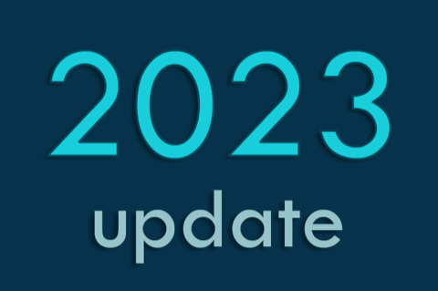

**What I've been up to since 2022, and my future blogging plans.**

It’s been almost 2 years since my last post here!

Nonetheless:

- I am still alive and feeling great!
- My main focus was/is on [the current MLOps projects](/portfolio/) and studying new technologies.
- Besides, I'm pretty active on different social platforms such as [Instagram](https://www.instagram.com/pawel_cislo/), [Twitter](https://x.com/pawel_cislo), Discord, etc.

**What are my plans for this blog?**

I never plan to stop the activity of knowledge sharing with the online community.

Generally, my current blogging habit used to drain a lot of energy; however, I am still writing a lot of content daily – offline in my Obsidian vault.

Therefore, after considering different blogging strategies, I am leaning towards refactoring this blog technologically, and editorially to some kind of personal [digital garden](https://joelhooks.com/digital-garden/), like many of [these awesome examples](https://github.com/lyz-code/best-of-digital-gardens).

I hope that you, dear reader, will continue sticking with me on this journey, as I have a lot to share! 👋🏻
