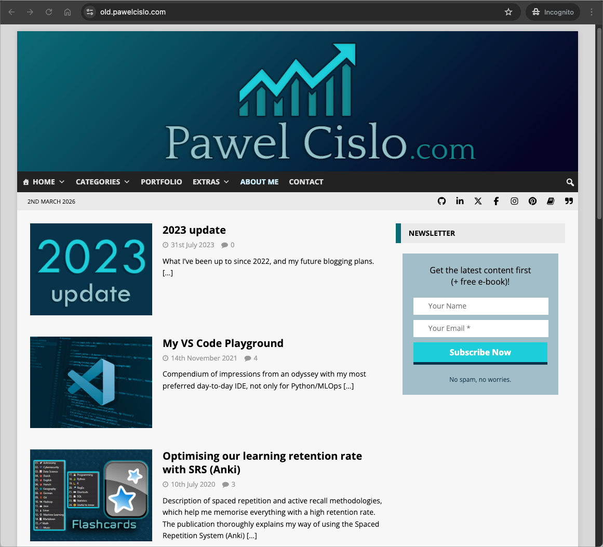
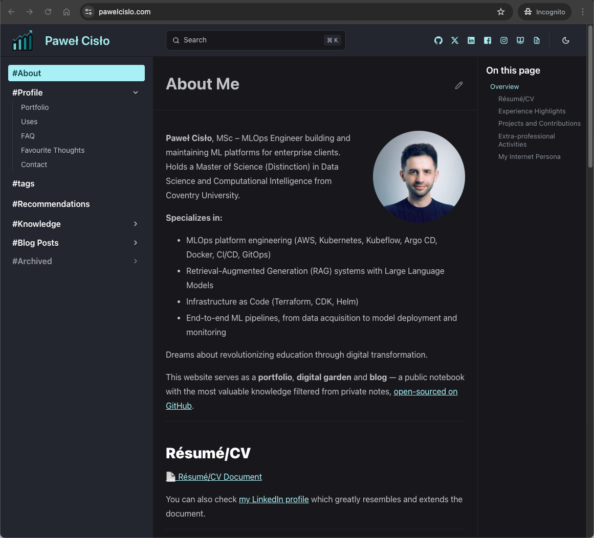
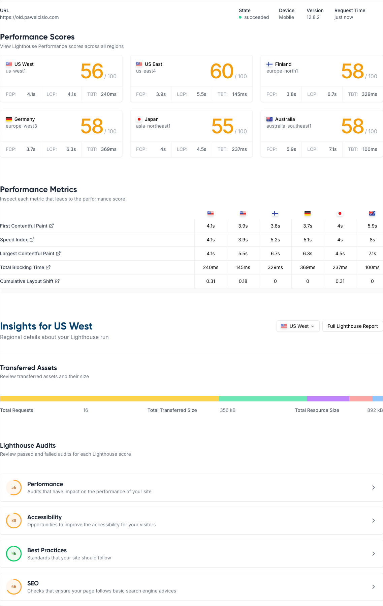
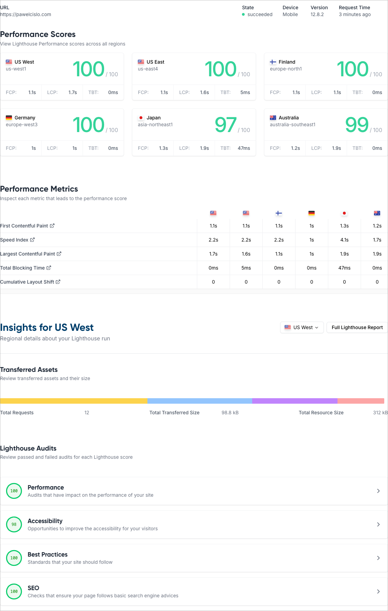

**How I migrated my personal website from WordPress on a Polish hosting to an open-source AstroJS Starlight site on Cloudflare Pages — and why it was worth every commit.**

**Before** (WordPress with 25 plugins):



**After** (Astro Starlight, open-source):



The site is no longer just a portfolio and blog — it's now a **digital garden** with a [knowledge base](/knowledge/software/obsidian/) section. It starts with just a handful of pages, but I plan to expand and regularly update them over time. I wanted it to feel closer to my personal Obsidian vault: a place where notes evolve, interlink freely, and stay in plain Markdown. The sidebar, dark theme, and "Last updated" timestamps all echo that Obsidian aesthetic.

## Why migrate?

My WordPress site had been running for 8 years (since 2018) on a Polish shared hosting provider ([MyDevil](https://www.mydevil.net/)). It served me well, but over time I started feeling the friction:

- **25 plugins** to maintain — security updates, compatibility issues, bloat (some were paid)
- **Subscriptions for updates** — my theme and some plugins required yearly subscriptions to keep receiving updates
- **No version control** — changes were irreversible clicks in a web admin panel
- **Slow performance** — shared hosting with PHP overhead
- **Vendor lock-in** — content trapped in a database, not in files I own
- **PHP version dictated by hosting** — limited control over the runtime environment
- **Cost** — yearly hosting fees for what is essentially a static site

I wanted something that would give me full control over my content as plain Markdown files, version history through Git, free hosting, and lightning-fast performance. Part of what motivated me was my move from OneNote to [Obsidian](/knowledge/software/obsidian/) back in 2022. Since then, I've been writing and editing Markdown daily, both for personal notes and at work. WordPress felt increasingly out of place.

After some research, I landed on [AstroJS Starlight](https://starlight.astro.build/) deployed on [Cloudflare Pages](https://pages.cloudflare.com/), with the [source code open on GitHub](https://github.com/pyxelr/pawelcislo.com). Since it's open-source, I welcome collaborative suggestions — just please, no ads or tool promotions.

## Choosing a framework

Before committing, I evaluated several static site generators and themes:

- **[Hugo](https://gohugo.io/)** — fast and popular, doesn't require JavaScript knowledge. [Webmastah's migration from WordPress to Hugo](https://webmastah.pl/weekly-065-alpinejs-koniec-dockera-pozbylem-sie-wordpressa/) back in 2021 planted the seed in my head. I looked at themes like [PaperMod](https://github.com/adityatelange/hugo-PaperMod), [Stack](https://github.com/CaiJimmy/hugo-theme-stack), and [PaperModX](https://reorx.github.io/hugo-PaperModX/). There's also good tooling for [Obsidian-to-Hugo](https://github.com/devidw/obsidian-to-hugo) and a [WordPress to Hugo Exporter](https://github.com/SchumacherFM/wordpress-to-hugo-exporter) plugin.
- **[GatsbyJS](https://www.gatsbyjs.com/)** — used by [Tania Rascia](https://www.taniarascia.com/) and [Victor Zhou](https://victorzhou.com/), both of whom I've followed since starting this blog.
- **[VitePress](https://vitepress.dev/)** — used by [Krystian Kościelniak](https://koscielniak.pro/) for his digital garden, which inspired me the most. We even exchanged a few messages on Instagram about his setup.
- **[AstroJS Starlight](https://starlight.astro.build/)** — ultimately my pick. [Reddit recommendations](https://www.reddit.com/r/webdev/comments/1i3101h/if_you_were_making_your_personal_site_from/) at the time pointed strongly toward Astro, and I noticed many documentation-based websites were adopting it. It's built on Astro, has an excellent sidebar and search out of the box, supports Markdown/MDX, and the [showcase](https://starlight.astro.build/resources/showcase/) demonstrated it could handle a blog + digital garden (knowledge) base setup well. I didn't find many sites combining traditional blogging with a knowledge base in this way, but I believe both systems complement each other nicely.

Part of what drew me to a documentation-style framework is that I genuinely enjoy writing and maintaining documentation at work. Starlight's structure felt natural.

For hosting, [Cloudflare Pages](https://pages.cloudflare.com/) (JAMstack platform) — stood out as likely [the best free option](https://www.reddit.com/r/astrojs/comments/1eazpt0/netlify_vs_vercel_vs_cloudflare/) over Netlify and Vercel — generous limits, global edge network, and tight DNS integration.

## Inspirations

Before diving in, I studied how others had built their personal sites, especially:

- [beepb00p](https://beepb00p.xyz/)
- [Jakub Mrugalski](https://mrugalski.pl/)
- [Krystian Kościelniak](https://koscielniak.pro/)
- [Piotr Migdał](https://p.migdal.pl/)
- [Tania Rascia](https://www.taniarascia.com/)
- [Tonsky](https://tonsky.me/)

Each had a different approach, but the common thread was: static site, Markdown content (mostly, I believe), Git-backed, fast.

## The migration process

### Step 1: Set up the basics

Before anything else, I installed [Node.js](https://nodejs.org/) (I use [nvm](https://github.com/nvm-sh/nvm) to manage versions) and created a [GitHub repository](https://github.com/pyxelr/pawelcislo.com) for the project. This gives you version control from day one.

### Step 2: Export WordPress content

WordPress has a built-in export tool under **Tools → Export**. I exported all content as an XML file, then used [wordpress-export-to-markdown](https://github.com/lonekorean/wordpress-export-to-markdown) to convert it:

```bash
npm install -g wordpress-export-to-markdown
wordpress-export-to-markdown --input=export.xml --output=src/content/docs
```

Options I chose:

- Put each post into its own folder? → **No**
- Add date prefix to posts? → **Yes**
- Organize posts into date folders? → **No**
- Save images? → **All Images**

This gave me all my posts as `.md` files with frontmatter and images — a solid starting point. Unfortunately, this was just the beginning. The exported content required significant cleanup:

- Converting WordPress shortcodes to standard Markdown links
- Replacing remote `wp-content` image URLs with local assets
- Standardising ~284 image filenames (lowercase, hyphens) for Linux case-sensitivity
- Fixing quote formatting, highlight blocks, and image captions
- Removing outdated pages and unused frontmatter fields

This turned into a [massive PR](https://github.com/pyxelr/pawelcislo.com/pull/1) that also added site infrastructure (RSS, LaTeX support, custom components) and fixed ~30 grammar issues across 11 files.

### Step 3: Set up Starlight

Creating the Starlight project was straightforward:

```bash
npm create astro@latest -- --template starlight
```

The template gives you a working site out of the box with a sidebar, search (via [Pagefind](https://pagefind.app/)), dark/light theme toggle, and sensible defaults. From there, I customised the sidebar structure, added my branding, and dropped in the exported content.

### Step 4: Chat with Claude Code

Here's where it gets interesting. I used the **Claude Code extension in VS Code** (which later became GitHub Copilot with Claude) to assist with the bulk of the migration work. Having an AI pair programmer turned what could have been weeks of tedious work into a much more manageable process.

Claude helped with:

- Fixing broken links and WordPress leftovers across all posts
- Adding SEO infrastructure (Schema.org structured data, Open Graph tags, `robots.txt`)
- Building custom components (page title with reading time, footer with JSON-LD)
- Setting up tag pages and RSS feed
- Creating URL redirects from old WordPress paths
- Image optimisation and deduplication
- Grammar review across all content

The full commit history on [GitHub](https://github.com/pyxelr/pawelcislo.com/commits/main/) tells the story.

### Step 5: Deploy to Cloudflare Pages

Deploying to Cloudflare Pages was remarkably simple:

1. Connected the GitHub repository in the Cloudflare dashboard
2. Set the build command to `git fetch --unshallow && npm run build`
   - The `git fetch --unshallow` is important — Cloudflare Pages does a shallow clone by default, which breaks Starlight's "Last updated" dates (every page shows the deployment date instead of its actual last-modified date)
3. Set `NODE_VERSION` to `22` and build output to `dist`
   - While [Astro supports Node 24](https://docs.astro.build/en/upgrade-astro/#nodejs-support-and-upgrade-policies), Cloudflare Pages does not yet, so Node 22 is used as the [default version in the V3 build image](https://developers.cloudflare.com/pages/configuration/build-image/)
4. Pointed my domain's DNS to Cloudflare

That's it. Every push to `main` triggers an automatic deployment. Every branch and commit gets its own preview URL, which makes testing changes much easier before merging. Rollbacks are one click away.

```text
┌─────────┐     git push     ┌─────────┐     webhook     ┌──────────────────┐
│ VS Code │ ───────────────► │ GitHub  │ ──────────────► │ Cloudflare Pages │
└─────────┘                  └─────────┘                 └────────┬─────────┘
                                                                  │
                                                            npm run build
                                                                  │
                                                                  ▼
┌──────────┐       CDN       ┌──────────────┐   static   ┌─────────────────┐
│ Visitors │ ◄────────────── │ Edge Network │ ◄───────── │    Astro SSG    │
└──────────┘                 └──────────────┘            └─────────────────┘
```

### Step 6: Polish and enhance

After the core migration, I spent time on improvements that would have been painful or impossible on WordPress:

- **Custom 404 page** with a themed dead link illustration
- **[Tag system](/tags/)** with an index page and individual tag pages
- **"Discuss on" links** per post (linking to Facebook, X, LinkedIn discussions)
- **Responsive iframe wrapper** for YouTube embeds via a custom remark plugin
- **Mobile header auto-hide** on scroll via custom JavaScript and CSS
- **i18n customization** to rename Starlight's "On this page" heading
- **Broken link checker** script (`npm run check:links`) — scans all Markdown files for URLs, then checks them concurrently via HTTP HEAD/GET and reports dead links grouped by file
- **[Recommendations](/recommendations/) sync** script (`npm run sync:recommendations`) — pulls the [recommendations-for-engineers](https://github.com/pyxelr/recommendations-for-engineers) README from GitHub and transforms it into a Starlight-compatible page (converting admonitions, stripping TOC, fixing links)
- **Newsletter migration** from Mailchimp to [Substack](https://pawelcislo.substack.com/)
- **Donation link** migration from PayPal to [Ko-Fi](https://ko-fi.com/pawelcislo)
- **Yearly auto-rebuild** via a Cloudflare deploy hook triggered by GitHub Actions (to keep the copyright year current)
- **Downtime monitoring** with [UptimeRobot](https://uptimerobot.com/) — free checks every 5 minutes with email alerts
- **Knowledge base** section — a growing digital garden with 16+ pages on topics from Kubernetes to music production

## Auditing WordPress plugins

One concern before migrating was: what functionality would I lose? I went through all 25 WordPress plugins to check:

| Plugin | Needed? |
|---|---|
| Akismet Anti-spam | ❌ No comments system (yet) |
| Classic Editor / Gutenberg | ❌ Writing in Markdown now |
| Custom Highlight Color | ❌ Handled by CSS |
| Enlighter - Syntax Highlighter | ❌ Starlight uses Shiki with excellent syntax highlighting |
| Fixed TOC | ❌ Starlight has built-in table of contents |
| footnotes | ❌ Standard Markdown footnotes work |
| Forms for Mailchimp | ❌ Migrated to Substack |
| instant.page | ❌ Static site is already fast |
| Jetpack | ❌ Cloudflare provides analytics |
| Phoenix Media Rename | ❌ Files are just files in a Git repo |
| Post Reading Time Estimate | ❌ Custom `PageTitle` component calculates this |
| **Redirection** | **✅ Reimplemented as Astro redirects in config** |
| WP-KaTeX | ❌ Using `remark-math` + `rehype-katex` |
| Yoast SEO | ❌ Custom Schema.org + Open Graph implementation |
| _...and 11 others_ | ❌ |

Only **Redirection** required actual reimplementation — and it was just a config object in `astro.config.mjs` mapping old WordPress date-based URLs to new paths.

## The results

### Performance

I ran Lighthouse audits on both sites to compare. The results were dramatic:



And after the migration:



The difference in Lighthouse scores speaks for itself. The WordPress site on shared hosting struggled with performance, while the Astro static site on Cloudflare's edge network scores near-perfect across the board.

The accessibility score of 98/100 is intentionally not 100 — on some pages I use non-sequential heading levels (e.g. starting from `###` instead of `##`) to achieve a smaller font size in certain sections.

### Current setup

| Service | Provider | Cost |
|---|---|---|
| Website | Astro (hosted on Cloudflare Pages) | Free |
| Domain (.com) | Cloudflare | ~39 PLN/year |
| Domain DNS | Cloudflare | Free |
| Newsletter | Substack | Free |
| Email | Small.pl | ~50 PLN/year |
| **Total** | | **\~89 PLN/year (\~$24 USD)** |

#### Email provider

I migrated my professional email away from MyDevil to reduce overhead and costs. Here's a quick comparison of the options I considered:

| Option | Est. Annual Cost | Pro | Con |
| :--- | :--- | :--- | :--- |
| **Cloudflare Routing** | 0 PLN | Completely free; uses existing DNS. | "Send" functionality is a hack; replies often show your personal Gmail address. |
| **Google Workspace** | ~378 PLN | Elite ecosystem (Calendar, Gemini AI). | Expensive (~7.5x the cost of Small.pl). |
| **Small.pl** | **50 PLN (Gross)** | **Full IMAP/SMTP support; Polish hosting.** | Not free (but the best value). |

[Small.pl](https://small.pl/) (the sister-brand of MyDevil) is the "Goldilocks" solution: 50 PLN/year for a real IMAP/SMTP mailbox, no "on behalf of" header hacks, and a seamless migration since both services are run by the same team.

To move all existing emails from MyDevil to Small.pl, I used [`imapsync`](https://imapsync.lamiral.info/) — a battle-tested tool for copying mailboxes between IMAP servers. It preserved the full folder structure and message flags. After the transfer, I reset the SPF, DKIM, and DMARC DNS records in Cloudflare to point to Small.pl's mail servers so outgoing emails stay properly authenticated. I used [DNSChecker](https://dnschecker.org/) to confirm the MX records had propagated and [Google's DNS flush tool](https://developers.google.com/speed/public-dns/cache) to clear stale cached records.

### What I gained

- **Full version control** — every change is a Git commit with history. I try to follow the [Conventional Commits](https://www.conventionalcommits.org/en/v1.0.0/) format for clarity. Visitors can also browse the [commit history](https://github.com/pyxelr/pawelcislo.com/commits/main/) to see what's changed
- **Open source** — the entire site is [on GitHub](https://github.com/pyxelr/pawelcislo.com)
- **Nearly free** — ~39 PLN/year for domain (.com on Cloudflare) and ~50 PLN/year for email, everything else is free
- **Speed** — static HTML served from edge locations worldwide
- **Content as files** — Markdown files I own, not rows in a database
- **Knowledge base** — Starlight's sidebar makes it easy to organise a growing digital garden
- **Work from anywhere** — just clone the repo on any device (macOS, Linux, Windows all work fine), run `npm run dev`, and deploy with a push. No FTP, no hosting panel, no database credentials
- **LLM-friendly codebase** — AI coding assistants like Copilot and Claude can read and modify the entire site. In WordPress, LLMs struggled with the PHP/database split and the admin-panel workflow

### What I lost

- **Comments** — WordPress had built-in comments. I haven't considered adding a comments section yet, but feedback is welcome via [GitHub issues](https://github.com/pyxelr/pawelcislo.com/issues) or in the linked social media posts at the bottom of each blog post
- **Potentially some visitors during migration** — there was a brief DNS transition period
- **WYSIWYG editing** — but I much prefer writing in Markdown anyway

## Tips if you're considering the same

1. **Export early, clean later** — get the content out of WordPress first, then iterate on it in your new setup
2. **Use `git fetch --unshallow`** on Cloudflare Pages — otherwise "Last updated" dates will be wrong
3. **Set up redirects** from your old URL structure — don't break existing links from Google and other sites
4. **Leverage AI** for the tedious parts — link fixing, frontmatter generation, grammar review
5. **Don't aim for perfection on day one** — ship it, then improve incrementally

## What's next?

The site is live and I'm happy with the result. The [knowledge base](/knowledge/software/obsidian/) is growing, and writing new content is a joy compared to the WordPress admin panel. If you're running a static-ish blog on WordPress and feeling the friction — I encourage you to make the jump. The tooling in 2026 makes it easier than ever.

The source code is at [github.com/pyxelr/pawelcislo.com](https://github.com/pyxelr/pawelcislo.com) — feel free to explore for inspiration or open an issue if you have questions.
